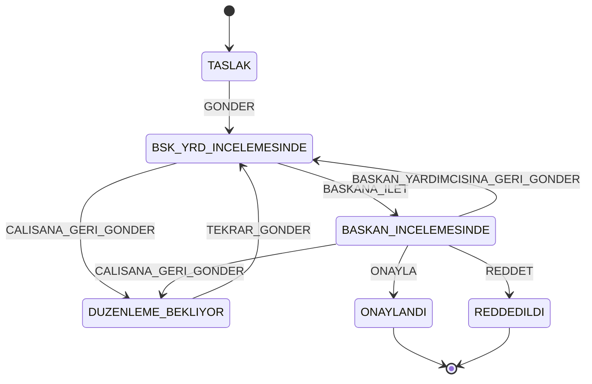
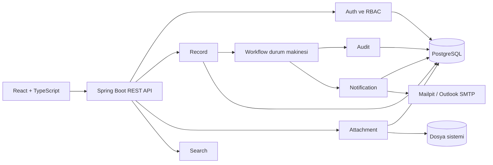

# İş Akışı ve Onay Yönetim Sistemi

[](https://github.com/btkstajyer26/WorkFlowProject/actions/workflows/ci.yml)

Kurum içindeki belge, kayıt ve onay süreçlerini dijitalleştirmek için geliştirilen web tabanlı bir Elektronik Belge Yönetim Sistemi (EBYS) modülüdür.

Sistem; kayıt oluşturma, hiyerarşik onay akışı, rol bazlı erişim, dosya yönetimi, denetim izi, arama ve bildirim yeteneklerini tek uygulamada birleştirir.

> Proje aktif geliştirme aşamasındadır ve henüz üretim ortamına hazır değildir. Güncel geliştirme kodu `test` dalındadır. Frontend ekranlarının bir bölümü hâlâ mock veri kullanmaktadır. İlk Admin kurulumu ve ilk girişte parola değiştirme akışı tamamlanmıştır; backend üretimli geçici parola ve davet e-postası henüz yoktur.

## İçindekiler

- [Mevcut durum](#mevcut-durum)
- [Roller ve iş akışı](#roller-ve-iş-akışı)
- [Mimari](#mimari)
- [Teknolojiler](#teknolojiler)
- [Proje yapısı](#proje-yapısı)
- [Hızlı başlangıç](#hızlı-başlangıç)
- [Yerel geliştirme](#yerel-geliştirme)
- [Ortam değişkenleri](#ortam-değişkenleri)
- [API özeti](#api-özeti)
- [Veritabanı ve migration yönetimi](#veritabanı-ve-migration-yönetimi)
- [Testler](#testler)
- [Branch ve katkı akışı](#branch-ve-katkı-akışı)
- [Bilinen eksikler](#bilinen-eksikler)
- [Dokümantasyon](#dokümantasyon)

## Mevcut durum

| Bileşen | Durum | Açıklama |
| --- | --- | --- |
| Backend altyapısı | Uygulandı | Java 21, Spring Boot, PostgreSQL, Flyway, Docker ve OpenAPI yapılandırıldı. |
| Kimlik doğrulama | Uygulandı | JWT ile giriş, token yenileme, çıkış, parola değiştirme ve e-posta kodlu parola sıfırlama mevcuttur. Pasif kullanıcı girişi ve token yenilemesi engellenir; ilk girişte parola değişimi JWT filtresinde `403 PASSWORD_CHANGE_REQUIRED` ile zorlanır. |
| RBAC | Uygulandı | Rol bazlı işlem yetkisi ve kayıt görünürlük politikası backend'de zorlanır; yetki matrisi uçtan uca testlerle kapsanır. |
| Kullanıcı yönetimi | Kısmi | Admin kullanıcı oluşturma, rol değiştirme, aktiflik yönetimi ve ilk Admin bootstrap akışı mevcuttur. Backend üretimli geçici parola ve davet e-postası henüz yoktur. |
| Kayıt yönetimi | Uygulandı | CRUD, kategori, filtreleme ve soft delete mevcuttur; görünürlük kuralı tekil görüntülemede ve listede tek kaynaktan uygulanır. |
| İş akışı | Uygulandı | Durum makinesi, adaptörler, transaction sınırı, audit/event bağlantısı ve HTTP endpointi mevcuttur; geçişler gerçek PostgreSQL üzerinde rollback ve sürüm çatışması senaryolarıyla test edilir. |
| Dosya yönetimi | Uygulandı | Yükleme, indirme, önizleme, içerik doğrulama ve soft delete mevcuttur; okuma uçları kayıt görünürlüğüyle, yazma uçları sahiplik ve durum kilidiyle korunur. |
| Audit | Kısmi | Kayıt ve kullanıcı işlemleri için audit altyapısı vardır; veritabanı seviyesindeki değiştirilemezlik güvencesi güçlendirilmelidir. |
| Arama | Uygulandı | Kriter, filtre ve sayfalama tabanlı kayıt araması bulunur. |
| Bildirim | Uygulandı | Uygulama içi workflow bildirimleri ve commit sonrası durum e-postası mevcuttur. Atama yapılan geçişte atanan kullanıcıya, nihai onay/ret geçişinde hem kaydı oluşturana hem kaydı Başkana ileten yardımcıya gider. Gerçek Outlook yapılandırması ortama bağlıdır. |
| Frontend | Kısmi | React arayüzü ve frontend testleri mevcuttur; bazı ekranlar mock veri katmanından gerçek API istemcilerine geçirilmelidir. |
| GitHub CI | Uygulandı | GitHub Actions akışı `test`, `main` ve `integration/**` dallarında backend `verify` ile frontend lint/test/build kontrollerini çalıştırır. Branch protection kuralları henüz etkin değildir. |

## Roller ve iş akışı

### Roller

| Rol | Sorumluluk |
| --- | --- |
| `CALISAN` | Kayıt oluşturur, taslağını düzenler, dosya ekler ve onay akışına gönderir. |
| `BASKAN_YARDIMCISI` | Kendisine atanan kaydı inceler; Başkana iletir veya açıklamayla Çalışana geri gönderir. |
| `BASKAN` | Kaydı onaylar, reddeder ya da Çalışana/Başkan Yardımcısına geri gönderir. |
| `ADMIN` | Kullanıcı ve rol yönetiminden sorumludur. Kendiliğinden workflow aktörü değildir ve yalnız Admin olduğu için kayıtlara erişemez. |

`ADMIN`, `BASKAN` ve `BASKAN_YARDIMCISI` **tekil rollerdir**: her birini aynı anda yalnızca bir aktif kullanıcı tutabilir. Bu nedenle istemci hiçbir aksiyonda hedef kullanıcı seçmez; hedefi her zaman backend çözer. `GONDER` ve `TEKRAR_GONDER` sistemdeki tek aktif Başkan Yardımcısını, `BASKANA_ILET` ise tek aktif Başkanı hedefler.

Başkan Yardımcısı koltuğu devredilirken (`PATCH /api/admin/users/{id}/role` isteğinde `replacementBaskanYardimcisiId` ile) eski yardımcının üzerindeki bekleyen kayıtlar aynı transaction içinde yeni yardımcıya aktarılır.

### Durumlar



### Temel kurallar

- İstemci hedef durumu doğrudan belirlemez; yalnızca aksiyonu gönderir, yeni durumu backend hesaplar.
- İstemci hedef kullanıcıyı da belirlemez. `targetUserId` **hiçbir aksiyonda gönderilmez**; yine de gönderilirse istek `400 WORKFLOW_TARGET_NOT_ALLOWED` ile reddedilir.
- `GONDER` ve `TEKRAR_GONDER` hedefini backend, sistemdeki tek aktif Başkan Yardımcısı olarak çözer; `BASKANA_ILET` hedefini tek aktif Başkan olarak çözer. Beklenen rolde sıfır veya birden fazla aktif kullanıcı bulunursa istek `409 WORKFLOW_ROLE_NOT_CONFIGURED` ile durur.
- Kaydı Başkana ileten Başkan Yardımcısı `lastDeputyId` alanında tutulur. Başkan geri gönderdiğinde kayıt bu kullanıcıya döner.
- Çalışana veya Başkan Yardımcısına geri gönderme ile nihai ret işlemlerinde açıklama zorunludur.
- `ONAYLANDI` ve `REDDEDILDI` terminal durumlardır; kayıt içeriği, ekler ve workflow kilitlenir.
- Pasif kullanıcı workflow hedefi olamaz.

## Mimari



Backend, modül sınırlarını paket seviyesinde ayırır. Workflow çekirdeği doğrudan Spring veya JPA'ya bağımlı değildir; dış sistemlere portlar üzerinden bağlanır. HTTP, güvenlik, kullanıcı, persistence ve event adaptörleri uygulama katmanında konumlanır.

## Teknolojiler

| Katman | Teknoloji |
| --- | --- |
| Backend | Java 21, Spring Boot 4.1.0, Spring Web MVC |
| Güvenlik | Spring Security, JWT (`jjwt` 0.12.6) |
| Persistence | Spring Data JPA, Hibernate, PostgreSQL 15 |
| Migration | Flyway |
| E-posta | Spring Mail, Mailpit, Outlook/SMTP uyumlu yapılandırma |
| Dosya doğrulama | Apache Tika 2.9.2 |
| API dokümantasyonu | Springdoc OpenAPI 3.1 |
| Frontend | React 19, TypeScript 6, Vite 8, Tailwind CSS 4 |
| Sunucu durumu | TanStack Query 5 |
| Form ve doğrulama | React Hook Form, Zod |
| Frontend test/kalite | Vitest, Testing Library, MSW, Oxlint |
| Çalıştırma | Docker, Docker Compose |

## Proje yapısı

```text
WorkFlowProject/
├── backend/
│   ├── src/main/java/btk/staj/WorkFlowProject/
│   │   ├── attachment/
│   │   ├── audit/
│   │   ├── auth/
│   │   ├── common/
│   │   ├── notification/
│   │   ├── rbac/
│   │   ├── record/
│   │   ├── search/
│   │   ├── user/
│   │   └── workflow/
│   ├── src/main/resources/
│   │   ├── application.properties
│   │   └── db/migration/
│   ├── src/test/
│   └── pom.xml
├── frontend/
│   ├── public/
│   ├── src/
│   ├── package.json
│   └── package-lock.json
├── docs/
├── .env.example
├── docker-compose.yml
└── README.md
```

## Hızlı başlangıç

### Gereksinimler

- Git
- Docker Desktop veya Docker Engine
- Docker Compose

Aktif geliştirme sürümünü kullanmak için:

```bash
git clone https://github.com/btkstajyer26/WorkFlowProject.git
cd WorkFlowProject
git switch test
```

Ortam dosyasını oluşturun:

Windows PowerShell:

```powershell
Copy-Item .env.example .env
```

Linux/macOS:

```bash
cp .env.example .env
```

PostgreSQL, Mailpit ve backend'i başlatın:

```bash
docker compose up --build -d
docker compose ps
```

Frontend'i Docker profiliyle birlikte başlatmak için:

```bash
docker compose --profile frontend up --build -d
```

| Servis | Adres |
| --- | --- |
| Backend | `http://localhost:8080` |
| Swagger UI | `http://localhost:8080/swagger-ui.html` |
| OpenAPI JSON | `http://localhost:8080/v3/api-docs` |
| Frontend | `http://localhost:5173` |
| Mailpit | `http://localhost:8025` |
| PostgreSQL | `localhost:5432` |

Logları izlemek için:

```bash
docker compose logs -f backend
```

Servisleri durdurmak için:

```bash
docker compose down
```

> [!WARNING]
> `docker compose down -v` veritabanı ve yüklenen dosya volume'lerini kalıcı olarak siler.

## Yerel geliştirme

### Backend

Gereksinimler:

- JDK 21
- Maven 3.9+
- PostgreSQL 15

Önce bağımlı servisleri başlatın:

```bash
docker compose up -d db mailpit
```

Backend'i çalıştırın:

```bash
cd backend
mvn spring-boot:run
```

Maven Wrapper depoda yapılandırılmıştır; yerelde Maven kurulu olmasa da aynı komut `./mvnw spring-boot:run` veya Windows'ta `.\mvnw.cmd spring-boot:run` ile çalıştırılabilir. CI de wrapper'ı kullanır.

### Frontend

Gereksinimler:

- Node.js 22
- npm

```bash
cd frontend
npm ci
npm run dev
```

## Ortam değişkenleri

### Backend

| Değişken | Varsayılan | Açıklama |
| --- | --- | --- |
| `DB_HOST` | `localhost` | PostgreSQL sunucusu |
| `DB_PORT` | `5432` | PostgreSQL portu |
| `DB_NAME` | `workflowdb` | Veritabanı adı |
| `DB_USER` | `postgres` | Veritabanı kullanıcısı |
| `DB_PASSWORD` | `postgres` | Yalnız yerel geliştirme parolası |
| `JWT_SECRET` | Yerel geliştirme değeri | En az 32 karakterlik JWT imzalama anahtarı |
| `JWT_ACCESS_TOKEN_EXPIRATION` | `3600000` | Access token süresi, milisaniye |
| `JWT_REFRESH_TOKEN_EXPIRATION` | `604800000` | Refresh token süresi, milisaniye |
| `MAIL_HOST` | `localhost` | SMTP sunucusu |
| `MAIL_PORT` | `1025` | SMTP portu |
| `MAIL_USERNAME` | Boş | Gerçek SMTP kullanıcı adı |
| `MAIL_PASSWORD` | Boş | Gerçek SMTP parolası |
| `MAIL_AUTH` | `false` | SMTP kimlik doğrulaması |
| `MAIL_STARTTLS` | `false` | STARTTLS kullanımı |
| `MAIL_FROM` | `ebys@ornek.local` | Bildirim e-postalarının gönderen adresi |
| `FRONTEND_URL` | `http://localhost:5173` | E-posta deep link tabanı |
| `CORS_ALLOWED_ORIGINS` | `http://localhost:5173` | Virgülle ayrılmış izinli origin listesi |
| `UPLOAD_DIR` | `./uploads` | Dosya saklama dizini |
| `BOOTSTRAP_ADMIN_EMAIL` | Boş | İlk Admin e-postası; aşağıdaki nota bakınız |
| `BOOTSTRAP_ADMIN_PASSWORD` | Boş | İlk Admin parolası; aşağıdaki nota bakınız |
| `PASSWORD_RESET_CODE_TTL_MINUTES` | `10` | E-postayla gönderilen 6 haneli kodun geçerlilik süresi |
| `PASSWORD_RESET_TOKEN_TTL_MINUTES` | `15` | Kod doğrulandıktan sonra verilen sıfırlama anahtarının süresi |
| `PASSWORD_RESET_RESEND_COOLDOWN_SECONDS` | `60` | Yeni kod istemek için beklenmesi gereken süre |

> [!NOTE]
> İlk Admin yalnızca **iki değişken de doludur** ve sistemde **aktif Admin yoktur** koşulunda oluşturulur. Hesap `mustChangePassword` işaretiyle açılır; ilk girişte parola değiştirilmeden diğer uçlara erişilemez.

### Frontend

| Değişken | Varsayılan | Açıklama |
| --- | --- | --- |
| `VITE_API_BASE_URL` | `http://localhost:8080` | Backend taban adresi. Yol öneki içermez; uçlar `/api/...` ile başlar. |
| `VITE_API_MODE` | Geliştirmede `mock`, üretim build'inde `backend` | `mock`: istekleri MSW karşılar. `backend`: istekler gerçek API'ye gider. |

> [!WARNING]
> `docker compose --profile frontend up` varsayılan olarak **mock modda** açılır ve backend'e hiç istek göndermez. Arayüzü gerçek backend ile denemek için `.env` dosyasında `VITE_API_MODE=backend` verin.

Gerçek parola, JWT anahtarı veya SMTP kimlik bilgilerini repository'ye eklemeyin. `.env` dosyası Git tarafından izlenmemelidir.

## API özeti

Tüm uçlar `/api` altındadır; sürüm öneki kullanılmaz.

| Alan | Endpoint | Açıklama |
| --- | --- | --- |
| Auth | `POST /api/auth/login` | E-posta ve parola ile giriş |
| Auth | `POST /api/auth/refresh` | Access token yenileme |
| Auth | `POST /api/auth/logout` | Refresh token iptali |
| Auth | `POST /api/auth/change-password` | Oturum açmış kullanıcının parola değiştirmesi |
| Auth | `POST /api/auth/forgot-password` | Parola sıfırlama kodu ister. Adres kayıtlı olsun olmasın `202` döner |
| Auth | `POST /api/auth/verify-reset-code` | E-postayla gelen 6 haneli kodu doğrular, tek kullanımlık sıfırlama anahtarı verir |
| Auth | `POST /api/auth/reset-password` | Doğrulanmış anahtarla yeni parolayı kaydeder; oturum gerektirmez |
| Kullanıcı | `GET /api/users/me` | Oturum açmış kullanıcının kendi bilgileri |
| Admin | `POST /api/admin/users` | Kullanıcı oluşturma |
| Admin | `GET /api/admin/users` | Kullanıcı listesi; arama, rol ve aktiflik filtreli, sayfalı |
| Admin | `PATCH /api/admin/users/{id}/role` | Rol değiştirme; tekil rol devri bu uçtan yapılır |
| Admin | `PATCH /api/admin/users/{id}/active` | Hesap etkinleştirme/pasifleştirme |
| Admin | `GET /api/admin/roles` | Atanabilir rollerin listesi |
| Admin | `GET /api/admin/audit-logs` | Sistem genelinde denetim izi |
| Kayıt | `POST /api/records` | Kayıt oluşturma; yalnız Çalışan |
| Kayıt | `GET /api/records/{id}` | Tekil kayıt; görünürlük kuralı uygulanır |
| Kayıt | `GET /api/records` | Listeleme, arama ve filtreleme; aşağıdaki nota bakınız |
| Kayıt | `PUT /api/records/{id}` | Kayıt düzenleme; yalnız oluşturan Çalışan |
| Kayıt | `DELETE /api/records/{id}` | Kayıt silme (soft delete); yalnız oluşturan Çalışan |
| Workflow | `POST /api/records/{recordId}/workflow/actions` | Tüm workflow aksiyonları için tek endpoint |
| Dosya | `POST /api/records/{id}/files` | Kayda dosya ekleme; yalnız Çalışan |
| Dosya | `GET /api/records/{id}/files` | Kaydın dosyalarını listeleme |
| Dosya | `GET /api/files/{id}/download` | Dosya indirme |
| Dosya | `GET /api/files/{id}/preview` | Tarayıcıda önizleme |
| Dosya | `DELETE /api/files/{id}` | Dosya silme; yalnız Çalışan |
| Kategori | `GET /api/categories` | Kategorileri listeleme |
| Audit | `GET /api/audit-logs/record/{recordId}` | Yetkili kullanıcının kayıt geçmişini görmesi |
| Audit | `GET /api/user-audit-logs/{targetUserId}` | Kullanıcı işlem geçmişi; yalnız Admin |
| Bildirim | `GET /api/notifications` | Bildirim geçmişi (okunmuş + okunmamış), sayfalı |
| Bildirim | `GET /api/notifications/unread` | Okunmamış bildirimler |
| Bildirim | `GET /api/notifications/unread/count` | Okunmamış bildirim sayısı |
| Bildirim | `PUT /api/notifications/{id}/read` | Bildirimi okundu işaretleme |

Arama için ayrı bir uç yoktur; filtreleme kayıt listesi ucu üzerinden yapılır:

```text
GET /api/records?page&size&status&categoryId&q&from&to&creator&sort
```

Admin uçlarının tamamı `@PreAuthorize` ile yalnızca `ADMIN` rolüne açıktır; kayıt oluşturma, düzenleme, silme ve dosya ekleme aynı biçimde yalnızca `CALISAN` rolüne açıktır. Workflow ucunda rol kontrolü bilinçli olarak controller'da değil durum makinesinde yapılır; yetkisiz rol denemesi `403 WORKFLOW_ROLE_NOT_ALLOWED` ile döner.

İstek ve yanıt şemaları için uygulama çalışırken Swagger UI kullanılmalıdır.

## Veritabanı ve migration yönetimi

Flyway migrationları `backend/src/main/resources/db/migration` dizinindedir.

| Migration | İçerik |
| --- | --- |
| `V1__init_database_schema.sql` | Roller, kullanıcılar, tokenlar, kayıtlar, dosyalar, audit ve bildirim tablolarını içeren kanonik başlangıç şeması |
| `V2__create_record_notes.sql` | (Kullanılmıyor) Kayıt çalışma notları; `V6` ile geri alındı |
| `V4__add_soft_delete_to_files.sql` | Dosyalara soft delete alanları ve indeks |
| `V5__add_notification_type.sql` | Bildirim türü alanı ve indeksi |
| `V6__drop_record_notes.sql` | Kullanılmayan `record_notes` tablosunun kaldırılması |
| `V7__request_and_auth_audit_columns.sql` | Audit tablolarında evrak zorunluluğunun kaldırılması; HTTP istek kolonları |
| `V8__password_reset_codes.sql` | Parola sıfırlama kodları tablosu (`password_reset_codes`) ve indeksleri |
| `V9__record_handoff_snapshot.sql` | Kayıt Çalışana geri gönderildiğinde içeriğini donduran `snapshot_*` kolonları |

`V1` hazırlanırken daha önce taslak olarak adlandırılan Admin ve workflow migrationları ortak veritabanına uygulanmadan birleştirilmiştir. Bu nedenle numaralandırmadaki boşluklar tarihsel tasarım kararının sonucudur.

Kayıt durumu `records.status` alanında `RecordStatus` enum adı olarak saklanır; ayrı bir `statuses` tablosu yoktur.

Kurallar:

- Uygulanmış migration dosyalarını değiştirmeyin.
- Her şema değişikliği için yeni ve sıralı bir migration oluşturun.
- Entity uyumu Hibernate tarafından `ddl-auto=validate` ile doğrulanır; şema Hibernate tarafından üretilmez.
- Eski veya dolu bir veritabanını taşımadan önce `flyway_schema_history` ve mevcut şema envanterini kontrol edin.

## Testler

### Backend

Backend testleri JUnit 5, Mockito, Spring Test ve MockMvc kullanır. Tam doğrulama PostgreSQL gerektirir:

```bash
docker compose up -d db
cd backend
mvn --batch-mode --no-transfer-progress verify
```

> [!WARNING]
> PostgreSQL parolası veri volume'ü **ilk oluşturulurken** sabitlenir. `.env` içindeki `DB_PASSWORD` sonradan değiştirilirse konteyneri yeniden başlatmak yetmez; testler `password authentication failed for user "postgres"` ile düşer ve sorun koddaymış gibi görünür. Çözüm ya `docker compose down -v` (veritabanı verisi silinir) ya da parolayı veritabanında elle güncellemektir.

### Frontend

```bash
cd frontend
npm ci
npm run lint
npm run test
npm run build
```

### Sürekli entegrasyon

`.github/workflows/ci.yml`, `test`, `main` ve `integration/**` dallarına açılan pull requestlerde ve bu dallara yapılan push'larda iki job çalıştırır:

| Job | İçerik |
| --- | --- |
| `Backend / verify` | PostgreSQL 15 servis konteyneriyle `./mvnw verify`; Surefire raporlarını artefakt olarak yükler |
| `Frontend / quality` | `npm ci`, `npm run lint`, `npm run test`, `npm run build` |

Aynı kontroller yerel olarak da çalıştırılabilir. Branch protection henüz etkin olmadığı için bu job'lar şu an merge için teknik olarak zorunlu değildir; ekip politikası olarak yeşil olmadan merge edilmemelidir.

## Branch ve katkı akışı

Hedef geliştirme akışı:

```text
feature/* veya bugfix/*
          │
          ▼
        test
          │
          ▼
        main
```

Yeni çalışma dalını güncel `test` üzerinden oluşturun:

```bash
git switch test
git pull --ff-only origin test
git switch -c feature/aciklayici-dal-adi
```

Önerilen süreç:

1. Küçük ve tek amaçlı commitler oluşturun.
2. Pull request hedefini `test` seçin.
3. İlgili backend ve frontend testlerini çalıştırın.
4. Code review ve CI kontrolleri tamamlanmadan merge etmeyin.
5. Doğrulanmış `test` sürümünü release PR ile `main` dalına alın.

Commit mesajlarında Conventional Commits benzeri bir biçim kullanılır:

```text
feat(workflow): iş akışı aksiyonunu ekle
fix(auth): pasif kullanıcı girişini engelle
test(record): görünürlük senaryolarını kapsa
docs: README dosyasını güncelle
ci: backend ve frontend kontrollerini ekle
```

Branch protection etkinleştirilene kadar doğrudan push yasağı teknik olarak GitHub tarafından uygulanmamaktadır; ekip politikası olarak PR akışına uyulmalıdır.

## Bilinen eksikler

- Admin kullanıcı oluştururken parolayı istemciden almaktadır; backend üretimli geçici parola ve davet e-postası henüz uygulanmamıştır.
- Frontend'in bazı bölümleri mock veri kullanmaktadır. Aynı iş kuralı iki yerde tutulmaktadır: `WorkflowContext` mock geçiş mantığını, `RecordActionPanel` gerçek API istemcisini kullanır.
- Audit değiştirilemezliği yalnızca uygulama seviyesinde sağlanır; veritabanı tarafında trigger veya rol kısıtı ile zorlanmaz.
- Başkan Yardımcısı koltuğu devredilirken `records.last_deputy_id` güncellenmez. Devirden sonra `BASKAN_YARDIMCISINA_GERI_GONDER` eski yardımcıyı hedefleyip `400` ile durur.
- Tekil rol invariant'ı yalnızca okuma anında kontrol edilir; `PATCH /api/admin/users/{id}/active` ile hesap yeniden etkinleştirilirken aynı rolde başka aktif kullanıcı olup olmadığına bakılmaz.
- `test` ve `main` dalları için branch protection kuralları etkin değildir.
- Frontend testlerinden biri (`AdminUsersPage`) paralel koşuda kararsızdır; tek başına ve `--no-file-parallelism` ile geçer, tam paralel koşuda zaman aşımına düşebilir.
- `docs/decisions/` altında henüz mimari karar kaydı yoktur.

## Dokümantasyon

- [İş akışı ve durum geçişleri](docs/workflow.md)
- [Frontend–backend çalışma sözleşmesi](docs/FRONTEND_BACKEND_SOZLESMESI.md)
- [Backend açık işler ve görev dağılımı](docs/BACKEND_ACIK_ISLER_VE_GOREV_DAGILIMI.md)
- [Sistem mimarisi](docs/architecture.md)
- [Mimari karar kayıtları](docs/decisions/README.md)
- [Eksik sınıflar ve öncelikler](docs/EKSIK_SINIFLAR_VE_ONCELIK.md)


