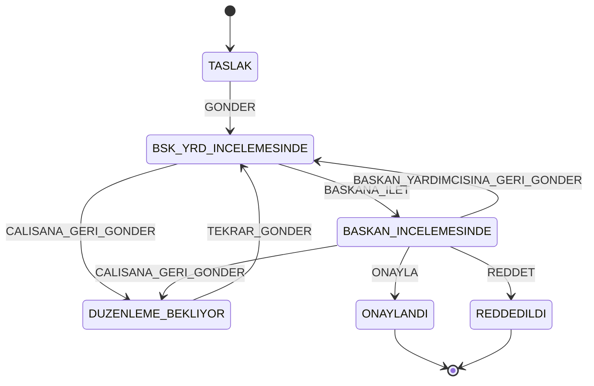
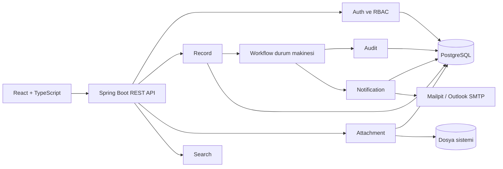

# İş Akışı ve Onay Yönetim Sistemi

Kurum içindeki belge, kayıt ve onay süreçlerini dijitalleştirmek için geliştirilen web tabanlı bir Elektronik Belge Yönetim Sistemi (EBYS) modülüdür.

Sistem; kayıt oluşturma, hiyerarşik onay akışı, rol bazlı erişim, dosya yönetimi, denetim izi, arama ve bildirim yeteneklerini tek uygulamada birleştirir.

> Proje aktif geliştirme aşamasındadır ve henüz üretim ortamına hazır değildir. Güncel geliştirme kodu `test` dalındadır. Frontend ekranlarının bir bölümü hâlâ mock veri kullanmakta; ilk Admin kurulumu, geçici parola ve ilk girişte parola değiştirme akışı henüz tamamlanmamıştır.

## İçindekiler

- [Mevcut durum](#mevcut-durum)
- [Roller ve iş akışı](#roller-ve-iş-akışı)
- [Mimari](#mimari)
- [Teknolojiler](#teknolojiler)
- [Proje yapısı](#proje-yapısı)
- [Hızlı başlangıç](#hızlı-başlangıç)
- [Yerel geliştirme](#yerel-geliştirme)
- [Ortam değişkenleri](#ortam-değişkenleri)
- [API özeti](#api-özeti)
- [Veritabanı ve migration yönetimi](#veritabanı-ve-migration-yönetimi)
- [Testler](#testler)
- [Branch ve katkı akışı](#branch-ve-katkı-akışı)
- [Bilinen eksikler](#bilinen-eksikler)
- [Dokümantasyon](#dokümantasyon)

## Mevcut durum

| Bileşen | Durum | Açıklama |
| --- | --- | --- |
| Backend altyapısı | Uygulandı | Java 21, Spring Boot, PostgreSQL, Flyway, Docker ve OpenAPI yapılandırıldı. |
| Kimlik doğrulama | Kısmi | JWT ile giriş, token yenileme ve çıkış mevcut. Pasif kullanıcı ve ilk parola değişimi politikaları tamamlanmalıdır. |
| RBAC | Kısmi | Backend rol kontrolleri ve kayıt görünürlük politikası mevcut; uçtan uca yetki testleri genişletilmelidir. |
| Kullanıcı yönetimi | Kısmi | Admin kullanıcı oluşturma endpointi mevcut. İlk Admin bootstrap, otomatik geçici parola ve davet e-postası henüz yoktur. |
| Kayıt yönetimi | Kısmi | CRUD, filtreleme ve soft delete mevcuttur; tekil görüntüleme ve genel liste uçlarında görünürlük politikası tamamlanmalıdır. |
| İş akışı | Kısmi | Durum makinesi, adaptörler, transaction sınırı, audit/event bağlantısı ve HTTP endpointi mevcuttur; gerçek PostgreSQL transaction testleri eksiktir. |
| Dosya yönetimi | Kısmi | Yükleme, indirme, önizleme, içerik doğrulama ve soft delete mevcuttur; indirme/önizleme erişim kontrolleri tamamlanmalıdır. |
| Audit | Kısmi | Kayıt ve kullanıcı işlemleri için audit altyapısı vardır; veritabanı seviyesindeki değiştirilemezlik güvencesi güçlendirilmelidir. |
| Arama | Uygulandı | Kriter, filtre ve sayfalama tabanlı kayıt araması bulunur. |
| Bildirim | Kısmi | Uygulama içi workflow bildirimleri ve commit sonrası durum e-postası mevcuttur. Gerçek Outlook yapılandırması ortama bağlıdır. |
| Frontend | Kısmi | React arayüzü ve frontend testleri mevcuttur; bazı ekranlar mock veri katmanından gerçek API istemcilerine geçirilmelidir. |
| GitHub CI | Planlandı | Backend ve frontend kontrollerini çalıştıracak GitHub Actions akışı henüz ana geliştirme dalına alınmamıştır. |

## Roller ve iş akışı

### Roller

| Rol | Sorumluluk |
| --- | --- |
| `CALISAN` | Kayıt oluşturur, taslağını düzenler, dosya ekler ve seçtiği Başkan Yardımcısına gönderir. |
| `BASKAN_YARDIMCISI` | Kendisine atanan kaydı inceler; Başkana iletir veya açıklamayla Çalışana geri gönderir. |
| `BASKAN` | Kaydı onaylar, reddeder ya da Çalışana/Başkan Yardımcısına geri gönderir. |
| `ADMIN` | Kullanıcı ve rol yönetiminden sorumludur. Kendiliğinden workflow aktörü değildir ve yalnız Admin olduğu için kayıtlara erişemez. |

Birden fazla aktif Başkan Yardımcısı desteklenir. `GONDER` ve `TEKRAR_GONDER` isteklerinde kullanıcı arayüzü seçilen Başkan Yardımcısının `targetUserId` değerini backend'e gönderir. Workflow ise `BASKANA_ILET` sırasında tam olarak bir aktif Başkan bulunmasını bekler.

### Durumlar



### Temel kurallar

- İstemci hedef durumu doğrudan belirlemez; yalnızca aksiyonu gönderir, yeni durumu backend hesaplar.
- `GONDER` ve `TEKRAR_GONDER` için `targetUserId` zorunludur ve hedef aktif bir Başkan Yardımcısı olmalıdır.
- `BASKANA_ILET` hedefini backend, sistemdeki tek aktif Başkan olarak çözer.
- Kaydı Başkana ileten Başkan Yardımcısı `lastDeputyId` alanında tutulur. Başkan geri gönderdiğinde kayıt bu kullanıcıya döner.
- Çalışana veya Başkan Yardımcısına geri gönderme ile nihai ret işlemlerinde açıklama zorunludur.
- `ONAYLANDI` ve `REDDEDILDI` terminal durumlardır; kayıt içeriği, ekler ve workflow kilitlenir.
- Pasif kullanıcı workflow hedefi olamaz.

## Mimari



Backend, modül sınırlarını paket seviyesinde ayırır. Workflow çekirdeği doğrudan Spring veya JPA'ya bağımlı değildir; dış sistemlere portlar üzerinden bağlanır. HTTP, güvenlik, kullanıcı, persistence ve event adaptörleri uygulama katmanında konumlanır.

## Teknolojiler

| Katman | Teknoloji |
| --- | --- |
| Backend | Java 21, Spring Boot 4.1.0, Spring Web MVC |
| Güvenlik | Spring Security, JWT (`jjwt` 0.12.6) |
| Persistence | Spring Data JPA, Hibernate, PostgreSQL 15 |
| Migration | Flyway |
| E-posta | Spring Mail, Mailpit, Outlook/SMTP uyumlu yapılandırma |
| Dosya doğrulama | Apache Tika 2.9.2 |
| API dokümantasyonu | Springdoc OpenAPI 3.1 |
| Frontend | React 19, TypeScript 6, Vite 8, Tailwind CSS 4 |
| Form ve doğrulama | React Hook Form, Zod |
| Frontend test/kalite | Vitest, Testing Library, Oxlint |
| Çalıştırma | Docker, Docker Compose |

## Proje yapısı

```text
WorkFlowProject/
├── backend/
│   ├── src/main/java/btk/staj/WorkFlowProject/
│   │   ├── attachment/
│   │   ├── audit/
│   │   ├── auth/
│   │   ├── common/
│   │   ├── notification/
│   │   ├── rbac/
│   │   ├── record/
│   │   ├── search/
│   │   ├── user/
│   │   └── workflow/
│   ├── src/main/resources/
│   │   ├── application.properties
│   │   └── db/migration/
│   ├── src/test/
│   └── pom.xml
├── frontend/
│   ├── public/
│   ├── src/
│   ├── package.json
│   └── package-lock.json
├── docs/
├── .env.example
├── docker-compose.yml
└── README.md
```

## Hızlı başlangıç

### Gereksinimler

- Git
- Docker Desktop veya Docker Engine
- Docker Compose

Aktif geliştirme sürümünü kullanmak için:

```bash
git clone https://github.com/btkstajyer26/WorkFlowProject.git
cd WorkFlowProject
git switch test
```

Ortam dosyasını oluşturun:

Windows PowerShell:

```powershell
Copy-Item .env.example .env
```

Linux/macOS:

```bash
cp .env.example .env
```

PostgreSQL, Mailpit ve backend'i başlatın:

```bash
docker compose up --build -d
docker compose ps
```

Frontend'i Docker profiliyle birlikte başlatmak için:

```bash
docker compose --profile frontend up --build -d
```

| Servis | Adres |
| --- | --- |
| Backend | `http://localhost:8080` |
| Swagger UI | `http://localhost:8080/swagger-ui.html` |
| OpenAPI JSON | `http://localhost:8080/v3/api-docs` |
| Frontend | `http://localhost:5173` |
| Mailpit | `http://localhost:8025` |
| PostgreSQL | `localhost:5432` |

Logları izlemek için:

```bash
docker compose logs -f backend
```

Servisleri durdurmak için:

```bash
docker compose down
```

> [!WARNING]
> `docker compose down -v` veritabanı ve yüklenen dosya volume'lerini kalıcı olarak siler.

## Yerel geliştirme

### Backend

Gereksinimler:

- JDK 21
- Maven 3.9+
- PostgreSQL 15

Önce bağımlı servisleri başlatın:

```bash
docker compose up -d db mailpit
```

Backend'i çalıştırın:

```bash
cd backend
mvn spring-boot:run
```

Maven Wrapper yapılandırması tamamlandıktan sonra aynı komut `./mvnw spring-boot:run` veya Windows'ta `.\mvnw.cmd spring-boot:run` ile çalıştırılabilir.

### Frontend

Gereksinimler:

- Node.js 22
- npm

```bash
cd frontend
npm ci
npm run dev
```

## Ortam değişkenleri

| Değişken | Varsayılan | Açıklama |
| --- | --- | --- |
| `DB_HOST` | `localhost` | PostgreSQL sunucusu |
| `DB_PORT` | `5432` | PostgreSQL portu |
| `DB_NAME` | `workflowdb` | Veritabanı adı |
| `DB_USER` | `postgres` | Veritabanı kullanıcısı |
| `DB_PASSWORD` | `postgres` | Yalnız yerel geliştirme parolası |
| `JWT_SECRET` | Yerel geliştirme değeri | En az 32 karakterlik JWT imzalama anahtarı |
| `JWT_ACCESS_TOKEN_EXPIRATION` | `900000` | Access token süresi, milisaniye |
| `JWT_REFRESH_TOKEN_EXPIRATION` | `604800000` | Refresh token süresi, milisaniye |
| `MAIL_HOST` | `localhost` | SMTP sunucusu |
| `MAIL_PORT` | `1025` | SMTP portu |
| `MAIL_USERNAME` | Boş | Gerçek SMTP kullanıcı adı |
| `MAIL_PASSWORD` | Boş | Gerçek SMTP parolası |
| `MAIL_AUTH` | `false` | SMTP kimlik doğrulaması |
| `MAIL_STARTTLS` | `false` | STARTTLS kullanımı |
| `FRONTEND_URL` | `http://localhost:5173` | E-posta deep link tabanı |
| `UPLOAD_DIR` | `./uploads` | Dosya saklama dizini |
| `VITE_API_BASE_URL` | `http://localhost:8080/api` | Frontend API taban adresi |

Gerçek parola, JWT anahtarı veya SMTP kimlik bilgilerini repository'ye eklemeyin. `.env` dosyası Git tarafından izlenmemelidir.

## API özeti

| Alan | Endpoint | Açıklama |
| --- | --- | --- |
| Auth | `POST /api/auth/login` | E-posta ve parola ile giriş |
| Auth | `POST /api/auth/refresh` | Access token yenileme |
| Auth | `POST /api/auth/logout` | Refresh token iptali |
| Admin | `POST /api/admin/users` | Kullanıcı oluşturma; yalnız Admin |
| Kayıt | `/api/v1/records` | Oluşturma, listeleme, görüntüleme, düzenleme ve silme |
| Kategori | `GET /api/v1/categories` | Kategorileri listeleme |
| Workflow | `POST /api/records/{recordId}/workflow/actions` | Tüm workflow aksiyonları için tek endpoint |
| Dosya | `/api/files` | Yükleme, indirme, önizleme ve silme |
| Arama | `GET /api/records/search` | Kriter ve sayfalama tabanlı arama |
| Audit | `GET /api/audit-logs/record/{recordId}` | Yetkili kullanıcının kayıt geçmişini görmesi |
| Bildirim | `GET /api/notifications/unread` | Okunmamış bildirimler |
| Bildirim | `GET /api/notifications/unread/count` | Okunmamış bildirim sayısı |
| Bildirim | `PUT /api/notifications/{id}/read` | Bildirimi okundu işaretleme |

İstek ve yanıt şemaları için uygulama çalışırken Swagger UI kullanılmalıdır. API base path'lerinin `/api/v1/records` ve `/api/records` arasında farklılaşması mevcut teknik borçtur; istemci entegrasyonunda endpointler varsayılmamalı, sözleşmeden okunmalıdır.

## Veritabanı ve migration yönetimi

Flyway migrationları `backend/src/main/resources/db/migration` dizinindedir.

| Migration | İçerik |
| --- | --- |
| `V1__init_database_schema.sql` | Roller, kullanıcılar, tokenlar, kayıtlar, dosyalar, audit ve bildirim tablolarını içeren kanonik başlangıç şeması |
| `V2__create_record_notes.sql` | Kayıt çalışma notları ve optimistic locking alanları |
| `V4__add_soft_delete_to_files.sql` | Dosyalara soft delete alanları ve indeks |
| `V5__add_notification_type.sql` | Bildirim türü alanı ve indeksi |

`V1` hazırlanırken daha önce taslak olarak adlandırılan Admin ve workflow migrationları ortak veritabanına uygulanmadan birleştirilmiştir. Bu nedenle numaralandırmadaki boşluklar tarihsel tasarım kararının sonucudur.

Kayıt durumu `records.status` alanında `RecordStatus` enum adı olarak saklanır; ayrı bir `statuses` tablosu yoktur.

Kurallar:

- Uygulanmış migration dosyalarını değiştirmeyin.
- Her şema değişikliği için yeni ve sıralı bir migration oluşturun.
- Entity uyumu Hibernate tarafından `ddl-auto=validate` ile doğrulanır; şema Hibernate tarafından üretilmez.
- Eski veya dolu bir veritabanını taşımadan önce `flyway_schema_history` ve mevcut şema envanterini kontrol edin.

## Testler

### Backend

Backend testleri JUnit 5, Mockito, Spring Test ve MockMvc kullanır. Tam doğrulama PostgreSQL gerektirir:

```bash
docker compose up -d db
cd backend
mvn --batch-mode --no-transfer-progress verify
```

### Frontend

```bash
cd frontend
npm ci
npm run lint
npm run test
npm run build
```

GitHub Actions CI henüz ana geliştirme dalında bulunmadığından, PR açmadan önce bu kontroller yerel olarak çalıştırılmalıdır. CI eklendikten sonra backend ve frontend job'ları `test` ve `main` pull requestlerinde zorunlu kontrol yapılmalıdır.

## Branch ve katkı akışı

Hedef geliştirme akışı:

```text
feature/* veya bugfix/*
          │
          ▼
        test
          │
          ▼
        main
```

Yeni çalışma dalını güncel `test` üzerinden oluşturun:

```bash
git switch test
git pull --ff-only origin test
git switch -c feature/aciklayici-dal-adi
```

Önerilen süreç:

1. Küçük ve tek amaçlı commitler oluşturun.
2. Pull request hedefini `test` seçin.
3. İlgili backend ve frontend testlerini çalıştırın.
4. Code review ve CI kontrolleri tamamlanmadan merge etmeyin.
5. Doğrulanmış `test` sürümünü release PR ile `main` dalına alın.

Commit mesajlarında Conventional Commits benzeri bir biçim kullanılır:

```text
feat(workflow): iş akışı aksiyonunu ekle
fix(auth): pasif kullanıcı girişini engelle
test(record): görünürlük senaryolarını kapsa
docs: README dosyasını güncelle
ci: backend ve frontend kontrollerini ekle
```

Branch protection etkinleştirilene kadar doğrudan push yasağı teknik olarak GitHub tarafından uygulanmamaktadır; ekip politikası olarak PR akışına uyulmalıdır.

## Bilinen eksikler

- İlk Admin hesabını güvenli ve tek seferlik oluşturan bootstrap akışı yoktur.
- Admin kullanıcı oluştururken parolayı istemciden almaktadır; backend üretimli geçici parola ve davet e-postası henüz uygulanmamıştır.
- `mustChangePassword` ve pasif kullanıcı kontrolleri login, refresh ve JWT filtre akışlarında tamamlanmalıdır.
- Frontend'in bazı bölümleri mock veri kullanmaktadır; gerçek API istemcileri ve hata eşlemeleri tamamlanmalıdır.
- Çoklu Başkan Yardımcısı için uygun hedef listesini sağlayan ve frontend seçimini besleyen sözleşme netleştirilmelidir.
- Record ve dosya okuma endpointlerinde görünürlük/sahiplik kontrolleri tamamlanmalıdır.
- Frontend'in ayrı origin üzerinden backend'e bağlanabilmesi için CORS politikası tanımlanmalıdır.
- Gerçek PostgreSQL transaction rollback ve JPA optimistic-lock yarış testleri genişletilmelidir.
- GitHub Actions CI ve `test`/`main` branch protection kuralları henüz etkin değildir.
- Kayıt ve workflow endpointlerinde kullanılan API base path'leri tek biçime getirilmelidir.
- `docs/workflow.md` ve `docs/database.md` ayrıntılı teknik içerikle doldurulmalıdır.

## Dokümantasyon

- [Sistem mimarisi](docs/architecture.md)
- [Frontend–backend çalışma sözleşmesi](docs/FRONTEND_BACKEND_SOZLESMESI.md)
- [Mimari karar kayıtları](docs/decisions/README.md)
- [Eksik sınıflar ve öncelikler](docs/EKSIK_SINIFLAR_VE_ONCELIK.md)

`docs/workflow.md` ve `docs/database.md` henüz taslak durumundadır. Frontend–backend çalışma sözleşmesindeki eski tek Başkan Yardımcısı ve eksik controller ifadeleri de güncel kodla eşleştirilmelidir. Yeni bir teknik karar alındığında kod, testler ve ilgili sözleşme belgeleri aynı değişiklik kapsamında güncellenmelidir.
