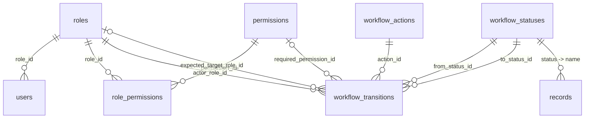

# DB-1 — Dinamik Rol, Yetki ve Workflow Veri Modeli Sözleşmesi

- **Durum:** Kabul edildi
- **Karar tarihi:** 1 Eylül 2026
- **Son güncelleme:** 3 Eylül 2026 — §15 departman veri şekli (ADR-0005 kabulü)
- **Kapsam:** DB-1
- **Mevcut şema tabanı:** Flyway `V1`–`V11` (`V3` tarihsel olarak yoktur)
- **Uygulama durumu:** Uygulandı — `V12`–`V16` migration'ları ve `DbTransitionRuleSource`
  devrede; §17 kabul kriterlerinin tamamı doğrulandı (2 Eylül 2026)

## 1. Amaç

Bu sözleşme rol, yetki ve workflow geçiş verisinin PostgreSQL'de nasıl
tutulacağını kesinleştirir. Yeni migration, entity, repository,
`DbTransitionRuleSource`, seed ve parity testi işleri bu belgeyi kaynak kabul
eder.

Hedef, mevcut sekiz workflow geçişini davranış değiştirmeden veritabanına
taşımak ve bugünkü şemanın ilerideki dinamik rol yönetimi, departman yönlendirme
ve görsel workflow tasarımını engellememesidir.

Bu sözleşmede **zorunludur**, **yasaktır** ve **yalnızca** ifadeleri bağlayıcıdır.
“İleride” veya “ayrı karar gerekir” olarak işaretlenen bölümler mevcut
iterasyonun uygulama kapsamına girmez.

## 2. Sözleşme yazılırken mevcut durum (1 Eylül 2026 snapshot'ı)

> Bu bölüm **tarihsel**tir: sözleşmenin çözmek için yazıldığı başlangıç durumunu
> anlatır. Bugünkü uygulama durumu için §20'ye bakın.

Sözleşme hazırlanırken kod ve şemada aşağıdaki yapı vardı:

- `roles(id, name, description)` ve `users.role_id` kullanılmaktadır.
- Bir kullanıcı tam olarak bir role sahiptir.
- `records.status`, `VARCHAR(50)` olarak Java `RecordStatus` enum adını tutar ve
  `chk_records_status` ile altı değere sınırlandırılmıştır.
- Yedi aksiyon ve sekiz geçiş Java'daki `TransitionRules` tablosunda statik
  olarak tanımlıdır.
- `WorkflowAction`, yorum zorunluluğu ve beklenen hedef rol gibi bazı davranışları
  enum üzerinde taşır.
- `RoleName`, `RecordStatus` ve `WorkflowAction` hâlen çalışma zamanında
  kullanılmaktadır.
- Uygulanmış Flyway migration'ları `V1`–`V11` aralığındadır.

Hedef model aşağıdaki çekirdeği ekler:

```text
roles
permissions
role_permissions

workflow_statuses
workflow_actions
workflow_transitions

users
records
```

## 3. Bağlayıcı mimari kararlar

1. `roles.id`, foreign key'lerde ve API'lerin yönetim işlemlerinde kullanılan
   **ilişkisel rol kimliğidir**. Rol adı kimlik olarak kullanılmaz.
2. Yerleşik bir role kod tarafından özel anlam verilecekse bu anlam
   `roles.system_key` ile belirtilir. `system_key` değişmez; `name` değişebilir.
3. `users.role_id` korunur. Bu iterasyonda `user_roles` tablosu ve çoklu rol
   modeli yoktur.
4. Permission kataloğu yalnız backend'in uygulayabildiği sabit capability
   kodlarından oluşur. Admin yeni permission kodu üretemez; mevcut permission'ı
   role atar veya rolden kaldırır.
5. Genel HTTP yetkilendirmesi rol adına bağlı `hasRole(...)` kontrollerinden
   permission tabanlı `hasAuthority(...)` kontrollerine taşınır.
6. `workflow_statuses` grafiğin düğümlerini, `workflow_transitions` grafiğin
   kenarlarını temsil eder.
7. Hedef çözüm stratejisi aksiyona değil geçişe aittir.
8. Beklenen hedef rol aksiyona değil geçişe aittir.
9. Workflow geçişinin varlığı, aktör rolü, gerekli permission ve aktörün kayıtla
   ilişkisi birbirinden ayrı koşullardır.
10. Validator saf Java kalır. Validator içine repository, JPA veya Spring
    bağımlılığı girmez; DB erişimi `TransitionRuleSource` adaptörü arkasındadır.
11. `records.status` bu iterasyonda `VARCHAR(50)` kalır. Sabit `CHECK` kaldırılır
    ve `workflow_statuses(name)` foreign key'i eklenir.
12. Uygulanmış `V1`–`V11` migration'ları değiştirilmez. Bütün değişiklikler yeni
    ve ileri yönlü migration'larla yapılır.
13. Workflow designer, draft/publish ve versioning bu iterasyonda uygulanmaz.
    Versioning olmadan aktif workflow grafiğini değiştiren bir admin arayüzü
    açılmaz.
14. Departman üyeliğindeki rolün global mi, üyelik kapsamlı mı olacağı ayrı bir
    karardır; bu sözleşme o kararı varsaymaz.

## 4. Kimlik ve adlandırma kuralları

Üç farklı kimlik türü birbirine karıştırılmamalıdır:

| Alan | Anlam | Değişebilir mi? | Kod tarafından kullanımı |
| --- | --- | --- | --- |
| `roles.id` | İlişkisel rol kimliği | Hayır | FK ve yönetim API'leri |
| `roles.system_key` | Yerleşik rolün semantik anahtarı | Hayır | Yalnız gerçekten sistem anlamı gereken davranışlar |
| `roles.name` | Kullanıcıya gösterilebilen rol adı | Evet | Yetkilendirme veya workflow kimliği olarak kullanılmaz |
| `permissions.code` | Backend capability anahtarı | Hayır | Spring authority ve policy kontrolleri |
| `workflow_statuses.name` | Teknik durum anahtarı | Hayır | Bu iterasyonda API, enum uyumu ve `records.status` FK'si |
| `workflow_actions.name` | Teknik aksiyon anahtarı | Hayır | Bu iterasyonda API ve enum uyumu |

`roles.id` birincil anahtar olsa da yerleşik rolün iş anlamı değildir. Örneğin
farklı ortamlardaki `BASKAN` satırlarının sayısal ID'lerinin aynı olması
beklenmez; değişmez semantik anahtar `system_key = 'BASKAN'` değeridir.

İlk geçiş migration'larında mevcut `roles.name` değerleri korunmalıdır. Kodun
`RoleName.valueOf(roles.name)` bağımlılığı kaldırılmadan bu değerler kullanıcı
dostu adlara çevrilemez.

## 5. Hedef varlık ilişkileri



## 6. Tablo sözleşmeleri

### 6.1. `roles`

Mevcut tablo aşağıdaki kolonlarla genişletilir:

| Kolon | Tip | Null | Varsayılan | Sözleşme |
| --- | --- | --- | --- | --- |
| `id` | `INTEGER` | hayır | mevcut identity/sequence | PK; ilişkisel rol kimliği |
| `name` | `VARCHAR(100)` | hayır | — | Kullanıcıya gösterilen ve yönetilebilen ad; benzersiz |
| `description` | `VARCHAR(255)` | evet | — | İnsan okur açıklaması |
| `system_key` | `VARCHAR(50)` | evet | — | Yerleşik roller için değişmez ve benzersiz anahtar |
| `is_system` | `BOOLEAN` | hayır | `FALSE` | Sistem rolü olup olmadığı |
| `is_workflow_actor` | `BOOLEAN` | hayır | `FALSE` | Rolün workflow aktörü olarak seçilip seçilemeyeceği |
| `max_users` | `INTEGER` | evet | — | `NULL` sınırsız; doluysa en az `1` |
| `is_active` | `BOOLEAN` | hayır | `TRUE` | Yeni atama ve yetkilendirmede kullanılabilirlik |

Zorunlu kısıtlar:

```text
PRIMARY KEY (id)
UNIQUE (name)
UNIQUE (system_key)
CHECK (max_users IS NULL OR max_users >= 1)
CHECK (
  (is_system = TRUE  AND system_key IS NOT NULL) OR
  (is_system = FALSE AND system_key IS NULL)
)
```

Davranış kuralları:

- Kullanılmış bir rol fiziksel olarak silinmez; `is_active = FALSE` yapılır.
- `is_system = TRUE` olan rol fiziksel olarak silinmez ve `system_key` değeri
  değiştirilemez.
- `max_users` sayımına yalnız aktif kullanıcılar girer.
- `max_users` genel bir `CHECK` ile doğrulanamaz. Kullanıcı oluşturma, rol
  değiştirme, etkinleştirme ve koltuk devri aynı transaction içinde bu sınırı
  kilitli biçimde doğrulamalıdır.
- WF-2C1 bu kontrolü bootstrap dahil `RoleCapacityService` ile uygular: mevcut
  kullanıcılar UUID, ardından rol satırları ID sırasıyla `PESSIMISTIC_WRITE`
  kilitlenir. Devirde iki kullanıcının net etkisi birlikte hesaplanır; kayıt
  devri ve audit aynı transaction'a dahildir.
- `is_active = FALSE` rol yeni kullanıcıya atanamaz ve o roldeki kullanıcıya
  yeni authority verilmez.

İlk migration sonrası yerleşik rol verisi:

| Mevcut `name` | `system_key` | `is_system` | `is_workflow_actor` | `max_users` | `is_active` |
| --- | --- | --- | --- | --- | --- |
| `CALISAN` | `CALISAN` | `TRUE` | `TRUE` | `NULL` | `TRUE` |
| `BASKAN_YARDIMCISI` | `BASKAN_YARDIMCISI` | `TRUE` | `TRUE` | `1` | `TRUE` |
| `BASKAN` | `BASKAN` | `TRUE` | `TRUE` | `1` | `TRUE` |
| `ADMIN` | `ADMIN` | `TRUE` | `FALSE` | `1` | `TRUE` |

`name` değerlerinin ilk migration'da korunması bir uyumluluk önlemidir; rol
kimliğinin yeniden `name` olduğu anlamına gelmez.

### 6.2. `permissions`

| Kolon | Tip | Null | Varsayılan | Sözleşme |
| --- | --- | --- | --- | --- |
| `id` | `INTEGER` | hayır | identity/sequence | PK |
| `code` | `VARCHAR(100)` | hayır | — | Değişmez, benzersiz capability anahtarı |
| `display_name` | `VARCHAR(150)` | hayır | — | Admin arayüzünde gösterilen ad |
| `description` | `VARCHAR(255)` | evet | — | Permission'ın uygulamadaki anlamı |
| `is_active` | `BOOLEAN` | hayır | `TRUE` | Yeni atamalarda kullanılabilirlik |

Zorunlu kısıtlar:

```text
PRIMARY KEY (id)
UNIQUE (code)
CHECK (code = UPPER(code))
```

Permission yönetimi:

- Yeni `code` yalnız backend desteği ve Flyway seed migration'ı ile eklenir.
- Admin yalnız var olan permission'ları role atayabilir veya rolden kaldırabilir.
- Kullanılmış permission fiziksel olarak silinmez; gerekirse pasifleştirilir.
- Pasif permission authority listesine eklenmez.

Başlangıç capability kataloğu en az aşağıdaki kodları içerir:

```text
RECORD_CREATE
RECORD_VIEW
RECORD_EDIT
RECORD_FORWARD
RECORD_RETURN
RECORD_APPROVE
RECORD_REJECT

USER_VIEW
USER_MANAGE
ROLE_VIEW
ROLE_MANAGE
DEPARTMENT_VIEW
DEPARTMENT_MANAGE
WORKFLOW_VIEW
WORKFLOW_MANAGE
ADMIN_PANEL_ACCESS
```

Bu liste backend'in desteklemediği hayali capability'lerle genişletilemez.
Mevcut controller ve policy'lerin permission'a taşınması sırasında eksik bir
capability görülürse aynı kod değişikliğinde katalog ve seed de güncellenir.

WF-2B (`V17`) bu kataloğa `FILE_MANAGE`, `RECORD_DELETE`, `AUDIT_VIEW` ekler.
İlk ikisi `CALISAN`, sonuncusu `ADMIN` sistem rolüne atanır. Kullanıcıya rol
atama `USER_MANAGE`, iki audit okuma endpoint'i `AUDIT_VIEW` ister; ek
`ADMIN_PANEL_ACCESS` koşulu yoktur. Her JWT isteği güncel aktif permission'ları
yükler; pasif rol erişim sağlayamaz. `ROLE_<rol adı>` authority yayını kaldırılmıştır.

### 6.3. `role_permissions`

| Kolon | Tip | Null | Sözleşme |
| --- | --- | --- | --- |
| `role_id` | `INTEGER` | hayır | FK → `roles.id` |
| `permission_id` | `INTEGER` | hayır | FK → `permissions.id` |

Zorunlu kısıtlar:

```text
PRIMARY KEY (role_id, permission_id)
FOREIGN KEY (role_id) REFERENCES roles(id) ON DELETE CASCADE
FOREIGN KEY (permission_id) REFERENCES permissions(id) ON DELETE CASCADE
```

`role_permissions(permission_id)` için ayrıca indeks oluşturulur; birleşik PK
yalnız `role_id` ile başlayan sorguları verimli karşılar.

İlk rol-permission seed'i en az mevcut workflow davranışını desteklemelidir:

| Rol `system_key` | Zorunlu workflow permission'ları |
| --- | --- |
| `CALISAN` | `RECORD_CREATE`, `RECORD_VIEW`, `RECORD_EDIT`, `RECORD_FORWARD` |
| `BASKAN_YARDIMCISI` | `RECORD_VIEW`, `RECORD_FORWARD`, `RECORD_RETURN` |
| `BASKAN` | `RECORD_VIEW`, `RECORD_APPROVE`, `RECORD_REJECT`, `RECORD_RETURN` |
| `ADMIN` | `USER_VIEW`, `USER_MANAGE`, `ROLE_VIEW`, `ROLE_MANAGE`, `DEPARTMENT_VIEW`, `DEPARTMENT_MANAGE`, `WORKFLOW_VIEW`, `WORKFLOW_MANAGE`, `ADMIN_PANEL_ACCESS`; workflow kayıt permission'ı yoktur |

### 6.4. `workflow_statuses`

| Kolon | Tip | Null | Varsayılan | Sözleşme |
| --- | --- | --- | --- | --- |
| `id` | `INTEGER` | hayır | identity/sequence | PK |
| `name` | `VARCHAR(50)` | hayır | — | Değişmez teknik anahtar |
| `display_name` | `VARCHAR(100)` | hayır | — | Kullanıcıya gösterilen ad |
| `is_terminal` | `BOOLEAN` | hayır | `FALSE` | Son durum; yeni geçiş kabul etmez |
| `is_editable_by_creator` | `BOOLEAN` | hayır | `FALSE` | Kaydı oluşturanın içeriği düzenleyebilmesi |
| `display_order` | `INTEGER` | hayır | — | UI sıralaması; sıfır veya pozitif |
| `is_active` | `BOOLEAN` | hayır | `TRUE` | Yeni geçişlerde kullanılabilirlik |

Zorunlu kısıtlar:

```text
PRIMARY KEY (id)
UNIQUE (name)
CHECK (display_order >= 0)
```

Başlangıç seed'i:

| `name` | `display_name` | `is_terminal` | `is_editable_by_creator` | `display_order` |
| --- | --- | --- | --- | --- |
| `TASLAK` | Taslak | `FALSE` | `TRUE` | `10` |
| `BSK_YRD_INCELEMESINDE` | Başkan Yardımcısı İncelemesinde | `FALSE` | `FALSE` | `20` |
| `BASKAN_INCELEMESINDE` | Başkan İncelemesinde | `FALSE` | `FALSE` | `30` |
| `DUZENLEME_BEKLIYOR` | Düzenleme Bekliyor | `FALSE` | `TRUE` | `40` |
| `ONAYLANDI` | Onaylandı | `TRUE` | `FALSE` | `50` |
| `REDDEDILDI` | Reddedildi | `TRUE` | `FALSE` | `60` |

`name` değerleri bu iterasyonda `RecordStatus` enum'u ve API sözleşmesiyle
birebir aynı kalır. `is_terminal` ve `is_editable_by_creator` DB'ye taşınsa da
enum kaldırılana kadar parity testi iki kaynağın ayrışmasını engeller.

### 6.5. `workflow_actions`

| Kolon | Tip | Null | Varsayılan | Sözleşme |
| --- | --- | --- | --- | --- |
| `id` | `INTEGER` | hayır | identity/sequence | PK |
| `name` | `VARCHAR(60)` | hayır | — | Değişmez teknik anahtar |
| `display_name` | `VARCHAR(120)` | hayır | — | Kullanıcıya gösterilen ad |
| `comment_required` | `BOOLEAN` | hayır | `FALSE` | Aksiyon için boş olmayan açıklama zorunluluğu |
| `is_active` | `BOOLEAN` | hayır | `TRUE` | Yeni geçişlerde kullanılabilirlik |

Zorunlu kısıtlar:

```text
PRIMARY KEY (id)
UNIQUE (name)
```

Başlangıç seed'i:

| `name` | `display_name` | `comment_required` |
| --- | --- | --- |
| `GONDER` | Gönder | `FALSE` |
| `TEKRAR_GONDER` | Tekrar Gönder | `FALSE` |
| `BASKANA_ILET` | Başkana İlet | `FALSE` |
| `CALISANA_GERI_GONDER` | Çalışana Geri Gönder | `TRUE` |
| `BASKAN_YARDIMCISINA_GERI_GONDER` | Başkan Yardımcısına Geri Gönder | `TRUE` |
| `ONAYLA` | Onayla | `FALSE` |
| `REDDET` | Reddet | `TRUE` |

`target_strategy` ve `expected_target_role_id` bu tabloda **bulunmaz**. Aynı
aksiyon farklı geçişlerde farklı hedefe gidebilir.

### 6.6. `workflow_transitions`

| Kolon | Tip | Null | Varsayılan | Sözleşme |
| --- | --- | --- | --- | --- |
| `id` | `INTEGER` | hayır | identity/sequence | PK |
| `from_status_id` | `INTEGER` | hayır | — | FK → `workflow_statuses.id` |
| `action_id` | `INTEGER` | hayır | — | FK → `workflow_actions.id` |
| `actor_role_id` | `INTEGER` | hayır | — | FK → `roles.id` |
| `actor_requirement` | `VARCHAR(40)` | hayır | — | Aktörün kayıtla ilişkisi |
| `to_status_id` | `INTEGER` | hayır | — | FK → `workflow_statuses.id` |
| `expected_target_role_id` | `INTEGER` | evet | — | Çözülen hedef kullanıcı için beklenen rol |
| `target_strategy` | `VARCHAR(40)` | hayır | — | Hedef çözüm primitive'i |
| `required_permission_id` | `INTEGER` | evet | — | FK → `permissions.id`; ek capability koşulu |
| `is_active` | `BOOLEAN` | hayır | `TRUE` | Geçişin çalıştırılabilirliği |

Zorunlu kısıtlar:

```text
PRIMARY KEY (id)

UNIQUE (from_status_id, action_id, actor_role_id)

FOREIGN KEY (from_status_id)
  REFERENCES workflow_statuses(id) ON DELETE RESTRICT
FOREIGN KEY (to_status_id)
  REFERENCES workflow_statuses(id) ON DELETE RESTRICT
FOREIGN KEY (action_id)
  REFERENCES workflow_actions(id) ON DELETE RESTRICT
FOREIGN KEY (actor_role_id)
  REFERENCES roles(id) ON DELETE RESTRICT
FOREIGN KEY (expected_target_role_id)
  REFERENCES roles(id) ON DELETE RESTRICT
FOREIGN KEY (required_permission_id)
  REFERENCES permissions(id) ON DELETE RESTRICT

CHECK (actor_requirement IN (
  'CREATOR',
  'ASSIGNEE',
  'CREATOR_AND_ASSIGNEE'
))

CHECK (target_strategy IN (
  'NONE',
  'ROLE',
  'CREATOR',
  'CURRENT_ASSIGNEE',
  'PREVIOUS_ACTOR'
))

CHECK (
  (target_strategy = 'NONE' AND expected_target_role_id IS NULL) OR
  (target_strategy = 'ROLE' AND expected_target_role_id IS NOT NULL) OR
  (target_strategy IN ('CREATOR', 'CURRENT_ASSIGNEE', 'PREVIOUS_ACTOR'))
)
```

Ek indeksler:

```text
workflow_transitions(action_id)
workflow_transitions(actor_role_id)
workflow_transitions(to_status_id)
workflow_transitions(expected_target_role_id)
workflow_transitions(required_permission_id)
```

`UNIQUE (from_status_id, action_id, actor_role_id)` indeksi
`from_status_id` ile başlayan aramayı da karşılar.

`required_permission_id` kolonunun `NULL` olabilmesi kontrollü bir genişleme
noktasıdır. Bu sözleşmedeki sekiz aktif seed geçişinin tamamında dolu olması
zorunludur. Yeni aktif geçiş permission olmadan oluşturulacaksa bunun gerekçesi
ayrı karar ve test gerektirir.

## 7. Aktör ve hedef primitive'lerinin anlamı

### 7.1. `actor_requirement`

| Değer | Zorunlu koşul |
| --- | --- |
| `CREATOR` | Aktör kimliği `records.created_by` ile aynıdır |
| `ASSIGNEE` | Aktör kimliği `records.assigned_to` ile aynıdır |
| `CREATOR_AND_ASSIGNEE` | İki koşul aynı anda sağlanır |

Rol veya permission sahibi olmak bu koşulların yerine geçmez.

### 7.2. `target_strategy`

| Değer | Bu iterasyondaki kesin anlam |
| --- | --- |
| `NONE` | Hedef kullanıcı yoktur; başarılı geçiş `assigned_to = NULL` yazar |
| `ROLE` | `expected_target_role_id` rolünde tam olarak bir aktif kullanıcı backend tarafından çözülür |
| `CREATOR` | Hedef `records.created_by` kullanıcısıdır |
| `CURRENT_ASSIGNEE` | Hedef geçiş öncesindeki `records.assigned_to` kullanıcısıdır |
| `PREVIOUS_ACTOR` | Mevcut akışta hedef `records.last_deputy_id` ile tutulan, kaydı Başkana ileten son Başkan Yardımcısıdır |

`PREVIOUS_ACTOR` genel bir audit araması anlamına gelmez. Audit tabanlı veya
aksiyon-parametreli geçmiş aktör çözümü eklenmeden bu primitive yalnız mevcut
`last_deputy_id` semantiğiyle kullanılır.

Aşağıdaki değerler gelecek departman çalışması için ayrılmış kavramlardır fakat
bu iterasyonda DB `CHECK` listesine veya runtime'a eklenmez:

```text
DEPARTMENT
DEPARTMENT_ROLE
PARENT_DEPARTMENT
EXPLICIT_USER
```

Desteklenmeyen bir primitive yalnız metin eklenerek etkinleştirilemez. DB
constraint, resolver, validator ve testler aynı değişiklikte genişletilmelidir.

> **Dondurmanın çözülmesi (ADR-0006, Kabul Edildi — 4 Eylül 2026).**
> [ADR-0006](decisions/0006-departman-hedefli-target-strategy.md) yalnız
> **`DEPARTMENT`** değerini açar; `DEPARTMENT_ROLE`, `PARENT_DEPARTMENT`
> ve `EXPLICIT_USER` dondurulmuş kalır. `V18` ile `chk_transition_target_strategy` ve
> `chk_transition_target_strategy_role` kısıtları yeniden oluşturulur; uygulanmış
> `V15` düzenlenmez (§13.1). Karar `DB-13` kapsamındadır ve Workflow V1 teslimine
> dahildir.

## 8. Bağlayıcı sekiz geçiş seed'i

Tabloda bulunmayan veya `is_active = FALSE` olan her
durum–aksiyon–aktör-rolü birleşimi geçersizdir.

| Kaynak durum | Aksiyon | Aktör `system_key` | Aktör ilişkisi | Gerekli permission | Hedef stratejisi | Beklenen hedef rol | Hedef durum |
| --- | --- | --- | --- | --- | --- | --- | --- |
| `TASLAK` | `GONDER` | `CALISAN` | `CREATOR` | `RECORD_FORWARD` | `ROLE` | `BASKAN_YARDIMCISI` | `BSK_YRD_INCELEMESINDE` |
| `DUZENLEME_BEKLIYOR` | `TEKRAR_GONDER` | `CALISAN` | `CREATOR_AND_ASSIGNEE` | `RECORD_FORWARD` | `ROLE` | `BASKAN_YARDIMCISI` | `BSK_YRD_INCELEMESINDE` |
| `BSK_YRD_INCELEMESINDE` | `BASKANA_ILET` | `BASKAN_YARDIMCISI` | `ASSIGNEE` | `RECORD_FORWARD` | `ROLE` | `BASKAN` | `BASKAN_INCELEMESINDE` |
| `BSK_YRD_INCELEMESINDE` | `CALISANA_GERI_GONDER` | `BASKAN_YARDIMCISI` | `ASSIGNEE` | `RECORD_RETURN` | `CREATOR` | `CALISAN` | `DUZENLEME_BEKLIYOR` |
| `BASKAN_INCELEMESINDE` | `ONAYLA` | `BASKAN` | `ASSIGNEE` | `RECORD_APPROVE` | `NONE` | — | `ONAYLANDI` |
| `BASKAN_INCELEMESINDE` | `REDDET` | `BASKAN` | `ASSIGNEE` | `RECORD_REJECT` | `NONE` | — | `REDDEDILDI` |
| `BASKAN_INCELEMESINDE` | `CALISANA_GERI_GONDER` | `BASKAN` | `ASSIGNEE` | `RECORD_RETURN` | `CREATOR` | `CALISAN` | `DUZENLEME_BEKLIYOR` |
| `BASKAN_INCELEMESINDE` | `BASKAN_YARDIMCISINA_GERI_GONDER` | `BASKAN` | `ASSIGNEE` | `RECORD_RETURN` | `PREVIOUS_ACTOR` | `BASKAN_YARDIMCISI` | `BSK_YRD_INCELEMESINDE` |

Bu seed mevcut davranışı şu noktada özellikle korur: `GONDER`,
`TEKRAR_GONDER` ve `BASKANA_ILET` hedefi istemciden alınmaz. Backend ilgili
roldeki tek aktif kullanıcıyı çözer. İstemcinin `targetUserId` göndermesi mevcut
API sözleşmesine göre reddedilmeye devam eder.

Yorum zorunluluğu geçişten değil `workflow_actions.comment_required` alanından
okunur. Böylece iki farklı aktörün kullandığı `CALISANA_GERI_GONDER` aksiyonu
aynı yorum kuralını paylaşır.

## 9. Yetkilendirme değerlendirme sırası

Bir workflow isteği en az aşağıdaki dört koşulu sağlamalıdır:

```text
Aktif transition var mı?
        +
Aktörün role_id değeri transition.actor_role_id ile aynı mı?
        +
Aktörün aktif permission'ları required_permission_id değerini içeriyor mu?
        +
actor_requirement kayıt bağlamında sağlanıyor mu?
```

Bunlara ek olarak yorum, hedef kullanıcı, hedef rol, hedef aktifliği, terminal
durum ve optimistic locking kontrolleri mevcut validator/application-service
sınırlarında uygulanır.

Permission tek başına bir geçişe izin vermez. Örneğin `RECORD_APPROVE`
permission'ı olan ama transition'ın `actor_role_id` değerini taşımayan veya
kaydın atanmış kullanıcısı olmayan aktör geçiş yapamaz.

JWT içindeki rol/permission bilgisi tek doğruluk kaynağı değildir. Authority
listesi aktif rol ve permission atamalarından üretilmeli; rol veya permission
değişikliğinin eski token ömrü boyunca yetkiyi sürdürmesine izin verilmemelidir.

## 10. `users` sözleşmesi

Bu iterasyonda mevcut ilişki korunur:

```text
users.role_id -> roles.id
```

Kurallar:

- `role_id` zorunludur; bir kullanıcı bir ana role sahiptir.
- `user_roles` N:N tablosu oluşturulmaz.
- Kullanıcı oluşturma, rol değiştirme ve yeniden etkinleştirme işlemleri hedef
  rolün `is_active` ve `max_users` kurallarını doğrular.
- Yerleşik rolü bulmak için sayısal ID sabiti veya kullanıcıya gösterilen rol adı
  kullanılmaz; gerektiğinde `system_key` kullanılır.

## 11. `records.status` geçiş sözleşmesi

Kolon bu iterasyonda değişmez:

```text
records.status VARCHAR(50) NOT NULL
```

Migration sırası zorunludur:

1. `workflow_statuses` oluşturulur.
2. Altı mevcut durum seed edilir.
3. Mevcut `records.status` değerlerinin tamamının katalogda bulunduğu doğrulanır.
4. `chk_records_status` kaldırılır.
5. Aşağıdaki foreign key eklenir:

```text
FOREIGN KEY (status)
  REFERENCES workflow_statuses(name)
  ON UPDATE RESTRICT
  ON DELETE RESTRICT
```

`records.status_id` bu iterasyonda eklenmez. Böylece mevcut
`@Enumerated(EnumType.STRING)` eşlemesi ve API sözleşmesi korunurken DB referans
bütünlüğü kazanılır.

`audit_logs.previous_status`, `audit_logs.new_status` ve geçmiş olay metinleri
bu iterasyonda foreign key'e dönüştürülmez; bunlar işlem anındaki değişmez
snapshot değerleridir.

## 12. Silme ve pasifleştirme politikası

| Varlık | Normal kaldırma yöntemi | Fiziksel silme |
| --- | --- | --- |
| Sistem rolü | Kural izin veriyorsa `is_active = FALSE` | Yasak |
| Kullanılmış özel rol | `is_active = FALSE` | FK'ler nedeniyle yasak |
| Hiç kullanılmamış özel rol | Tercihen `is_active = FALSE` | Kontrollü olarak mümkün |
| Permission | `is_active = FALSE` | Kullanılmışsa yasak |
| Workflow status | `is_active = FALSE` | Kayıt/geçiş geçmişi varsa yasak |
| Workflow action | `is_active = FALSE` | Geçiş veya token geçmişi varsa yasak |
| Workflow transition | `is_active = FALSE` | Normal işletimde yapılmaz |

Pasifleştirme geçmiş audit kayıtlarını değiştirmez. Bir satırı pasifleştirmek,
onu kullanan açık workflow kayıtlarının güvenli şekilde tamamlanacağını
kendiliğinden garanti etmez; uygulama servisi etki analizi yapmadan aktif durum,
aksiyon veya geçişin pasifleştirilmesine izin vermemelidir.

## 13. Migration ve rollout sözleşmesi

### 13.1. Flyway

- `V1`–`V11` dosyaları düzenlenmez, yeniden adlandırılmaz veya silinmez.
- Yeni dosyalar sıradaki kullanılmamış version numaralarından başlar; bu belge
  yazılırken ilk uygun numara `V12`'dir.
- Şema, seed ve constraint adımları ileri yönlü migration'larla uygulanır.
- Seed'ler sabit sayısal ID varsaymaz; teknik anahtarlarla satırları çözer.
- Migration sonunda `ddl-auto=validate` başarılı olmalıdır.

### 13.2. Güvenli rollout sırası

1. `roles` geriye uyumlu kolonlarla genişletilir ve yerleşik roller backfill
   edilir.
2. `permissions` ile `role_permissions` oluşturulur ve seed edilir.
3. `workflow_statuses` ile `workflow_actions` oluşturulur ve seed edilir.
4. `workflow_transitions` oluşturulur ve sekiz geçiş seed edilir.
5. `records.status` sabit `CHECK` yerine katalog FK'sine geçirilir.
6. JPA entity/repository katmanı eklenir.
7. `DbTransitionRuleSource`, statik kaynağın davranışını koruyacak biçimde
   devreye alınır.
8. Static–DB parity testi yeşil olmadan statik kaynak kaldırılmaz.
9. Permission authority yükleme ve `hasAuthority(...)` dönüşümü tamamlanır.
10. Rol adına ve `WorkflowAction.expectedTargetRole` alanına bağlı kodlar ayrı,
    gözden geçirilebilir adımlarla kaldırılır.

Şema migration'ı ile `RoleName` enum'unun kaldırılması tek atomik zorunluluk
değildir. Uyumluluk kolonları ve parity testleri aşamalı rollout için vardır.

## 14. Gelecekteki workflow designer sınırı

Bu modelde:

```text
workflow_statuses    = node kataloğu
workflow_transitions = edge kataloğu
```

Ancak bu iterasyondaki tablolar tek yayımlı workflow grafiğini temsil eder.
Görsel düzenleme açılmadan önce en az aşağıdaki model ayrıca kararlaştırılmalıdır:

```text
workflow_definitions
workflow_versions
workflow_version_statuses veya status.version_id
workflow_transitions.version_id
records.workflow_version_id
draft / published / retired yaşam döngüsü
publish-time graph validation
```

Rollout'un on adımının tamamı uygulandı; `WorkflowAction.getExpectedTargetRole()`
kaldırıldı ve workflow kimliği `RoleId`'ye taşındı (§20).

Versioning gelene kadar açık kayıtların kullandığı grafiği yerinde değiştiren
bir admin özelliği yapılmaz. Gelecekte versioning eklenmesi mevcut status,
action ve transition tablolarını atmayı gerektirmemeli; version ilişkileri bu
çekirdeğe eklenmelidir.

WF-8 bu sınır içinde, **sabit bir geçişe dinamik aktör rolü bağlamaya** izin verir.
Yeni satır kaynak geçişin bütün sabit alanlarını kopyalar; yalnız aktör rolü ve
aktiflik yönetilir. Kullanımda olan ve sistem rollerine ait bağlar kaldırılamaz.
Durum/aksiyon/topoloji, hedef stratejisi, hedef rol, permission ve aktör ilişkisi
düzenlemek bu istisnaya girmez. Yeni migration gerekmez; transaction, snapshot ve
AP-8 entegrasyonu [WF-8 sözleşmesinde](WF8_AP8_AKTOR_ROL_BAGLAMA_SOZLESMESI.md) tanımlıdır.

Publish doğrulaması en az şunları kontrol etmelidir:

- başlangıç durumu vardır;
- en az bir terminal durum vardır;
- aktif geçişlerin kaynak/hedef düğümleri aktiftir;
- aktör rolü aktif ve `is_workflow_actor = TRUE` değerindedir;
- gerekli permission aktif ve aktör rolüne atanmıştır;
- target strategy için gerekli alanlar doludur;
- ulaşılamayan durumlar ve istenmeyen döngüler raporlanır.

## 15. Departman modeli — şekil kabul edildi, uygulama Workflow V1 kapsamında

[ADR-0005](decisions/0005-departman-atamasi-ve-akis-kurali.md) (**Kabul Edildi**,
3 Eylül 2026) departman atamasının açık kararlarını kapattı. Bu bölüm o kararların
**veri şeklini** taşır; değerlendirilen seçenekler ve gerekçe ADR'dedir. Şekil
bağlayıcıdır; DDL bu sözleşmenin kendi kapsamında değil, `DB-11` · `DB-12` ·
`DB-13` işleriyle gelir.

> **Zamanlama güncellemesi (4 Eylül 2026).** Bu bölüm yazıldığında departman
> uygulaması "sonraki iterasyon" idi. Plan güncellemesiyle `DB-11`/`DB-12`/`DB-13`
> **10 Eylül Workflow V1 teslim kapsamına** alındı; §16'daki "hemen uygulanması
> istenmez" maddesi departman DDL'i için artık geçerli değildir. Şekil değişmedi,
> yalnız takvim öne alındı.

ADR-0005'ten gelen bağlayıcı kararlar:

- Üyelik kendi rolünü taşımaz; yetki global `users.role_id` ile çözülür. Üyelik
  kapsamlı (scoped) rol açılmaz — §10'daki tek ana rol kararı korunur.
- Bir kullanıcı birden fazla departmana üye olabilir.
- Akış kuralı `(department_id, from_status_id, action_id)` taneciğinde tutulur ve
  bir **rol** işaret eder.
- `records.assigned_to` ile `records.assigned_department_id` global XOR ile değil,
  karşılıklı dışlama `CHECK`'i ile korunur.
- `departments.parent_department_id` kolon olarak açılır; hedef çözümünde
  **kullanılmaz**.

Departman hedefli `target_strategy` sorusu [ADR-0006](decisions/0006-departman-hedefli-target-strategy.md)
ile kapandı (**Kabul Edildi**, 4 Eylül 2026): yalnız `DEPARTMENT` açılır ve
`assigned_department_id`'yi yazan yol `DEPARTMANA_GONDER` aksiyonudur.
`DEPARTMENT_ROLE`, `PARENT_DEPARTMENT` ve `EXPLICIT_USER` ile hiyerarşi üzerinden
eskalasyon **dondurulmuş kalır**.

### 15.1. `departments`

| Kolon | Tip | Null | Varsayılan | Sözleşme |
| --- | --- | --- | --- | --- |
| `id` | `INTEGER` | hayır | identity/sequence | PK |
| `name` | `VARCHAR(150)` | hayır | — | Kullanıcıya gösterilen ad; benzersiz |
| `parent_department_id` | `INTEGER` | evet | — | FK → `departments.id`; yalnız veri, çözümlemede kullanılmaz |
| `is_active` | `BOOLEAN` | hayır | `TRUE` | Yeni atama ve üyelikte kullanılabilirlik |

```text
PRIMARY KEY (id)
UNIQUE (name)
FOREIGN KEY (parent_department_id)
  REFERENCES departments(id) ON DELETE RESTRICT
CHECK (parent_department_id IS NULL OR parent_department_id <> id)
```

Satır içi `CHECK` yalnız kendine referansı engeller. Daha uzun ata döngüleri satır
içi `CHECK` ile görülemez; parent'ı yazan uygulama servisi aynı transaction içinde
ata zincirini yürüyerek döngüyü reddetmelidir. Bu, §6.1'in `max_users` için
tanımladığı kalıbın aynısıdır.

### 15.2. `department_members`

| Kolon | Tip | Null | Sözleşme |
| --- | --- | --- | --- |
| `department_id` | `INTEGER` | hayır | FK → `departments.id` |
| `user_id` | `UUID` | hayır | FK → `users.id` |

```text
PRIMARY KEY (department_id, user_id)
FOREIGN KEY (department_id) REFERENCES departments(id) ON DELETE RESTRICT
FOREIGN KEY (user_id)       REFERENCES users(id)       ON DELETE RESTRICT
```

`user_id` üzerinde UNIQUE **tanımlanmaz**: çoklu üyelik bilinçli olarak açıktır.
Üyelik satırı rol taşımaz; "bu kişi bu adımda yetkili mi" sorusu `users.role_id`
ile kuralın `target_role_id` değeri karşılaştırılarak cevaplanır.

`department_members(user_id)` için ayrıca indeks oluşturulur; birleşik PK yalnız
`department_id` ile başlayan sorguları verimli karşılar.

### 15.3. `department_routing_rules`

| Kolon | Tip | Null | Varsayılan | Sözleşme |
| --- | --- | --- | --- | --- |
| `id` | `INTEGER` | hayır | identity/sequence | PK |
| `department_id` | `INTEGER` | hayır | — | FK → `departments.id` |
| `from_status_id` | `INTEGER` | hayır | — | FK → `workflow_statuses.id` |
| `action_id` | `INTEGER` | hayır | — | FK → `workflow_actions.id` |
| `target_role_id` | `INTEGER` | hayır | — | FK → `roles.id`; kuralın işaret ettiği rol |
| `is_active` | `BOOLEAN` | hayır | `TRUE` | Kuralın çalıştırılabilirliği |

```text
PRIMARY KEY (id)
UNIQUE (department_id, from_status_id, action_id)

FOREIGN KEY (department_id)   REFERENCES departments(id)        ON DELETE RESTRICT
FOREIGN KEY (from_status_id)  REFERENCES workflow_statuses(id)  ON DELETE RESTRICT
FOREIGN KEY (action_id)       REFERENCES workflow_actions(id)   ON DELETE RESTRICT
FOREIGN KEY (target_role_id)  REFERENCES roles(id)              ON DELETE RESTRICT
```

`UNIQUE` kısıtı §6.6'daki `UNIQUE (from_status_id, action_id, actor_role_id)` ile
aynı mantıktadır: bir departman için bir adımda tek kural. Kural satırı veya
işaret edilen rolde aktif üye bulunamazsa uygulama servisi sessizce geçmez;
ADR-0005 bu durum için `WORKFLOW_DEPARTMENT_ROUTING_NOT_CONFIGURED` kodunu önerir
ve bu kod mevcut runtime'da uygulanmış değildir.

### 15.4. `records` atama kolonları

`records` tablosuna `assigned_department_id` eklenir; mevcut `assigned_to`
korunur ve yeniden adlandırılmaz (§16).

| Kolon | Tip | Null | Sözleşme |
| --- | --- | --- | --- |
| `assigned_to` | `UUID` | evet | Mevcut kolon; FK → `users.id` |
| `assigned_department_id` | `INTEGER` | evet | FK → `departments.id` ON DELETE RESTRICT |

```sql
CHECK (assigned_to IS NULL OR assigned_department_id IS NULL)
```

Atama kuralı üç kademelidir ve **yalnız birinci maddesi DDL'e girer**:

1. İkisi birden dolu olamaz — yukarıdaki `CHECK`.
2. Atama gerektiren geçişten sonra tam olarak biri dolu olmalıdır.
3. Atama gerektirmeyen durumda ikisi de `NULL` olabilir.

2. madde satır içi `CHECK` ile zorlanamaz: `CHECK` başka tabloya
(`workflow_statuses`) bakamaz ve "atama gerektiren durum" bilgisi veride yoktur —
`workflow_statuses` yalnız `is_terminal`, `is_editable_by_creator`,
`display_order` ve `is_active` taşır (`V14`), `is_terminal` de bu bilgiyi
türetmeye yetmez (`TASLAK` terminal değildir ama atamasızdır). Bu nedenle 2. madde
uygulama servisinde, atamayı yazan transaction içinde doğrulanır ve beklenti
statüden değil **geçişin `target_strategy` değerinden** türetilir: strateji `NONE`
değilse tam olarak biri dolu olmalıdır, `NONE` ise ikisi de `NULL` kalır.
`workflow_statuses.requires_assignment` kolonu ve trigger **seçilmemiştir**.

Bugünkü sekiz geçişte bu beklenti sağlanır: `BSK_YRD_INCELEMESINDE`,
`BASKAN_INCELEMESINDE` ve `DUZENLEME_BEKLIYOR`'a giren her satır
`ROLE`/`CREATOR`/`PREVIOUS_ACTOR`, `ONAYLANDI` ve `REDDEDILDI`'ye giren her satır
`NONE` taşır (§8).

**Global XOR yasaktır.** "Tam olarak biri dolu" kısıtı bugünkü davranışla
çelişirdi: yeni kayıt `TASLAK` durumunda ve `assigned_to = NULL` ile oluşur,
`ONAYLA` ve `REDDET` ise `target_strategy = NONE` ile atamayı `NULL`'a çeker.
Global XOR konsaydı hiçbir kayıt oluşturulamazdı.

## 16. Kapsam dışı

Bu sözleşme aşağıdakilerin hemen uygulanmasını istemez:

- drag-and-drop workflow editörü;
- workflow draft/publish/versioning;
- çoklu kullanıcı rolü;
- admin tarafından yeni permission türü oluşturma;
- ~~departman üyelik ve routing DDL'i~~ — **Workflow V1 kapsamına alındı**
  (4 Eylül 2026 plan güncellemesi); bkz. §15;
- `records.assigned_to` kolonunun yeniden adlandırılması;
- audit tablolarının yeniden modellenmesi;
- mevcut enumların tek adımda kaldırılması;
- mevcut sekiz geçişin iş davranışının değiştirilmesi.

## 17. Kabul kriterleri

DB-1'in uygulama işleri ancak aşağıdaki koşullar sağlandığında tamamlanmış
sayılır:

- [x] Yeni tablolar ve kolonlar bu sözleşmedeki nullability, FK, unique, check
      ve indeks kurallarına uyar.
- [x] `V1`–`V11` dosyalarının checksum'ı değişmemiştir.
- [x] Dört yerleşik rol doğru `system_key` ve davranış alanlarıyla backfill
      edilmiştir.
- [x] Permission kataloğu ve başlangıç role-permission eşlemeleri seed edilmiştir.
- [x] Altı status, yedi action ve sekiz transition eksiksiz seed edilmiştir.
- [x] Sekiz aktif transition'ın `required_permission_id` değeri doludur.
- [x] `records.status` verisi korunmuş; sabit `CHECK` yerine katalog FK'si
      çalışmaktadır.
- [x] Static kaynak ile DB kaynağı aynı sekiz kuralı üretir.
- [x] Eksik, fazla veya farklı tek bir DB geçişi parity testini düşürür.
- [x] Validator repository/JPA/Spring bağımlılığı almamıştır.
- [x] Mevcut workflow regresyon testleri davranış değişmeden geçer.
- [x] `GONDER`, `TEKRAR_GONDER` ve `BASKANA_ILET` hedefi backend tarafından
      çözülmeye devam eder; istemciden hedef kabul edilmez.
- [x] `ONAYLA` ve `REDDET` sonunda `assigned_to = NULL` kalır.
- [x] Başkanın yardımcıya geri gönderme hedefi mevcut `last_deputy_id`
      semantiğini korur.
- [x] `docs/database.md` ve `docs/workflow.md`, uygulama değişikliğiyle aynı
      kapsamda güncellenir.

## 18. İnceleme sırasında netleştirilen noktalar

Referans DB-1 önerisi bu sözleşmeye dönüştürülürken aşağıdaki belirsizlikler
giderilmiştir:

1. “`roles.id` gerçek business identity'dir” ifadesi ayrıştırıldı. `id`
   ilişkisel kimliktir; yerleşik rolün değişmez semantik kimliği `system_key`dir.
2. Mevcut dokümandaki “istekteki Başkan Yardımcısı” anlatımı güncel kodla
   uyumlu hale getirildi. Hedef kullanıcıyı istemci değil backend çözer.
3. Pasifleştirme ihtiyacı yalnız role değil status ve action kataloglarına da
   uygulandı; geçmişi olan katalog satırlarının silinmesi engellendi.
4. `target_strategy` için bu iterasyonda gerçekten uygulanacak değerler ile
   geleceğe ayrılan departman değerleri ayrıldı.
5. `PREVIOUS_ACTOR` mevcut `records.last_deputy_id` davranışıyla sınırlandı;
   belirsiz bir audit geçmişi taraması olarak tanımlanmadı.
6. Aktif sekiz geçişte `required_permission_id` değerinin boş olamayacağı kabul
   kriterine bağlandı.
7. Versioning olmadan aktif grafiği düzenleyen bir admin arayüzünün güvenli
   olmadığı açıkça sözleşmeye eklendi.

## 19. İlgili kaynaklar

- [`database.md`](database.md) — uygulanmış mevcut PostgreSQL şeması
- [`workflow.md`](workflow.md) — mevcut workflow davranışı ve API sözleşmesi
- `backend/src/main/resources/db/migration/` — şemanın mevcut tek uygulama
  otoritesi
- `backend/src/test/java/btk/staj/WorkFlowProject/workflow/statemachine/TransitionRules.java`
  — sekiz kuralın parity ve veritabanısız test referansı; `TZ-1` ile test ağacına
  taşındı, production artifact'ında yer almaz
- `backend/src/main/java/btk/staj/WorkFlowProject/workflow/statemachine/TransitionRuleSource.java`
  — statik ve DB-backed kaynakların portu

## 20. Güncel uygulama sınırları ve kanıtlar

*Son doğrulama: 3 Eylül 2026, `test` @ `aa113f1` (PR #64 dahil).*

| Konu | Durum / kanıt |
| --- | --- |
| Şema ve seed | `V12`–`V17`; 6 durum, 7 aksiyon, 8 başlangıç geçişi; 19 permission ve 23 rol-permission seed eşlemesi |
| Permission + kapasite | `AuthenticatedUserFactory`, `RoleCapacityService`; WF-2B / WF-2C1 kapanışı WF2A envanteri §18.8'de |
| Aktör ve hedef kimliği | `TransitionRule`, `CurrentActor`, `TransitionContext`, kullanıcı portu, audit ve event modellerinde `RoleId`; PR #61 / #60 |
| Canlı kural yenileme | `ReloadableTransitionRuleSource`, `WorkflowRuleAdminController`; PR #56. Bean sarmalayıcıdır, sardığı snapshot `DbTransitionRuleSource`'tur |
| Aktör rolü bağlama | WF-8 `WorkflowActorBindingService`: mevcut geçişe dinamik rol, kullanımda kaldırma koruması, transaction/audit ve commit sonrası snapshot. AP-8 HTTP/UI ayrı teslimdir |
| Dinamik rol kanıtı | `DynamicWorkflowRoleIntegrationTest`: 11 PostgreSQL/HTTP senaryosu |
| Görünürlük | [WF-2C2 / DB-8 sözleşmesi](WF2C2_DB8_GORUNURLUK_SOZLESMESI.md) mevcut şemada uygulanmıştır: RoleId aktörü, ortak scope ve dinamik rol okuma erişimi. Departman query/runtime ve V1 kabulü açık; yeni migration eklenmedi |
| Admin paneli | PR #57 rol listesi getirir. Rol CRUD, permission matrisi ve durum katalog ekranı teslim edilmiş değildir |
| Statik kaynak | `TZ-1` **tamamlandı**: `TransitionRules` ve `StaticTransitionRuleSource` test ağacına taşındı ve production jar'ından çıktı. Parity oracle'ı ve invariantlar korundu; invariantlar artık veritabanı kaynağı üzerinde de koşuyor |
| Atama sözleşmesi | `TransitionContext.actorHoldsAssignment` (`WF-5` ile yeniden adlandırıldı); departman anlamı `WF-6` ile gelecek |
| Departman | ADR-0005 **Kabul Edildi**; veri şekli §15'te. `assigned_department_id`'yi yazan gönderim yolu ADR-0006'ya bırakıldı |

Test kanıtı: bu doğrulamada tam süit **646 test / 0 failure / 0 error / 0 skipped**
(TZ-1 öncesi kayıt 639; `TZ-1`'in eklediği kaynak-agnostik invariantlar ve mutasyon
testleriyle arttı). Uzak CI ve TEST sunucusu doğrulaması ayrıca yapılır.
