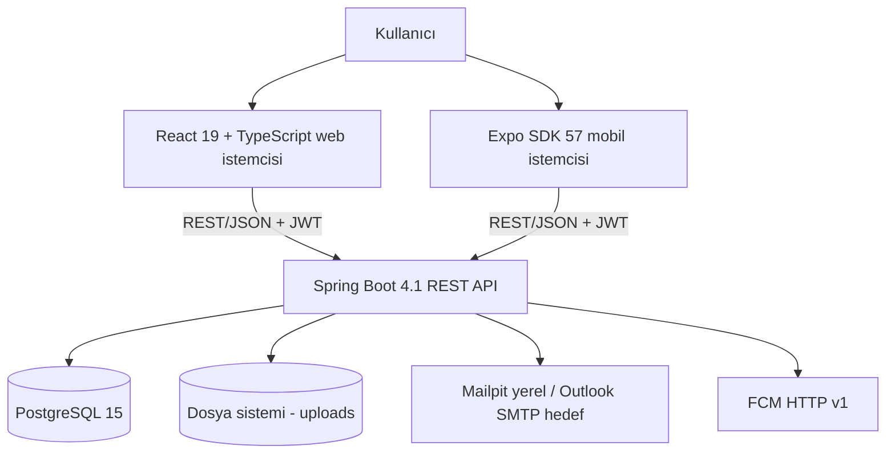
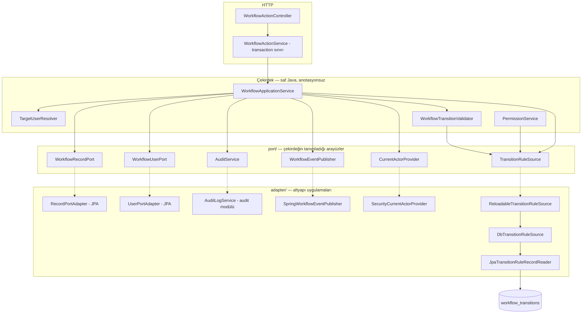

# Sistem Mimarisi

Bu belge İş Akışı ve Onay Yönetim Sistemi'nin **çalışan mimarisini** tanımlar. Hedef durumu değil, koda bakılarak doğrulanmış mevcut yapıyı anlatır. Modül sınırları, katmanlama veya bağımlılık yönü değiştiğinde belge aynı değişiklik kapsamında güncellenir.

4 Eylül 2026, `codex/ap-2-frontend-uyum` @ `c9b0297` tabanı incelenmiştir. Hazır
teslimler ve açık bağlantılar [dokümantasyon dizininde](README.md) özetlenir.
Doğrulanmış davranış problemleri aşağıdaki
[Bilinen mimari boşluklar](#bilinen-mimari-boşluklar) bölümünde `B`-kimlikleriyle
işaretlidir.

## İçindekiler

- [Sistem bağlamı](#sistem-bağlamı)
- [Backend modül sınırları](#backend-modül-sınırları)
- [Katmanlama kuralları](#katmanlama-kuralları)
- [Workflow çekirdeği: port ve adapter](#workflow-çekirdeği-port-ve-adapter)
- [Kesişen konular](#kesişen-konular)
- [Veri ve dosya yönetimi](#veri-ve-dosya-yönetimi)
- [Yerel çalışma topolojisi](#yerel-çalışma-topolojisi)
- [Güvenlik sınırları](#güvenlik-sınırları)
- [Bilinen mimari boşluklar](#bilinen-mimari-boşluklar)

## Sistem bağlamı



Web istemcisi ile sunucu ayrı origin'lerde çalışır; erişim `CORS_ALLOWED_ORIGINS`
ile açıkça listelenen origin'lere sınırlıdır (`common/config/CorsConfig`). Mobil
istemci native HTTP kullanır. Kimlik doğrulama JWT taşıyıcı token ile yapılır,
oturum durumu sunucuda tutulmaz; yalnız refresh token'ları `tokens` tablosunda
izlenir ve iptal edilebilir.

## Backend modül sınırları

Ana paket `btk.staj.WorkFlowProject`. `department` entity/repository katmanını
sağlar; workflow runtime bağlantısı `workflow` içindeki adapter'lar üzerinden
kurulmuştur. Departmanın **yönetim HTTP uçları hâlâ yoktur** (`AP-4`/`AP-5`):
departman, üyelik ve routing yalnız veritabanından değiştirilebilir.

| Modül | Sınır | Dışa açtığı |
| --- | --- | --- |
| `auth` | Giriş, token yenileme, çıkış, parola değiştirme | `/api/auth/**`, `JwtAuthenticationFilter` |
| `user` | Kullanıcı oluşturma, rol atama, aktiflik, koltuk devri | `/api/admin/**`, `/api/users/me` |
| `rbac` | Rol tanımı, işlem yetkisi, kayıt görünürlük politikası, güvenlik yapılandırması | `RecordAccessPolicy`, `PermissionService`, `SecurityConfig` |
| `record` | Kayıt ve kategori yaşam döngüsü, taslak, soft delete | `/api/records`, `/api/categories` |
| `department` | Departman, çoklu üyelik ve routing kalıcılığı | Entity/repository; yönetim HTTP ucu yok (`AP-4`/`AP-5` açık) |
| `workflow` | İzinli durum geçişleri, hedef çözümleme, atama ve aktör rolü bağlama | `/api/records/{id}/workflow/actions`, `/api/workflow/rules/reload`, Java `WorkflowActorBindingService` |
| `attachment` | Dosya içerik doğrulama, saklama, erişim | `/api/records/{id}/files`, `/api/files/**` |
| `audit` | Değiştirilemez işlem geçmişi (kayıt ve kullanıcı) | `/api/audit-logs/**`, `/api/user-audit-logs/**` |
| `search` | Kriter tabanlı filtreleme, sayfalama, görünürlük kapsamı | `RecordSearchService`, `RecordSpecifications` |
| `notification` | Uygulama içi bildirim, cihaz tokenı, FCM push ve güvenli e-posta hızlı işlem | `/api/notifications/**`, `/api/device-tokens`, `/api/public/mail-actions/**` |
| `common` | Ortak hata sözleşmesi, sayfalama DTO'su, CORS | `ApiError`, `GlobalExceptionHandler`, `PagedResponse` |

İki sınır kararı ayrıca not edilmelidir:

- **Durum geçişlerini `workflow` uygular.** `record` yeni kaydı `TASLAK` ile oluşturur; sonraki CRUD güncellemeleri içerik alanlarıyla sınırlıdır.
- **Listeleme ve görünürlük kapsamı tek yerdedir.** `RecordController.getAllRecords` kendi filtre mantığını tutmaz; `RecordSearchService`'e devreder. Aynı erişim kuralının iki yerde yazılıp birinin unutulmasını önlemek için bu bilinçli bir tercihtir.

## Katmanlama kuralları

```text
controller -> service/domain -> repository
                    │
                    ├── audit
                    └── notification
```

- Controller katmanı yalnız HTTP sözleşmesi, doğrulama ve yanıt eşlemesiyle ilgilenir.
- İş kuralları ilgili servis veya domain katmanında tutulur.
- Yetki ve kayıt görünürlüğü backend'de uygulanır; istemci kontrolleri güvenlik sınırı değildir.
- Dış modüller başka bir modülün repository katmanına doğrudan bağlanmak yerine o modülün servis sınırını kullanır.
- Ortak hata yanıtları ve çapraz kesen yapılandırmalar `common` altında tutulur.

`workflow` bu şemanın tek istisnasıdır ve aşağıda ayrıca anlatılır.

## Workflow çekirdeği: port ve adapter

Onay akışı, projenin iş kuralı yoğunluğu en yüksek parçasıdır. Bu yüzden çekirdeği altyapıdan ayrılmıştır: **durum makinesi ve uygulama servisi Spring'i, JPA'yı ve HTTP'yi bilmez.**



Bağımlılık yönü kritik: **oklar çekirdekten dışarı, kesikli oklar dışarıdan içeri bakar.** Portları çekirdek tanımlar, altyapı uygular. Bu, bağımlılığı tersine çevirir ve çekirdeğin veritabanı, Spring context'i veya HTTP olmadan test edilmesini sağlar.

Yapının üç somut sonucu:

| Karar | Sonuç |
| --- | --- |
| Çekirdek sınıfları `@Service` taşımaz | `new` ile örneklenip test edilir; bean tanımları `WorkflowConfiguration`'da dışarıdan yapılır |
| Kural tüketicileri `TransitionRuleSource` kullanır | Validator ve yetki servisi kural kaynağına doğrudan bağlanmaz; güncel adapter kuralları `workflow_transitions` tablosundan okur. Kurallar açılışta bir kez okunup belleğe alınır; `ReloadableTransitionRuleSource` bunu yeniden başlatmadan tazeleyebilir ve tazeleme başarısız olursa **eski snapshot yerinde kalır** |
| Transaction sınırı ayrı bir sınıfta (`WorkflowActionService`) | Çekirdek Spring bilmediği için transaction'ı kendisi açamaz; kayıt güncellemesi ve audit yazımı ya birlikte olur ya hiç olmaz |

Bir geçişin sırası: tek kural snapshot'ını al → aktörü oku → kaydı bul → **ön doğrulama** → geçiş kuralını bul → hedefi çöz → **nihai doğrulama** → kaydı güncelle → audit yaz → olay yayınla. İki doğrulama ve kural/hedef seçimi aynı snapshot'ı kullanır. Yetkisiz istek hedef sorgusundan önce elenir; başlamış işlem araya reload girse de eski snapshot ile tamamlanır.

WF-8'in Spring yönetim servisi bu saf çekirdekten ayrıdır. Bağ değişikliği kendi
transaction'ında audit ile yazılır; flush sonrası hazırlanan doğrulanmış snapshot
yalnız başarılı commit'te yayınlanır. Manuel reload aynı koordinatörü kullanır.
Bu koordinasyon tek backend instance'ı içindir; dağıtık invalidation uygulanmadı.

Ayrıntı için [workflow.md](workflow.md).

## Kesişen konular

| Konu | Uygulama | Not |
| --- | --- | --- |
| Hata yönetimi | `common/exception/GlobalExceptionHandler` (`@RestControllerAdvice`) | Tüm hatalar tek `ApiError` biçiminde döner; workflow hata kodları burada HTTP durumlarına eşlenir |
| Kimlik doğrulama | `auth/security/JwtAuthenticationFilter` | Pasif hesabı ve parola değişimi bekleyen kullanıcıyı zincirin başında durdurur |
| Yetkilendirme | `@PreAuthorize("hasAuthority(...)")` + `RecordAccessPolicy` | Uç yetkileri rol adına değil **permission koduna** bağlıdır (`USER_MANAGE`, `RECORD_CREATE`, `AUDIT_VIEW`, …); authority listesi her istekte `role_permissions`'tan üretilir. Workflow ucunda kontrol bilinçli olarak controller'da değil durum makinesindedir |
| Denetim izi | `AuditLogService`, workflow transaction'ı **içinde** | Geçiş geri alınırsa audit satırı da geri alınır |
| Uygulama içi bildirim | `@EventListener`, transaction **içinde** | Geçişle birlikte yazılır veya hiç yazılmaz |
| E-posta | `@TransactionalEventListener(AFTER_COMMIT)` + `@Async` | Geri alınabilir bir işlem için dışarıya e-posta çıkmasın diye commit sonrası; gönderim best-effort |
| Push | Aynı `AFTER_COMMIT` listener içinde `PushNotificationService` | `recipientsOf` alıcı matrisi kullanılır; FCM yapılandırılmamışsa workflow push olmadan devam eder |
| E-posta hızlı işlem | `mail_action_tokens` + `/api/public/mail-actions/preview` ve `/consume` | Anahtar süreli, tek kullanımlık ve alıcı/kayıt/aksiyona bağlıdır; preview mutasyon yapmaz |
| Loglama | `logback-spring.xml` | Konsola düz metin, dosyaya ECS şemasında JSON (`StructuredLogEncoder`); `dev` profilinde DEBUG, diğerlerinde INFO |

## Veri ve dosya yönetimi

- PostgreSQL şemasının tek otoritesi Flyway'dir; şema Hibernate tarafından üretilmez.
- Hibernate `ddl-auto=validate` ile yalnız entity–şema uyumunu doğrular. Uyumsuzluk uygulamayı açılışta durdurur.
- Open Session in View kapalıdır; gerekli ilişkiler servis işlemi içinde yüklenmelidir.
- Yüklenen dosyalar veritabanında ikili veri olarak tutulmaz. Disk üzerinde GUID tabanlı `stored_name` ile saklanır, kullanıcıya gösterilen `original_name` ve diğer metadata veritabanındadır.
- Dosya türü istemcinin gönderdiği `Content-Type` başlığına değil, Apache Tika ile **içerikten** tespit edilen türe göre doğrulanır.
- Kayıt silme soft delete'tir (`records.deleted_at`); workflow ve okuma uçları silinmiş kaydı `404` sayar.

Şema ayrıntıları için [database.md](database.md).

## Yerel çalışma topolojisi

Docker Compose varsayılan olarak üç servis başlatır:

| Servis | Bağımlılık / veri | Port |
| --- | --- | --- |
| `db` | `db-data-pg15` volume | Host `127.0.0.1:${DB_PORT:-5432}` → container `5432`; testten önce gerçek port doğrulanır |
| `mailpit` | Yerel SMTP yakalayıcı | `1025`, Web UI `8025` |
| `backend` | Sağlıklı `db`, `uploads` volume | Temel dosyada `0.0.0.0:8080` (LAN + localhost); TEST overlay'inde host portu kaldırılır |

Frontend servisi `frontend` profili arkasındadır ve `docker compose --profile frontend up` ile başlatılır. Uygulama `VITE_API_BASE_URL` üzerinden gerçek backend'e bağlanır; MSW yalnızca Vitest testlerinde kullanılır.

## Güvenlik sınırları

Aşağıdakiler uygulanmış davranışlardır:

- Kullanıcı oluşturma ve rol atama uçları `USER_MANAGE` ister; gerekli permission'a sahip dinamik rol de çağırabilir. Yeni kullanıcı varsayılan `CALISAN` sistem rolüyle başlar; başlangıç rolü dışarıdan seçilemez (`UserService.createUser`).
- Sonraki rol ataması ayrı ve audit'lenen `changeRole` işlemiyle yapılır; rol aktifliği ve kapasite kontrolleri uygulanır.
- Bu üç rol **tekildir**: aynı anda yalnız bir aktif kullanıcı tutabilir. Tekillik artık kodda sabit bir rol listesiyle değil, `roles.max_users` kolonuyla taşınır (`V12`; üçü için değer `1`).
- Kapasite kontrolü ortak `RoleCapacityService` içindedir; oluşturma, bootstrap, rol değiştirme, yeniden etkinleştirme ve yardımcı devri aynı yolu kullanır. Pasif tekil rol sahibi yeniden etkinleştirilirken de çalışır; aynı rolde başka aktif kullanıcı varsa yazma işlemi reddedilir.
- Admin rolü tek başına iş akışı kayıtlarına erişim vermez; `RecordAccessPolicy` Admin için boş kapsam üretir.
- Başlangıç seed'inde onay/ret aktörü Başkan'dır. WF-8 ile aynı geçişe bağlanmış dinamik rol de gerekli permission ve doğrudan atama ilişkisiyle işlem yapabilir; rol adı tek başına yetki sağlamaz.
- Admin hesabı aktiflik ucundan pasifleştirilemez (`UserService.setActive`).
- Parolalar yalnız tek yönlü hash ile saklanır; sırlar ortam değişkenlerinden okunur, repository'ye yazılmaz.
- İlk Admin yalnız `BOOTSTRAP_ADMIN_EMAIL` ve `BOOTSTRAP_ADMIN_PASSWORD` birlikte verildiğinde **ve sistemde aktif Admin yokken** oluşturulur; hesap parola değiştirme zorunluluğuyla açılır.

## Bilinen mimari boşluklar

- **Son Admin'in rolü korunmuyor.** `setActive` Admin hesabının pasifleştirilmesini engelliyor, ancak `changeRole` sistemdeki tek Admin'in rolünü başka bir role çevirmeyi engellemiyor. Tekil rol kontrolü yalnız bir role *girerken* çalışıyor, *çıkarken* değil. Sistem yönetimsiz kalabilir.
- **Audit append-only kuralı veritabanında zorlanmıyor.** Uygulama güncelleme veya silme ucu sunmuyor, fakat DB trigger'ı ya da rol kısıtı yok.
- **E-posta teslim garantisi yok.** Gönderim asenkron ve best-effort; retry, outbox veya DLQ bulunmuyor.
- **ADR kapsamı seçicidir.** Dizinde altı ADR bulunur; rol kapasitesi ve tekillik ADR-0007'de karara bağlanmıştır. Port/adapter sınırı bu belgede gerekçelendirilir. ADR-0003'ün rol kapsamı/tekillik önerisinin yerine ADR-0005/0007 geçmiştir; dizindeki her kabul edilmiş kararın runtime'ı tamamlanmış değildir.

- **Departman runtime'ı bağlıdır; yönetim ve istemci katmanı değildir.** Görünürlük ortak `RecordVisibilityScope` üzerinden tekil policy ve SQL predicate üretir. Şema/entity/repository V18–V22, gönderim stratejisi/aksiyonu/seed'leri V23 ile hazırdır. `DepartmentRoutingResolver`, `DepartmentRoutingAdapter` (`DepartmentRoutingPort`) ve `DepartmentVisibilityAdapter` (`DepartmentVisibilityPort`) runtime'ı bağlar; validator DB bağımlılığı almaz. Açık kalanlar: departman/üyelik/routing yönetim uçları (`AP-4`/`AP-5`), NT-5 alıcı fan-out'u ve istemci departman seçicisi. Sınırlar ve DB-8 entegrasyonu: [WF-2C2 sözleşmesi](WF2C2_DB8_GORUNURLUK_SOZLESMESI.md).
- **Geçiş grafiği arayüzden düzenlenemiyor.** WF-8'in Spring yönetim servisi mevcut geçişlere dinamik aktör rolü bağlar; topoloji, routing, permission ve aktör ilişkisini değiştirmez. AP-8 HTTP/UI entegrasyonu açıktır. Bağ yazımı ve audit tek transaction'dadır; reload ile ortak koordinatör doğrulanmış snapshot'ı commit sonrası yayınlar. Saf workflow çekirdeği işlem başına bir snapshot kullanır. Grafik topolojisini düzenlemek Workflow V2/versioning kapsamındadır (DB-1 §14). [WF-8 sözleşmesi](WF8_AP8_AKTOR_ROL_BAGLAMA_SOZLESMESI.md).
- **Atama bilgisi yanıt DTO'larında taşınmıyor.** [Sözleşme karara bağlandı](APP9_APP10_B11_ISTEMCI_SOZLESMESI.md#3-b11--ortak-atama-sözleşmesi); uygulama açık. `records.assigned_department_id` yazılır ve sorgulanır; `RecordResponse`, `RecordSearchResponse` ve `WorkflowActionResponse` bu alanı döndürmez. `WorkflowTransitionAudit` de departman hedefini taşımaz, bu yüzden bir kaydın hangi departmana gönderildiği kalıcı geçmişten okunamaz (B11/B12).
- **İstemci workflow yetkisi ikinci kez istemcide kuruluyor.** [APP-9 sözleşmesi](APP9_APP10_B11_ISTEMCI_SOZLESMESI.md#1-app-9--kullanılabilir-aksiyonlar) bunu tek kaynağa bağlar; uygulama açık. Web aksiyon paneli düğmeleri `systemKey` sabitlerine bağlıdır; `systemKey=null` olan dinamik rol için panel kapanır. Backend'in hesapladığı kullanılabilir aksiyon bilgisi istemciye sunulmamaktadır (B10).
- **Eşzamanlılık koruması bazı yazma yollarında eksiktir.** Görev devri ve `last_deputy_id` toplu JPQL güncellemeleri `records.version` değerini artırmaz; dosya yükleme kayıt sürümüne dokunmaz ve `RecordLockValidator` isminin aksine kilit almaz; refresh token tüketimi satır kilidi veya koşullu UPDATE kullanmaz (B03/B04/B05).
- **WebSocket bildirim kanalı yoktur.** Bildirimler REST/polling ile taşınır.
