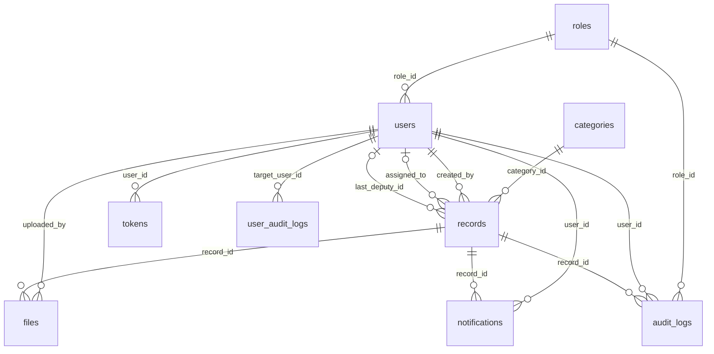

# Veritabanı Tasarımı

Bu belge PostgreSQL şemasını, tasarım kararlarını ve migration yönetimini tanımlar. Kaynağı `backend/src/main/resources/db/migration/` altındaki Flyway dosyalarıdır.

> Son kod doğrulaması 19 Ağustos 2026 tarihinde `test` dalının `2b5016a` commit'i üzerinde yapılmıştır. Şema değiştiğinde bu belge aynı değişiklik kapsamında güncellenmelidir.

- **Veritabanı:** PostgreSQL 15.18
- **Migration:** Flyway (`V1`–`V7`)
- **ORM:** Spring Data JPA / Hibernate, `ddl-auto=validate`

## İçindekiler

- [Tasarım ilkeleri](#tasarım-ilkeleri)
- [Varlık ilişki diyagramı](#varlık-ilişki-diyagramı)
- [Tablo sözlüğü](#tablo-sözlüğü)
- [Foreign key silme politikaları](#foreign-key-silme-politikaları)
- [Kısıtlar](#kısıtlar)
- [İndeksler](#i̇ndeksler)
- [Başlangıç verisi](#başlangıç-verisi)
- [Migration yönetimi](#migration-yönetimi)
- [Bilinen eksikler](#bilinen-eksikler)

## Tasarım ilkeleri

| İlke | Uygulanışı |
| --- | --- |
| Şemanın tek otoritesi Flyway'dir | Hibernate şema üretmez; `ddl-auto=validate` yalnız entity–şema uyumunu doğrular ve uyumsuzlukta uygulama açılışta durur |
| Sayısal ID'ler koda taşınmaz | `roles.name` ve `records.status` metin olarak saklanır ve Java enum'larıyla birebir aynı yazılır |
| Kayıt silme geri alınabilir olmalı | `records.deleted_at` ve `files.deleted_at` ile soft delete; fiziksel silme yok |
| Denetim izi kaybolmamalı | Geçmişi olan kullanıcı, rol ve kategori satırları `ON DELETE RESTRICT` ile korunur |
| İkili veri veritabanında tutulmaz | Dosya içeriği diskte, yalnız metadata veritabanında |
| Eşzamanlı düzenleme sessizce kaybolmamalı | `records.version` ile JPA optimistic locking |

## Varlık ilişki diyagramı

## Tablo sözlüğü

### `roles`

Kullanıcı yetki seviyeleri. `name` değerleri Java'daki `RoleName` enum'u ile birebir aynıdır.

| Kolon | Tip | Null | Açıklama |
| --- | --- | --- | --- |
| `id` | `SERIAL` | hayır | Birincil anahtar |
| `name` | `VARCHAR(50)` | hayır | Benzersiz. `CALISAN`, `BASKAN_YARDIMCISI`, `BASKAN`, `ADMIN` |
| `description` | `VARCHAR(255)` | evet | Rolün insan okur açıklaması |

### `categories`

Kayıt kategorisi / departman listesi. Dinamiktir, uygulamadan yönetilir.

| Kolon | Tip | Null | Açıklama |
| --- | --- | --- | --- |
| `id` | `SERIAL` | hayır | Birincil anahtar |
| `name` | `VARCHAR(100)` | hayır | Benzersiz |

### `users`

| Kolon | Tip | Null | Açıklama |
| --- | --- | --- | --- |
| `id` | `UUID` | hayır | `gen_random_uuid()` varsayılanı |
| `first_name`, `last_name` | `VARCHAR(100)` | hayır | |
| `email` | `VARCHAR(150)` | hayır | Benzersiz; giriş kimliği |
| `password_hash` | `VARCHAR(255)` | hayır | Tek yönlü hash; ham parola saklanmaz |
| `role_id` | `INT` | hayır | `roles` referansı. Kullanıcı **tek** rol taşır |
| `is_active` | `BOOLEAN` | hayır | Varsayılan `TRUE`. Pasif kullanıcı giriş yapamaz ve workflow hedefi olamaz |
| `must_change_password` | `BOOLEAN` | hayır | Varsayılan `FALSE`. `TRUE` iken kullanıcı yalnız parola değiştirme, çıkış ve kendi bilgisi uçlarına erişebilir |
| `created_at` | `TIMESTAMP` | hayır | |
| `updated_at` | `TIMESTAMP` | evet | |

### `tokens`

JWT refresh token yaşam döngüsü. Access token'lar saklanmaz; yalnız yenileme token'ları izlenir ve iptal edilebilir.

| Kolon | Tip | Null | Açıklama |
| --- | --- | --- | --- |
| `id` | `UUID` | hayır | |
| `user_id` | `UUID` | hayır | Sahibi |
| `token` | `VARCHAR(500)` | hayır | Benzersiz |
| `token_type` | `VARCHAR(50)` | hayır | |
| `revoked` | `BOOLEAN` | hayır | Çıkışta, parola değişiminde ve hesap pasifleştirilirken `TRUE` yapılır |
| `expired` | `BOOLEAN` | hayır | |
| `created_at`, `expires_at` | `TIMESTAMP` | hayır | Süresi dolanlar `TokenCleanupJob` ile temizlenir |

### `records`

Sistemin ana varlığı.

| Kolon | Tip | Null | Açıklama |
| --- | --- | --- | --- |
| `id` | `UUID` | hayır | |
| `title` | `VARCHAR(255)` | hayır | |
| `description` | `TEXT` | hayır | |
| `category_id` | `INT` | hayır | |
| `status` | `VARCHAR(50)` | hayır | `RecordStatus` enum **adı**. `chk_records_status` ile kısıtlı |
| `created_by` | `UUID` | hayır | Kaydı oluşturan Çalışan. Değişmez |
| `assigned_to` | `UUID` | evet | Kaydın o an işlem beklediği kullanıcı. Terminal durumda `NULL` |
| `last_deputy_id` | `UUID` | evet | Kaydı Başkana ileten Başkan Yardımcısı. Yalnız `BASKANA_ILET` sırasında yazılır; Başkanın geri gönderme hedefi buradan bulunur |
| `version` | `INT` | hayır | JPA `@Version`. Eşzamanlı geçiş `409 WORKFLOW_VERSION_CONFLICT` verir |
| `created_at` | `TIMESTAMP` | hayır | |
| `updated_at` | `TIMESTAMP` | evet | Her workflow geçişinde güncellenir |
| `deleted_at` | `TIMESTAMP` | evet | Soft delete işareti. Dolu kayıt okuma ve workflow uçlarında `404` sayılır |

### `files`

Kayıt ekleri. İçerik diskte, metadata burada.

| Kolon | Tip | Null | Açıklama |
| --- | --- | --- | --- |
| `id` | `UUID` | hayır | |
| `record_id` | `UUID` | hayır | |
| `original_name` | `VARCHAR(255)` | hayır | Kullanıcıya gösterilen ad |
| `stored_name` | `VARCHAR(255)` | hayır | Benzersiz. Diskteki GUID tabanlı ad; kullanıcı girdisi dosya yoluna karışmaz |
| `mime_type` | `VARCHAR(100)` | hayır | İstemcinin `Content-Type` başlığından değil, Apache Tika ile **içerikten** tespit edilen tür |
| `file_size` | `INT` | hayır | Bayt |
| `uploaded_by` | `UUID` | hayır | |
| `uploaded_at` | `TIMESTAMP` | hayır | |
| `deleted_at` | `TIMESTAMP` | evet | `V4` ile eklendi — soft delete |
| `deleted_by` | `UUID` | evet | `V4` ile eklendi |

> `original_name` / `stored_name` ayrımı bilinçlidir: diskteki ad tahmin edilemez olmalı, kullanıcıya gösterilen ad ise özgün kalmalıdır. Aynı gerekçeyle alan `content_type` değil `mime_type` adını taşır — değer istemciden değil içerikten gelir.

### `audit_logs`

Kayıt odaklı denetim izi. Append-only kullanılır. `V7` ile HTTP istek denetimini de taşıyacak biçimde genişletildi; bu yüzden evraka bağlı kolonlar artık zorunlu değildir.

| Kolon | Tip | Null | Açıklama |
| --- | --- | --- | --- |
| `id` | `UUID` | hayır | |
| `record_id` | `UUID` | evet | `V7` öncesi zorunluydu. Evraktan bağımsız olaylarda `NULL` |
| `user_id` | `UUID` | evet | İşlemi yapan |
| `role_id` | `INT` | evet | İşlem anındaki rol — sonradan rol değişse bile geçmiş bozulmaz |
| `action` | `VARCHAR(50)` | hayır | Sözlüğün sahibi audit modülüdür |
| `previous_status` | `VARCHAR(50)` | evet | |
| `new_status` | `VARCHAR(50)` | evet | `V7` öncesi zorunluydu |
| `comment` | `TEXT` | evet | Geri gönderme ve ret gerekçesi |
| `created_at` | `TIMESTAMP` | hayır | |
| `http_method`, `request_path`, `http_status`, `error_code` | — | evet | `V7` ile eklendi — HTTP istek denetimi |

### `user_audit_logs`

Evraktan bağımsız kullanıcı yönetimi denetim izi. Ayrı tablo olmasının sebebi `audit_logs.record_id`'nin başlangıçta zorunlu olmasıydı; kullanıcı oluşturma veya rol değiştirme işleminin bağlanacağı bir evrak yoktur.

| Kolon | Tip | Null | Açıklama |
| --- | --- | --- | --- |
| `id` | `UUID` | hayır | |
| `target_user_id` | `UUID` | evet | İşlemden etkilenen kullanıcı |
| `performed_by` | `UUID` | evet | İşlemi yapan Admin. Bootstrap Admin oluşturmada `NULL` |
| `action` | `VARCHAR(50)` | hayır | `USER_CREATED`, `ROLE_CHANGED`, `ACCOUNT_ACTIVATED`, `TASKS_REASSIGNED`, `BOOTSTRAP_ADMIN_CREATED` … |
| `previous_role_id`, `new_role_id` | `INT` | evet | Rol değişiminin öncesi ve sonrası |
| `previous_active`, `new_active` | `BOOLEAN` | evet | Aktiflik değişiminin öncesi ve sonrası |
| `comment` | `TEXT` | evet | |
| `created_at` | `TIMESTAMP` | hayır | |
| `http_method`, `request_path`, `http_status`, `error_code` | — | evet | `V7` ile eklendi |

> **Yönlendirme kuralı (`V7`):** Admin işlemleri `audit_logs`'a, diğer kullanıcıların istekleri `user_audit_logs`'a yazılır.

### `notifications`

| Kolon | Tip | Null | Açıklama |
| --- | --- | --- | --- |
| `id` | `UUID` | hayır | |
| `user_id` | `UUID` | hayır | Alıcı |
| `record_id` | `UUID` | hayır | İlgili kayıt |
| `message` | `VARCHAR(500)` | hayır | Uzun mesajlar bu sınıra kısaltılır |
| `is_read` | `BOOLEAN` | hayır | Varsayılan `FALSE` |
| `notification_type` | `VARCHAR(50)` | hayır | `V5` ile eklendi. Arayüz ikon ve gruplamayı buradan yapar, mesaj metnini ayrıştırmak zorunda kalmaz |
| `created_at` | `TIMESTAMP` | hayır | |

## Foreign key silme politikaları

Üç politika bilinçli olarak farklı yerlerde kullanılmıştır.

| Politika | Nerede | Gerekçe |
| --- | --- | --- |
| `RESTRICT` | `users.role_id`, `records.category_id`, `records.created_by`, `files.uploaded_by`, `audit_logs.user_id`, `audit_logs.role_id`, `user_audit_logs.target_user_id`, `user_audit_logs.previous_role_id`, `user_audit_logs.new_role_id` | Geçmişi olan bir kullanıcı, rol veya kategori silinemez. Denetim izinin "kim, hangi rolle" bilgisi kaybolamaz |
| `CASCADE` | `tokens.user_id`, `audit_logs.record_id`, `files.record_id`, `notifications.user_id`, `notifications.record_id` | Sahibi olmadan anlamı kalmayan yan veriler. Kayıtlar zaten soft delete edildiği için bu yol pratikte tetiklenmez |
| `SET NULL` | `records.assigned_to`, `records.last_deputy_id`, `files.deleted_by`, `user_audit_logs.performed_by` | Referans kaybolabilir ama satırın kendisi anlamlı kalır |

## Kısıtlar

| Kısıt | Tablo | İşlevi |
| --- | --- | --- |
| `chk_records_status` | `records` | `status` yalnız altı geçerli durum adından biri olabilir. Yazım hatasının veritabanına yazılmasını engeller |
| `UNIQUE (email)` | `users` | Aynı e-postayla ikinci hesap açılamaz; ihlali `409` döner |
| `UNIQUE (token)` | `tokens` | |
| `UNIQUE (stored_name)` | `files` | Diskte ad çakışması olamaz |
| `UNIQUE (name)` | `roles`, `categories` | |

> `chk_records_status` şemayı Java enum'una bağlar. **Yeni bir durum eklenirse bu kısıt da yeni bir migration ile güncellenmelidir**, aksi halde uygulama geçerli bir durumu yazamaz.

## İndeksler

Toplam 21 indeks; hepsi bir sorgu deseninden türetilmiştir.

| İndeks | Tablo / kolonlar | Hangi sorgu için |
| --- | --- | --- |
| `idx_users_role_id` | `users (role_id)` | Tekil rol çözümlemesi — "sistemdeki aktif Başkan kim?" |
| `idx_users_is_active` | `users (is_active)` | Aktiflik filtreli kullanıcı listesi |
| `idx_tokens_user_id` | `tokens (user_id)` | Çıkış ve pasifleştirmede kullanıcının token'larını iptal etme |
| `idx_records_status` | `records (status)` | Duruma göre filtreleme |
| `idx_records_created_by` | `records (created_by)` | "Kayıtlarım" — Çalışan görünürlük kapsamı |
| `idx_records_assigned_to` | `records (assigned_to)` | "Bana atananlar" — yönetici görünürlük kapsamı |
| `idx_records_category_id` | `records (category_id)` | Kategoriye göre filtreleme |
| `idx_records_last_deputy_id` | `records (last_deputy_id)` | Başkanın yardımcıya geri gönderme hedefi |
| **`idx_records_not_deleted`** | `records (created_at) WHERE deleted_at IS NULL` | **Kısmi indeks.** Silinmemiş kayıtların tarihe göre listelenmesi en sık sorgudur; silinmiş satırlar indekse hiç girmez |
| `idx_audit_record_id` | `audit_logs (record_id)` | Kayıt detayındaki işlem geçmişi tablosu |
| `idx_audit_user_id` | `audit_logs (user_id)` | Kullanıcı bazlı denetim sorgusu |
| `idx_audit_created_at` | `audit_logs (created_at)` | Zaman sıralı denetim listesi |
| `idx_audit_http_status` | `audit_logs (http_status)` | `V7` — hatalı isteklerin taranması |
| `idx_files_record_id` | `files (record_id)` | Kaydın eklerini listeleme |
| **`idx_files_not_deleted`** | `files (record_id) WHERE deleted_at IS NULL` | `V4` — kısmi indeks; silinmemiş ekler |
| `idx_notifications_user_unread` | `notifications (user_id, is_read)` | **Bileşik.** Okunmamış bildirim sayacı en sık çağrılan uçtur |
| `idx_notifications_type` | `notifications (notification_type)` | `V5` — tür filtresi |
| `idx_user_audit_target_user_id` | `user_audit_logs (target_user_id)` | Bir kullanıcının işlem geçmişi |
| `idx_user_audit_performed_by` | `user_audit_logs (performed_by)` | Admin'in yaptığı işlemler |
| `idx_user_audit_created_at` | `user_audit_logs (created_at)` | Zaman sıralı liste |
| `idx_user_audit_http_status` | `user_audit_logs (http_status)` | `V7` |

## Başlangıç verisi

`V1` iki tabloyu tohumlar:

- **`roles`** — `CALISAN`, `BASKAN_YARDIMCISI`, `BASKAN`, `ADMIN`. Adlar `RoleName` enum'uyla birebir aynı olmalıdır; aksi halde rol çözümlemesi çalışmaz.
- **`categories`** — İdari, Mali, İnsan Kaynakları, Bilgi İşlem, Teknik.

Kullanıcı tohumlanmaz. İlk Admin, `BOOTSTRAP_ADMIN_EMAIL` ve `BOOTSTRAP_ADMIN_PASSWORD` birlikte verildiğinde ve sistemde aktif Admin yokken uygulama açılışında oluşturulur.

## Migration yönetimi

| Migration | İçerik |
| --- | --- |
| `V1__init_database_schema.sql` | Kanonik başlangıç şeması: 9 tablo, 17 indeks, kısıtlar ve başlangıç verisi |
| `V2__create_record_notes.sql` | Kayıt çalışma notları — **kullanılmıyor**, `V6` ile geri alındı |
| `V4__add_soft_delete_to_files.sql` | `files.deleted_at`, `deleted_by` ve kısmi indeks |
| `V5__add_notification_type.sql` | `notifications.notification_type` ve indeksi |
| `V6__drop_record_notes.sql` | `record_notes` tablosunun kaldırılması |
| `V7__request_and_auth_audit_columns.sql` | Audit tablolarında evrak zorunluluğunun kaldırılması; HTTP istek kolonları |

### Numaralandırmadaki boşluk

**`V3` yoktur.** Şema hiçbir ortak veritabanına uygulanmadan önce, ayrı hazırlanan üç taslak (`V1` temel şema, `V2` ADMIN paketi, `V3` workflow kolonları) tek dosyada birleştirildi. Bu yüzden `records.last_deputy_id` ve `records.version` ayrı bir migration'da değil, doğrudan `V1` içindedir. Boşluk tarihsel bir tasarım kararının sonucudur, eksik dosya değildir.

`V2` numarası ise sonradan farklı bir iş için kullanıldı ve `V6` ile geri alındı; dosya tarihsel kayıt olarak bırakılmıştır.

### Kurallar

- **Uygulanmış migration dosyaları asla değiştirilmez.** Flyway checksum tutar; değişiklik uygulamanın açılmasını engeller.
- Her şema değişikliği için yeni ve sıralı bir `V` dosyası eklenir.
- Paralel geliştirmede sürüm çakışmasını önlemek için ekipler timestamp tabanlı adlandırma kullanır: `V20260810_1430__aciklama.sql`.
- Entity uyumu `ddl-auto=validate` ile doğrulanır; şema Hibernate tarafından üretilmez.
- Eski veya dolu bir veritabanını taşımadan önce `flyway_schema_history` ve mevcut şema envanteri kontrol edilir.

### Yerel veritabanı parolası

PostgreSQL parolası veri volume'ü **ilk oluşturulurken** sabitlenir. `.env` içindeki `DB_PASSWORD` sonradan değiştirilirse `docker-compose.yml`'deki değer etkisiz kalır ve bağlantı `password authentication failed for user "postgres"` ile reddedilir. Çözüm `docker compose down -v` (veri silinir) veya parolayı veritabanında elle güncellemektir.

## Bilinen eksikler

- **Append-only kuralı veritabanında zorlanmıyor.** `audit_logs` ve `user_audit_logs` uygulama üzerinden güncellenemez veya silinemez, ancak bunu garanti eden bir trigger ya da rol kısıtı yoktur. Şartname §4.2 "silinemez tablo" diyor; garanti şu an yalnız uygulama seviyesinde.
- **Bildirim geçmişi için bileşik indeks yok.** Mevcut `(user_id, is_read)` okunmamış sayacına hizmet ediyor; sayfalı geçmiş sorgusu `(user_id, created_at DESC)` indeksinden faydalanır. Veri büyüdükçe değerlendirilmelidir.
- **`records.version` yalnız workflow tarafında kullanılıyor.** Kayıt CRUD'u aynı korumayı almıyor.
