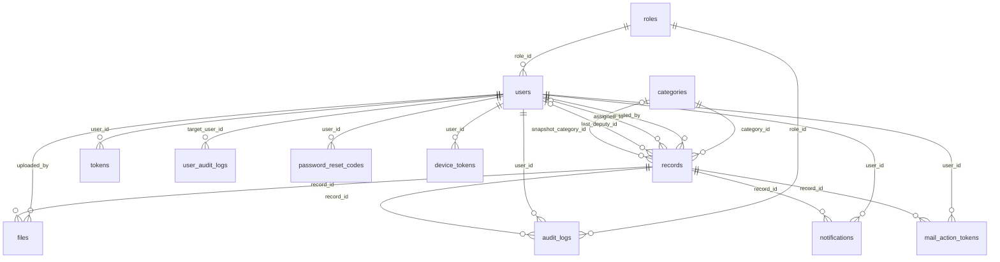

# Veritabanı Tasarımı

Bu belge PostgreSQL şemasını, tasarım kararlarını ve migration yönetimini tanımlar. Kaynağı `backend/src/main/resources/db/migration/` altındaki Flyway dosyalarıdır.

> Son kod doğrulaması 31 Ağustos 2026 tarihinde `test` dalının `4491a80` commit'i üzerinde yapılmıştır. Şema değiştiğinde bu belge aynı değişiklik kapsamında güncellenmelidir.

- **Veritabanı:** PostgreSQL 15.18
- **Migration:** Flyway (`V1`–`V21`; `V3` tarihsel olarak yoktur). Aşağıdaki gövde `V1`–`V11` tabanını anlatır; `V12`–`V17` ile gelen katalog/capability/FK değişiklikleri ve `V18`–`V21` ile gelen departman şeması belgenin sonundaki bölümlerde ele alınır.
- **ORM:** Spring Data JPA / Hibernate, `ddl-auto=validate`

## İçindekiler

- [Tasarım ilkeleri](#tasarım-ilkeleri)
- [Varlık ilişki diyagramı](#varlık-ilişki-diyagramı)
- [Tablo sözlüğü](#tablo-sözlüğü)
- [Foreign key silme politikaları](#foreign-key-silme-politikaları)
- [Kısıtlar](#kısıtlar)
- [İndeksler](#i̇ndeksler)
- [Başlangıç verisi](#başlangıç-verisi)
- [Migration yönetimi](#migration-yönetimi)
- [Departman veri modeli (V18–V21) — TASLAK](#departman-veri-modeli-v18v21--taslak)
- [Bilinen eksikler](#bilinen-eksikler)

## Tasarım ilkeleri

| İlke                                      | Uygulanışı                                                                                                                                                                                                                                              |
| ----------------------------------------- | ------------------------------------------------------------------------------------------------------------------------------------------------------------------------------------------------------------------------------------------------------- |
| Şemanın tek otoritesi Flyway'dir          | Hibernate şema üretmez; `ddl-auto=validate` yalnız entity–şema uyumunu doğrular ve uyumsuzlukta uygulama açılışta durur                                                                                                                                 |
| Sayısal ID'ler koda taşınmaz              | `records.status` metin olarak saklanır ve `RecordStatus` ile birebir aynı yazılır. `roles` için durum `V12` ile değişti: ilişkisel kimlik `roles.id`, yerleşik rolün değişmez semantik anahtarı `system_key`, `name` ise değiştirilebilir görünen addır |
| Kayıt silme geri alınabilir olmalı        | `records.deleted_at` ve `files.deleted_at` ile soft delete; fiziksel silme yok                                                                                                                                                                          |
| Denetim izi kaybolmamalı                  | Geçmişi olan kullanıcı, rol ve kategori satırları `ON DELETE RESTRICT` ile korunur                                                                                                                                                                      |
| İkili veri veritabanında tutulmaz         | Dosya içeriği diskte, yalnız metadata veritabanında                                                                                                                                                                                                     |
| Eşzamanlı düzenleme sessizce kaybolmamalı | `records.version` ile JPA optimistic locking                                                                                                                                                                                                            |

## Varlık ilişki diyagramı



## Tablo sözlüğü

### `roles`

Kullanıcı yetki seviyeleri. Aşağıdaki kolonlar `V1` tabanıdır; `V12` bu tabloya `system_key`, `is_system`, `is_workflow_actor`, `max_users` ve `is_active` kolonlarını ekledi (belgenin sonundaki `V12` bölümüne bakın). Yerleşik rol artık `name` ile değil `system_key` ile tanınır; `name` panelden değiştirilebilir.

| Kolon         | Tip            | Null  | Açıklama                                                     |
| ------------- | -------------- | ----- | ------------------------------------------------------------ |
| `id`          | `SERIAL`       | hayır | Birincil anahtar                                             |
| `name`        | `VARCHAR(50)`  | hayır | Benzersiz. `CALISAN`, `BASKAN_YARDIMCISI`, `BASKAN`, `ADMIN` |
| `description` | `VARCHAR(255)` | evet  | Rolün insan okur açıklaması                                  |

### `categories`

Kayıt kategorisi / departman listesi. Dinamiktir, uygulamadan yönetilir.

| Kolon  | Tip            | Null  | Açıklama         |
| ------ | -------------- | ----- | ---------------- |
| `id`   | `SERIAL`       | hayır | Birincil anahtar |
| `name` | `VARCHAR(100)` | hayır | Benzersiz        |

### `users`

| Kolon                     | Tip            | Null  | Açıklama                                                                                                       |
| ------------------------- | -------------- | ----- | -------------------------------------------------------------------------------------------------------------- |
| `id`                      | `UUID`         | hayır | `gen_random_uuid()` varsayılanı                                                                                |
| `first_name`, `last_name` | `VARCHAR(100)` | hayır |                                                                                                                |
| `email`                   | `VARCHAR(150)` | hayır | Benzersiz; giriş kimliği                                                                                       |
| `password_hash`           | `VARCHAR(255)` | hayır | Tek yönlü hash; ham parola saklanmaz                                                                           |
| `role_id`                 | `INT`          | hayır | `roles` referansı. Kullanıcı **tek** rol taşır                                                                 |
| `is_active`               | `BOOLEAN`      | hayır | Varsayılan `TRUE`. Pasif kullanıcı giriş yapamaz ve workflow hedefi olamaz                                     |
| `must_change_password`    | `BOOLEAN`      | hayır | Varsayılan `FALSE`. `TRUE` iken kullanıcı yalnız parola değiştirme, çıkış ve kendi bilgisi uçlarına erişebilir |
| `created_at`              | `TIMESTAMP`    | hayır |                                                                                                                |
| `updated_at`              | `TIMESTAMP`    | evet  |                                                                                                                |

### `tokens`

JWT refresh token yaşam döngüsü. Access token'lar saklanmaz; yalnız yenileme token'ları izlenir ve iptal edilebilir.

| Kolon                      | Tip            | Null  | Açıklama                                                               |
| -------------------------- | -------------- | ----- | ---------------------------------------------------------------------- |
| `id`                       | `UUID`         | hayır |                                                                        |
| `user_id`                  | `UUID`         | hayır | Sahibi                                                                 |
| `token`                    | `VARCHAR(500)` | hayır | Benzersiz                                                              |
| `token_type`               | `VARCHAR(50)`  | hayır |                                                                        |
| `revoked`                  | `BOOLEAN`      | hayır | Çıkışta, parola değişiminde ve hesap pasifleştirilirken `TRUE` yapılır |
| `expired`                  | `BOOLEAN`      | hayır |                                                                        |
| `created_at`, `expires_at` | `TIMESTAMP`    | hayır | Süresi dolanlar `TokenCleanupJob` ile temizlenir                       |

### `records`

Sistemin ana varlığı.

| Kolon                  | Tip            | Null  | Açıklama                                                                                                                       |
| ---------------------- | -------------- | ----- | ------------------------------------------------------------------------------------------------------------------------------ |
| `id`                   | `UUID`         | hayır |                                                                                                                                |
| `title`                | `VARCHAR(255)` | hayır |                                                                                                                                |
| `description`          | `TEXT`         | hayır |                                                                                                                                |
| `category_id`          | `INT`          | hayır |                                                                                                                                |
| `status`               | `VARCHAR(50)`  | hayır | `RecordStatus` enum **adı**. `V16` ile `chk_records_status` kaldırıldı; yerine `workflow_statuses(name)` foreign key'i geldi   |
| `created_by`           | `UUID`         | hayır | Kaydı oluşturan Çalışan. Değişmez                                                                                              |
| `assigned_to`          | `UUID`         | evet  | Kaydın o an işlem beklediği kullanıcı. Terminal durumda `NULL`                                                                 |
| `last_deputy_id`       | `UUID`         | evet  | Kaydı Başkana ileten Başkan Yardımcısı. Yalnız `BASKANA_ILET` sırasında yazılır; Başkanın geri gönderme hedefi buradan bulunur |
| `version`              | `INT`          | hayır | JPA `@Version`. Eşzamanlı geçiş `409 WORKFLOW_VERSION_CONFLICT` verir                                                          |
| `created_at`           | `TIMESTAMP`    | hayır |                                                                                                                                |
| `updated_at`           | `TIMESTAMP`    | evet  | Her workflow geçişinde güncellenir                                                                                             |
| `deleted_at`           | `TIMESTAMP`    | evet  | Soft delete işareti. Dolu kayıt okuma ve workflow uçlarında `404` sayılır                                                      |
| `snapshot_title`       | `VARCHAR(255)` | evet  | `V9` — devir anındaki başlık                                                                                                   |
| `snapshot_description` | `TEXT`         | evet  | `V9` — devir anındaki açıklama                                                                                                 |
| `snapshot_category_id` | `INT`          | evet  | `V9` — devir anındaki kategori                                                                                                 |
| `snapshot_at`          | `TIMESTAMP`    | evet  | `V9` — anlık görüntünün alındığı an                                                                                            |

> **`snapshot_*` kolonları neden var?** Başkan Yardımcısı, Çalışana geri gönderdiği evrağı izlemeye devam eder; ama evrak o sırada Çalışanın elindedir. Bu kolonlar olmadan Çalışanın kaydettiği her değişiklik yardımcının ekranına anında yansırdı. Yardımcı düzeltmeleri ancak `TEKRAR_GONDER` ile geri geldiğinde görmelidir — bu yüzden gördüğü içerik devir anında dondurulur.
>
> Değerler yalnızca kayıt `DUZENLEME_BEKLIYOR` durumundayken okunur, bu yüzden yeniden gönderimde temizlenmeleri gerekmez; bir sonraki geri gönderme üzerlerine yazar. Ekler ayrıca kopyalanmaz: `files` tablosundaki `uploaded_at`/`deleted_at` ile devir anına göre süzmek yeterlidir.

### `password_reset_codes`

Parola sıfırlama akışı (`V8`). Üç adım tek satırda izlenir: kod üretimi → kod doğrulama → parolanın değiştirilmesi.

| Kolon                    | Tip            | Null  | Açıklama                                                                                 |
| ------------------------ | -------------- | ----- | ---------------------------------------------------------------------------------------- |
| `id`                     | `UUID`         | hayır |                                                                                          |
| `user_id`                | `UUID`         | hayır | Kodun sahibi                                                                             |
| `code_hash`              | `VARCHAR(255)` | hayır | 6 haneli kodun **BCrypt** özeti. Kodun kendisi hiçbir yerde saklanmaz                    |
| `attempts`               | `INT`          | hayır | Kaba kuvvet sayacı; üst sınıra ulaşınca kod ölür                                         |
| `reset_token_hash`       | `VARCHAR(64)`  | evet  | Benzersiz. Kod doğrulandıktan sonra üretilen tek kullanımlık anahtarın **SHA-256** özeti |
| `reset_token_expires_at` | `TIMESTAMP`    | evet  | Anahtarın son kullanma anı                                                               |
| `verified_at`            | `TIMESTAMP`    | evet  | Kodun doğrulandığı an                                                                    |
| `consumed_at`            | `TIMESTAMP`    | evet  | Dolu ise satır tüketilmiştir: parola değişti, yeni kod istendi ya da deneme hakkı bitti  |
| `created_at`             | `TIMESTAMP`    | hayır |                                                                                          |
| `expires_at`             | `TIMESTAMP`    | hayır | Kodun son kullanma anı                                                                   |

> **İki farklı özet algoritması bilinçlidir.** Kod yalnızca 10⁶ olasılık taşır; kaba kuvvetin pahalı olması için BCrypt kullanılır. Sıfırlama anahtarı ise 256 bit rastgeledir, bu yüzden SHA-256 yeterlidir — ayrıca tek yönlü olmasına rağmen sorguda doğrudan aranabilir.
>
> **Neden `tokens` tablosuna eklenmedi?** Oradaki satırlar refresh token yaşam döngüsüne (`revoked`/`expired`) aittir; deneme sayacı ve iki aşamalı doğrulama o modele sığmıyordu.

### `files`

Kayıt ekleri. İçerik diskte, metadata burada.

| Kolon           | Tip            | Null  | Açıklama                                                                                     |
| --------------- | -------------- | ----- | -------------------------------------------------------------------------------------------- |
| `id`            | `UUID`         | hayır |                                                                                              |
| `record_id`     | `UUID`         | hayır |                                                                                              |
| `original_name` | `VARCHAR(255)` | hayır | Kullanıcıya gösterilen ad                                                                    |
| `stored_name`   | `VARCHAR(255)` | hayır | Benzersiz. Diskteki GUID tabanlı ad; kullanıcı girdisi dosya yoluna karışmaz                 |
| `mime_type`     | `VARCHAR(100)` | hayır | İstemcinin `Content-Type` başlığından değil, Apache Tika ile **içerikten** tespit edilen tür |
| `file_size`     | `INT`          | hayır | Bayt                                                                                         |
| `uploaded_by`   | `UUID`         | hayır |                                                                                              |
| `uploaded_at`   | `TIMESTAMP`    | hayır |                                                                                              |
| `deleted_at`    | `TIMESTAMP`    | evet  | `V4` ile eklendi — soft delete                                                               |
| `deleted_by`    | `UUID`         | evet  | `V4` ile eklendi                                                                             |

> `original_name` / `stored_name` ayrımı bilinçlidir: diskteki ad tahmin edilemez olmalı, kullanıcıya gösterilen ad ise özgün kalmalıdır. Aynı gerekçeyle alan `content_type` değil `mime_type` adını taşır — değer istemciden değil içerikten gelir.

### `audit_logs`

Kayıt odaklı denetim izi. Append-only kullanılır. `V7` ile HTTP istek denetimini de taşıyacak biçimde genişletildi; bu yüzden evraka bağlı kolonlar artık zorunlu değildir.

| Kolon                                                      | Tip           | Null  | Açıklama                                                       |
| ---------------------------------------------------------- | ------------- | ----- | -------------------------------------------------------------- |
| `id`                                                       | `UUID`        | hayır |                                                                |
| `record_id`                                                | `UUID`        | evet  | `V7` öncesi zorunluydu. Evraktan bağımsız olaylarda `NULL`     |
| `user_id`                                                  | `UUID`        | evet  | İşlemi yapan                                                   |
| `role_id`                                                  | `INT`         | evet  | İşlem anındaki rol — sonradan rol değişse bile geçmiş bozulmaz |
| `action`                                                   | `VARCHAR(50)` | hayır | Sözlüğün sahibi audit modülüdür                                |
| `previous_status`                                          | `VARCHAR(50)` | evet  |                                                                |
| `new_status`                                               | `VARCHAR(50)` | evet  | `V7` öncesi zorunluydu                                         |
| `comment`                                                  | `TEXT`        | evet  | Geri gönderme ve ret gerekçesi                                 |
| `created_at`                                               | `TIMESTAMP`   | hayır |                                                                |
| `http_method`, `request_path`, `http_status`, `error_code` | —             | evet  | `V7` ile eklendi — HTTP istek denetimi                         |

### `user_audit_logs`

Evraktan bağımsız kullanıcı yönetimi denetim izi. Ayrı tablo olmasının sebebi `audit_logs.record_id`'nin başlangıçta zorunlu olmasıydı; kullanıcı oluşturma veya rol değiştirme işleminin bağlanacağı bir evrak yoktur.

| Kolon                                                      | Tip           | Null  | Açıklama                                                                                             |
| ---------------------------------------------------------- | ------------- | ----- | ---------------------------------------------------------------------------------------------------- |
| `id`                                                       | `UUID`        | hayır |                                                                                                      |
| `target_user_id`                                           | `UUID`        | evet  | İşlemden etkilenen kullanıcı                                                                         |
| `performed_by`                                             | `UUID`        | evet  | İşlemi yapan Admin. Bootstrap Admin oluşturmada `NULL`                                               |
| `action`                                                   | `VARCHAR(50)` | hayır | `USER_CREATED`, `ROLE_CHANGED`, `ACCOUNT_ACTIVATED`, `TASKS_REASSIGNED`, `BOOTSTRAP_ADMIN_CREATED` … |
| `previous_role_id`, `new_role_id`                          | `INT`         | evet  | Rol değişiminin öncesi ve sonrası                                                                    |
| `previous_active`, `new_active`                            | `BOOLEAN`     | evet  | Aktiflik değişiminin öncesi ve sonrası                                                               |
| `comment`                                                  | `TEXT`        | evet  |                                                                                                      |
| `created_at`                                               | `TIMESTAMP`   | hayır |                                                                                                      |
| `http_method`, `request_path`, `http_status`, `error_code` | —             | evet  | `V7` ile eklendi                                                                                     |

> **Yönlendirme kuralı (`V7`):** Admin işlemleri `audit_logs`'a, diğer kullanıcıların istekleri `user_audit_logs`'a yazılır.

### `notifications`

| Kolon               | Tip            | Null  | Açıklama                                                                                            |
| ------------------- | -------------- | ----- | --------------------------------------------------------------------------------------------------- |
| `id`                | `UUID`         | hayır |                                                                                                     |
| `user_id`           | `UUID`         | hayır | Alıcı                                                                                               |
| `record_id`         | `UUID`         | hayır | İlgili kayıt                                                                                        |
| `message`           | `VARCHAR(500)` | hayır | Uzun mesajlar bu sınıra kısaltılır                                                                  |
| `is_read`           | `BOOLEAN`      | hayır | Varsayılan `FALSE`                                                                                  |
| `notification_type` | `VARCHAR(50)`  | hayır | `V5` ile eklendi. Arayüz ikon ve gruplamayı buradan yapar, mesaj metnini ayrıştırmak zorunda kalmaz |
| `created_at`        | `TIMESTAMP`    | hayır |                                                                                                     |

### `device_tokens`

`V10` ile eklendi. Mobil push bildirimi için cihaz başına FCM token tutar.

| Kolon         | Tip            | Null  | Açıklama                                                                         |
| ------------- | -------------- | ----- | -------------------------------------------------------------------------------- |
| `id`          | `UUID`         | hayır |                                                                                  |
| `user_id`     | `UUID`         | hayır | Token'ın o an bağlı olduğu kullanıcı                                             |
| `token`       | `TEXT`         | hayır | **UNIQUE.** FCM token'ı cihaz + uygulama başına tekildir, kullanıcı başına değil |
| `platform`    | `VARCHAR(20)`  | hayır | `ANDROID` veya `IOS`                                                             |
| `device_name` | `VARCHAR(120)` | evet  | Kullanıcıya gösterilen cihaz adı                                                 |
| `is_active`   | `BOOLEAN`      | hayır | Varsayılan `TRUE`. Çıkışta ve geçersiz FCM cevabında `FALSE` yapılır             |
| `created_at`  | `TIMESTAMP`    | hayır |                                                                                  |
| `updated_at`  | `TIMESTAMP`    | evet  | Ölü token ayıklaması için son görülme bilgisi                                    |

`token` UNIQUE olduğu için kayıt bir **upsert**'tir: aynı token yeniden
gönderilirse satır güncellenir. `user_id` de güncellenir; aynı telefonda başka
bir kullanıcı giriş yaptığında token yeni kullanıcıya geçmezse push **yanlış
kişinin** evrağını bildirir.

### `mail_action_tokens`

`V11` ile eklendi. E-posta bildirimindeki hızlı işlem bağlantısının tek
kullanımlık, süreli ve alıcıya bağlı yetki kanıtını taşır. Ham anahtar hiçbir
zaman saklanmaz; yalnız SHA-256 özeti bulunur.

| Kolon         | Tip           | Null  | Açıklama                                                     |
| ------------- | ------------- | ----- | ------------------------------------------------------------ |
| `id`          | `UUID`        | hayır | Birincil anahtar; `gen_random_uuid()`                        |
| `token_hash`  | `VARCHAR(64)` | hayır | **UNIQUE.** 256 bit rastgele anahtarın SHA-256 hex özeti     |
| `record_id`   | `UUID`        | hayır | Anahtarın bağlı olduğu evrak                                 |
| `user_id`     | `UUID`        | hayır | Aksiyonu yürütecek alıcı; tüketimde aktör bu alandan çözülür |
| `action`      | `VARCHAR(50)` | hayır | `WorkflowAction` enum adı                                    |
| `expires_at`  | `TIMESTAMP`   | hayır | Son geçerlilik anı                                           |
| `consumed_at` | `TIMESTAMP`   | evet  | Doluysa anahtar daha önce kullanılmıştır                     |
| `created_at`  | `TIMESTAMP`   | hayır | Varsayılan `CURRENT_TIMESTAMP`                               |

`preview` yalnız anahtarı ve güncel workflow uygunluğunu doğrular; mutasyon
yapmaz. `consume`, satırı kilitleyip `consumed_at` değerini yazar ve gerçek
durum makinesini yeniden çalıştırır. Evrak arada el değiştirdiyse tablo satırı
tek başına yetki vermez.

## Foreign key silme politikaları

Üç politika bilinçli olarak farklı yerlerde kullanılmıştır.

| Politika   | Nerede                                                                                                                                                                                                                                                             | Gerekçe                                                                                                               |
| ---------- | ------------------------------------------------------------------------------------------------------------------------------------------------------------------------------------------------------------------------------------------------------------------ | --------------------------------------------------------------------------------------------------------------------- |
| `RESTRICT` | `users.role_id`, `records.category_id`, `records.snapshot_category_id`, `records.created_by`, `files.uploaded_by`, `audit_logs.user_id`, `audit_logs.role_id`, `user_audit_logs.target_user_id`, `user_audit_logs.previous_role_id`, `user_audit_logs.new_role_id` | Geçmişi olan bir kullanıcı, rol veya kategori silinemez. Denetim izinin "kim, hangi rolle" bilgisi kaybolamaz         |
| `CASCADE`  | `tokens.user_id`, `audit_logs.record_id`, `files.record_id`, `notifications.user_id`, `notifications.record_id`, `password_reset_codes.user_id`, `device_tokens.user_id`, `mail_action_tokens.user_id`, `mail_action_tokens.record_id`                             | Sahibi olmadan anlamı kalmayan yan veriler. Kayıtlar zaten soft delete edildiği için record yolu pratikte tetiklenmez |
| `SET NULL` | `records.assigned_to`, `records.last_deputy_id`, `files.deleted_by`, `user_audit_logs.performed_by`                                                                                                                                                                | Referans kaybolabilir ama satırın kendisi anlamlı kalır                                                               |

## Kısıtlar

| Kısıt                  | Tablo                 | İşlevi                                                                                                          |
| ---------------------- | --------------------- | --------------------------------------------------------------------------------------------------------------- |
| `records.status` FK    | `records`             | `V16` ile `chk_records_status` kaldırıldı; `status` artık `workflow_statuses(name)` kataloğuna FK ile bağlıdır  |
| `UNIQUE (email)`       | `users`               | Aynı e-postayla ikinci hesap açılamaz; ihlali `409` döner                                                       |
| `UNIQUE (token)`       | `tokens`              |                                                                                                                 |
| `UNIQUE (token_hash)`  | `mail_action_tokens`  | Aynı hızlı işlem anahtarının ikinci satırda kullanılmasını engeller; aynı zamanda tüketim sorgusunun indeksidir |
| `UNIQUE (stored_name)` | `files`               | Diskte ad çakışması olamaz                                                                                      |
| `UNIQUE (name)`        | `roles`, `categories` |                                                                                                                 |

> `chk_records_status` `V16` ile kaldırıldı. **Yeni bir durum eklenirse `workflow_statuses` tablosuna yeni bir satır eklenir**; sabit bir CHECK listesi güncellenmez.

## İndeksler

Toplam 26 açıkça tanımlanmış indeks; hepsi bir sorgu deseninden türetilmiştir.

| İndeks                              | Tablo / kolonlar                                                       | Hangi sorgu için                                                                                                       |
| ----------------------------------- | ---------------------------------------------------------------------- | ---------------------------------------------------------------------------------------------------------------------- |
| `idx_users_role_id`                 | `users (role_id)`                                                      | Tekil rol çözümlemesi — "sistemdeki aktif Başkan kim?"                                                                 |
| `idx_users_is_active`               | `users (is_active)`                                                    | Aktiflik filtreli kullanıcı listesi                                                                                    |
| `idx_tokens_user_id`                | `tokens (user_id)`                                                     | Çıkış ve pasifleştirmede kullanıcının token'larını iptal etme                                                          |
| `idx_records_status`                | `records (status)`                                                     | Duruma göre filtreleme                                                                                                 |
| `idx_records_created_by`            | `records (created_by)`                                                 | "Kayıtlarım" — Çalışan görünürlük kapsamı                                                                              |
| `idx_records_assigned_to`           | `records (assigned_to)`                                                | "Bana atananlar" — yönetici görünürlük kapsamı                                                                         |
| `idx_records_category_id`           | `records (category_id)`                                                | Kategoriye göre filtreleme                                                                                             |
| `idx_records_last_deputy_id`        | `records (last_deputy_id)`                                             | Başkanın yardımcıya geri gönderme hedefi                                                                               |
| **`idx_records_not_deleted`**       | `records (created_at) WHERE deleted_at IS NULL`                        | **Kısmi indeks.** Silinmemiş kayıtların tarihe göre listelenmesi en sık sorgudur; silinmiş satırlar indekse hiç girmez |
| `idx_audit_record_id`               | `audit_logs (record_id)`                                               | Kayıt detayındaki işlem geçmişi tablosu                                                                                |
| `idx_audit_user_id`                 | `audit_logs (user_id)`                                                 | Kullanıcı bazlı denetim sorgusu                                                                                        |
| `idx_audit_created_at`              | `audit_logs (created_at)`                                              | Zaman sıralı denetim listesi                                                                                           |
| `idx_audit_http_status`             | `audit_logs (http_status)`                                             | `V7` — hatalı isteklerin taranması                                                                                     |
| `idx_files_record_id`               | `files (record_id)`                                                    | Kaydın eklerini listeleme                                                                                              |
| **`idx_files_not_deleted`**         | `files (record_id) WHERE deleted_at IS NULL`                           | `V4` — kısmi indeks; silinmemiş ekler                                                                                  |
| `idx_notifications_user_unread`     | `notifications (user_id, is_read)`                                     | **Bileşik.** Okunmamış bildirim sayacı en sık çağrılan uçtur                                                           |
| `idx_notifications_type`            | `notifications (notification_type)`                                    | `V5` — tür filtresi                                                                                                    |
| `idx_user_audit_target_user_id`     | `user_audit_logs (target_user_id)`                                     | Bir kullanıcının işlem geçmişi                                                                                         |
| `idx_user_audit_performed_by`       | `user_audit_logs (performed_by)`                                       | Admin'in yaptığı işlemler                                                                                              |
| `idx_user_audit_created_at`         | `user_audit_logs (created_at)`                                         | Zaman sıralı liste                                                                                                     |
| `idx_user_audit_http_status`        | `user_audit_logs (http_status)`                                        | `V7`                                                                                                                   |
| **`idx_password_reset_user_open`**  | `password_reset_codes (user_id, created_at) WHERE consumed_at IS NULL` | `V8` — **kısmi + bileşik.** Kullanıcının açık kodunu bulmak en sık sorgudur; tüketilmiş satırlar indekse hiç girmez    |
| `idx_password_reset_expires_at`     | `password_reset_codes (expires_at)`                                    | `V8` — süresi dolmuş kodların temizlenmesi                                                                             |
| `idx_device_tokens_user_active`     | `device_tokens (user_id, is_active)`                                   | `V10` — **bileşik.** Push gönderimi "bu kullanıcının aktif cihazları" diye sorar                                       |
| `idx_mail_action_tokens_expires_at` | `mail_action_tokens (expires_at)`                                      | `V11` — süresi geçmiş hızlı işlem anahtarlarının toplu temizliği                                                       |
| **`idx_mail_action_tokens_open`**   | `mail_action_tokens (record_id, user_id) WHERE consumed_at IS NULL`    | `V11` — **kısmi + bileşik.** Aynı evrak/alıcı için önceki açık anahtarları geçersizleştirme                            |

## Başlangıç verisi

`V1` iki tabloyu tohumlar:

- **`roles`** — `CALISAN`, `BASKAN_YARDIMCISI`, `BASKAN`, `ADMIN`. `V12` sonrasında rol çözümlemesi `system_key` üzerinden yapılır; `name` değiştirilebilir ve çözümlemeyi bozmaz.
- **`categories`** — İdari, Mali, İnsan Kaynakları, Bilgi İşlem, Teknik.

Kullanıcı tohumlanmaz. İlk Admin, `BOOTSTRAP_ADMIN_EMAIL` ve `BOOTSTRAP_ADMIN_PASSWORD` birlikte verildiğinde ve sistemde aktif Admin yokken uygulama açılışında oluşturulur.

## Migration yönetimi

| Migration                                   | İçerik                                                                                        |
| ------------------------------------------- | --------------------------------------------------------------------------------------------- | --- |
| `V1__init_database_schema.sql`              | Kanonik başlangıç şeması: 9 tablo, 17 indeks, kısıtlar ve başlangıç verisi                    |
| `V2__create_record_notes.sql`               | Kayıt çalışma notları — **kullanılmıyor**, `V6` ile geri alındı                               |
| `V4__add_soft_delete_to_files.sql`          | `files.deleted_at`, `deleted_by` ve kısmi indeks                                              |
| `V5__add_notification_type.sql`             | `notifications.notification_type` ve indeksi                                                  |
| `V6__drop_record_notes.sql`                 | `record_notes` tablosunun kaldırılması                                                        |
| `V7__request_and_auth_audit_columns.sql`    | Audit tablolarında evrak zorunluluğunun kaldırılması; HTTP istek kolonları                    |
| `V8__password_reset_codes.sql`              | `password_reset_codes` tablosu ve iki indeksi                                                 |
| `V9__record_handoff_snapshot.sql`           | `records`'a `snapshot_*` kolonları; mevcut `DUZENLEME_BEKLIYOR` kayıtları için geri doldurma  |
| `V10__device_tokens.sql`                    | `device_tokens` tablosu ve `(user_id, is_active)` bileşik indeksi                             |
| `V11__mail_action_tokens.sql`               | Süreli, tek kullanımlık e-posta hızlı işlem anahtarları; iki foreign key ve iki sorgu indeksi |
| `V12__extend_roles.sql`                     | `roles`'a `system_key`, `is_system`, `is_workflow_actor`, `max_users`, `is_active`            |
| `V13__permissions_and_role_permissions.sql` | `permissions` ve `role_permissions` katalogları; 16 kod, 20 eşleme                            |
| `V14__workflow_statuses_and_actions.sql`    | Altı durum ve yedi aksiyon katalogları                                                        |
| `V15__workflow_transitions.sql`             | Sekiz geçiş; aktör ilişkisi, hedef stratejisi ve gerekli permission metadata'sı               |
| `V16__records_status_fk.sql`                | `chk_records_status` kaldırıldı; `records.status` → `workflow_statuses(name)` FK'si           |
| `V17__authorization_capabilities.sql`       | `FILE_MANAGE`, `RECORD_DELETE` → `CALISAN`; `AUDIT_VIEW` → `ADMIN`                            |
| `V18__departments.sql`                      | `departments` — self-FK, `is_active`                                                          |
| `V19__department_members.sql`               | `department_members` — N:N üyelik                                                             |
| `V20__department_routing_rules.sql`         | **Taslak.** `department_routing_rules` — `(dept, durum, aksiyon) → rol`                       |
| `V21__records_assigned_department.sql`      | **Taslak.** `records.assigned_department_id` + mutual exclusion CHECK                         |     |

### Numaralandırmadaki boşluk

**`V3` yoktur.** Şema hiçbir ortak veritabanına uygulanmadan önce, ayrı hazırlanan üç taslak (`V1` temel şema, `V2` ADMIN paketi, `V3` workflow kolonları) tek dosyada birleştirildi. Bu yüzden `records.last_deputy_id` ve `records.version` ayrı bir migration'da değil, doğrudan `V1` içindedir. Boşluk tarihsel bir tasarım kararının sonucudur, eksik dosya değildir.

`V2` numarası ise sonradan farklı bir iş için kullanıldı ve `V6` ile geri alındı; dosya tarihsel kayıt olarak bırakılmıştır.

### Kurallar

- **Uygulanmış migration dosyaları asla değiştirilmez.** Flyway checksum tutar; değişiklik uygulamanın açılmasını engeller.
- Her şema değişikliği için yeni ve sıralı bir `V` dosyası eklenir.
- Paralel geliştirmede sürüm çakışmasını önlemek için ekipler timestamp tabanlı adlandırma kullanır: `V20260810_1430__aciklama.sql`.
- Entity uyumu `ddl-auto=validate` ile doğrulanır; şema Hibernate tarafından üretilmez.
- Eski veya dolu bir veritabanını taşımadan önce `flyway_schema_history` ve mevcut şema envanteri kontrol edilir.

### Yerel veritabanı parolası

PostgreSQL parolası veri volume'ü **ilk oluşturulurken** sabitlenir. `.env` içindeki `DB_PASSWORD` sonradan değiştirilirse `docker-compose.yml`'deki değer etkisiz kalır ve bağlantı `password authentication failed for user "postgres"` ile reddedilir. Çözüm `docker compose down -v` (veri silinir) veya parolayı veritabanında elle güncellemektir.

## Departman veri modeli (V18–V21) — TASLAK

> Kaynak: `ADR-0005` (Kabul Edildi), `WORKFLOW_V1_V2_PLANI.md` §5, §10, §11, §14.
> Amaç: Kayıtların kişiye değil bir organizasyon birimine (departmana)
> atanabilmesi ve departman içindeki uygun rolün işlem yapabilmesi —
> Workflow V1 teslim kapsamı (10 Eylül 2026).

| Migration                            | Durum     | Bekleyen karar                                  |
| ------------------------------------ | --------- | ----------------------------------------------- |
| `V18` departments                    | ✅ Kesin  | Yok                                             |
| `V19` department_members             | ✅ Kesin  | Yok                                             |
| `V20` department_routing_rules       | 🔶 Taslak | Burak'ın (`WF-6`) final routing semantiği onayı |
| `V21` records.assigned_department_id | 🔶 Taslak | `ADR-0006` (departman hedefli gönderim kararı)  |

### `departments` (`V18`)

| Kolon                  | Tip            | Null  | Açıklama                                    |
| ---------------------- | -------------- | ----- | ------------------------------------------- |
| `id`                   | `SERIAL`       | hayır | Birincil anahtar                            |
| `name`                 | `VARCHAR(100)` | hayır | Benzersiz                                   |
| `parent_department_id` | `INT`          | evet  | Self-FK, `RESTRICT`. `NULL` = kök departman |
| `is_active`            | `BOOLEAN`      | hayır | Varsayılan `TRUE`                           |

**V1'de hiyerarşi yalnız yapısal bilgidir.** Uygun kullanıcı bulunamazsa üst
departmana otomatik eskalasyon **yapılmaz** (plan §14).

### `department_members` (`V19`)

Bileşik PK `(department_id, user_id)`, iki `CASCADE` FK. Üyeliğin **kendi
rolü yoktur** — kullanıcının rolü her zaman `users.role_id`'den global
çözülür (plan §5.3). Bir kullanıcı birden fazla departmana üye olabilir.

`department_members` tablosunda `is_active` kolonu yoktur; aktiflik her zaman
`users.is_active`'ten gelir. Bu yüzden "bu departmanın aktif üyeleri" sorgusu
(`WF-6` resolver'ın ihtiyacı) `department_members` ve `users`'ı birlikte
sorgulayan bir `JOIN` gerektirir — repository'de `findActiveUsersByDepartmentId`
bunu sağlar.

### `department_routing_rules` (`V20`, taslak)

| Kolon            | Tip       | Null  | Açıklama                                |
| ---------------- | --------- | ----- | --------------------------------------- |
| `id`             | `SERIAL`  | hayır | Birincil anahtar                        |
| `department_id`  | `INT`     | hayır | FK → `departments.id`, `CASCADE`        |
| `from_status_id` | `INT`     | hayır | FK → `workflow_statuses.id`, `RESTRICT` |
| `action_id`      | `INT`     | hayır | FK → `workflow_actions.id`, `RESTRICT`  |
| `target_role_id` | `INT`     | hayır | FK → `roles.id`, `RESTRICT`             |
| `is_active`      | `BOOLEAN` | hayır | Varsayılan `TRUE`                       |

`UNIQUE (department_id, from_status_id, action_id)`. Anlamı plan §11'deki
örnekle birebir:

> _Hukuk + BSK_YRD_INCELEMESINDE + BASKANA_ILET → HUKUK_UZMANI_

Departmana atanmış olmak tek başına yetki vermez — rol, üyelik ve (varsa)
gerekli permission birlikte aranır (plan §12). Aynı departmanda birden fazla
uygun kullanıcı varsa **first-action-wins**: hangisi önce işlem tamamlarsa
kayıt versiyonu değişir, diğeri optimistic locking çatışması alır (plan §13).

**Taslak notu:** Burak'ın final routing semantiğini onaylaması bekleniyor.
Onay sonrası değişiklik gerekirse `V20` değiştirilmez, yeni bir `V` dosyası
eklenir.

### `records.assigned_department_id` (`V21`, taslak)

Nullable, `RESTRICT` FK. Zorunlu invariant (plan §10):

```sql
CHECK (assigned_to IS NULL OR assigned_department_id IS NULL)
```

Kayıt aynı anda hem kişiye hem departmana atanamaz. `TASLAK` ve terminal
durumlarda ikisinin de `NULL` olması geçerlidir.

**Taslak notu:** Kolon/FK/CHECK hazır, ama **hangi transition bu kolonu ne
zaman yazar/temizler** sorusu `ADR-0006`'ya bağlı — henüz kapanmadı.

## Bilinen eksikler

- **Append-only kuralı veritabanında zorlanmıyor.** `audit_logs` ve `user_audit_logs` uygulama üzerinden güncellenemez veya silinemez, ancak bunu garanti eden bir trigger ya da rol kısıtı yoktur. Şartname §4.2 "silinemez tablo" diyor; garanti şu an yalnız uygulama seviyesinde.
- **Bildirim geçmişi için bileşik indeks yok.** Mevcut `(user_id, is_read)` okunmamış sayacına hizmet ediyor; sayfalı geçmiş sorgusu `(user_id, created_at DESC)` indeksinden faydalanır. Veri büyüdükçe değerlendirilmelidir.
- ~~Süresi dolmuş e-posta hızlı işlem anahtarları için temizlik işi yok.~~ **Kapandı (`NT-6`).** `TokenCleanupJob` her gece 03:00'te `tokens`, `password_reset_codes` ve `mail_action_tokens` tablolarını birlikte temizler; mail aksiyon anahtarları destek soruları için bir gün bekletilir ve `idx_mail_action_tokens_expires_at` indeksi kullanılır.
- **`records.version` yalnız workflow tarafında kullanılıyor.** Kayıt CRUD'u aynı korumayı almıyor.

## Dinamik rol, yetki ve workflow veri modeli (V12–V17)

> Kaynak: `DB_1_VERI_MODELI_SOZLESMESI.md` (kabul edildi, 1 Eylül 2026).
> Amaç: rol, yetki ve workflow geçiş verisinin derleme zamanında sabit
> (Java enum/statik liste) olmaktan çıkıp veritabanına taşınması — mevcut
> davranış değiştirilmeden.

### `roles` genişletmesi (`V12`)

Mevcut `roles(id, name, description)` tablosuna beş yeni kolon eklendi:

| Kolon               | Tip                             | Anlamı                                                                                                                                                            |
| ------------------- | ------------------------------- | ----------------------------------------------------------------------------------------------------------------------------------------------------------------- |
| `system_key`        | `VARCHAR(50)`, UNIQUE, nullable | Yerleşik rolün **değişmez** semantik anahtarı. `name` kullanıcıya gösterilir ve değişebilir; `system_key` asla değişmez                                           |
| `is_system`         | `BOOLEAN`                       | Sistem rolü mü (fiziksel silinemez, `system_key` değiştirilemez)                                                                                                  |
| `is_workflow_actor` | `BOOLEAN`                       | Rol workflow aktörü olarak seçilebilir mi (`ADMIN` için `FALSE`)                                                                                                  |
| `max_users`         | `INTEGER`, nullable             | `NULL` = sınırsız. Doluysa en az 1. Sayım yalnız aktif kullanıcıları kapsar — bu sınır genel `CHECK` ile değil, uygulama katmanında transaction içinde doğrulanır |
| `is_active`         | `BOOLEAN`                       | Pasif rol yeni atama alamaz                                                                                                                                       |

`roles.id` ilişkisel kimlik olarak kalır (FK'lerde kullanılan budur). `system_key`
yerleşik rolün iş anlamıdır — örn. farklı ortamlarda `BASKAN` satırının sayısal
ID'si farklı olabilir, ama `system_key = 'BASKAN'` her zaman aynıdır.

### `permissions` + `role_permissions` (`V13`, `V17`)

Yetkilendirmenin rol adına bağlı (`hasRole(...)`) olmaktan çıkıp permission
tabanlı (`hasAuthority(...)`) hale gelmesinin temeli. `permissions.code` sabit
bir capability kataloğudur (`RECORD_CREATE`, `USER_MANAGE`, `ADMIN_PANEL_ACCESS`
vb.; `V13` ile 16, `V17` sonrasında 19 kod) — yeni kodlar backend desteği ve migration gerektirir.
`role_permissions` bileşik PK'li (`role_id, permission_id`) klasik N:N eşleme
tablosu.

`V17`, `FILE_MANAGE` ve `RECORD_DELETE` kodlarını `CALISAN`, `AUDIT_VIEW` kodunu
`ADMIN` sistem rolüne `system_key` üzerinden atar. Authentication yalnız aktif
rolün aktif permission'larını yükler. JWT her istekte DB'den yeniler; e-posta
aksiyonları aynı principal factory'yi kullanır. `ROLE_<rol adı>` üretilmez.

WF-2C1'de `RoleCapacityService` kullanıcı oluşturma, bootstrap, rol değişimi,
yeniden etkinleştirme ve devir için ortak kapasite kontrolüdür. Mevcut kullanıcılar
UUID, sonra etkilenen roller ID sırasıyla `PESSIMISTIC_WRITE` kilitlenir. Rol
ID'sine göre aktif kullanıcı sayımı ve yazım tek transaction'da yapılır;
`max_users=NULL` sınırsızdır, aşım `409 ADMIN_LIMIT_EXCEEDED` döndürür.

### `workflow_statuses` + `workflow_actions` (`V14`)

`records.status`'ta bugüne kadar sabit metin olarak tutulan 6 durum ve
Test ağacındaki `TransitionRules`'ta duran 7 aksiyon artık veri:

- `workflow_statuses`: `name` (teknik anahtar, `RecordStatus` enum adıyla
  birebir), `display_name`, `is_terminal`, `is_editable_by_creator`,
  `display_order`, `is_active`
- `workflow_actions`: `name`, `display_name`, **`comment_required`**,
  `is_active` — yorum zorunluluğu geçişe değil aksiyona ait (iki farklı
  aktörün kullandığı `CALISANA_GERI_GONDER` aynı kuralı paylaşır)

### `workflow_transitions` (`V15`)

Test ağacındaki 8 satırlık statik geçiş tablosunun veri karşılığı.
`(from_status_id, action_id, actor_role_id)` UNIQUE — tabloda bulunmayan her
durum-aksiyon-rol birleşimi geçersizdir. Ayrıca:

- `actor_requirement`: aktörün kayıtla ilişkisi (`CREATOR` / `ASSIGNEE` /
  `CREATOR_AND_ASSIGNEE`) — rol yetkisi tek başına yetmez
- `target_strategy`: hedef kullanıcının nasıl çözüleceği (`NONE` / `ROLE` /
  `CREATOR` / `CURRENT_ASSIGNEE` / `PREVIOUS_ACTOR`)
- `required_permission_id`: geçiş için ek yetki koşulu — 8 aktif satırın
  hepsinde dolu

### `records.status` → katalog FK (`V16`)

`records.status` kolonu **`VARCHAR(50)` olarak kalır** — `status_id`'ye
dönüştürülmedi. `@Enumerated(EnumType.STRING)` eşlemesi ve mevcut API
sözleşmesi bozulmadan, sabit `chk_records_status` CHECK kısıtı kaldırılıp
yerine `workflow_statuses(name)`'e `ON UPDATE RESTRICT ON DELETE RESTRICT`
foreign key eklendi. Aynı garanti, çok daha az invaziv değişiklik.

### Üretim kural kaynağı ve statik referans

Üretim zinciri `ReloadableTransitionRuleSource → DbTransitionRuleSource → JpaTransitionRuleRecordReader → PostgreSQL`
şeklindedir; bean sarmalayıcıdır, tazelemeyi o yürütür. Açılışta yüklenen immutable snapshot, `TransitionRuleSource` üzerinden
saf validator'a sunulur. Tabloya dışarıdan dokunulduğunda snapshot
`POST /api/workflow/rules/reload` ile yeniden başlatmadan tazelenebilir;
tazeleme başarısız olursa çalışan kurallar korunur. Boş/geçersiz kural verisi ve aktif geçişte eksik permission
metadata'sı açılışı durdurur. Test ağacındaki `TransitionRules`, sekiz geçişin hedef ve permission
metadata'sını da kapsayan parity ve veritabanısız test referansıdır. Yeni kurallar
yeni Flyway migration'ı ve eşleşen parity referansıyla birlikte eklenir.
