# Veritabanı Tasarımı

Bu belge PostgreSQL şemasını, tasarım kararlarını ve migration yönetimini tanımlar. Kaynağı `backend/src/main/resources/db/migration/` altındaki Flyway dosyalarıdır.

> Son kod doğrulaması 4 Eylül 2026 tarihinde `test` dalı üzerinde yapılmıştır. Şema değiştiğinde bu belge aynı değişiklik kapsamında güncellenmelidir.

- **Veritabanı:** PostgreSQL 15.18
- **Migration:** Flyway (`V1`–`V21`; `V3` tarihsel olarak yoktur). Aşağıdaki gövde `V1`–`V11` tabanını anlatır; `V12`–`V17` ile gelen katalog/capability/FK değişiklikleri ve `V18`–`V21` ile gelen departman şeması belgenin sonundaki bölümlerde ele alınır.
- **ORM:** Spring Data JPA / Hibernate, `ddl-auto=validate`

## İçindekiler

- [Tasarım ilkeleri](#tasarım-ilkeleri)
- [Varlık ilişki diyagramı](#varlık-ilişki-diyagramı)
- [Tablo sözlüğü](#tablo-sözlüğü)
- [Foreign key silme politikaları](#foreign-key-silme-politikaları)
- [Kısıtlar](#kısıtlar)
- [İndeksler](#i̇ndeksler)
- [Başlangıç verisi](#başlangıç-verisi)
- [Migration yönetimi](#migration-yönetimi)
- [Dinamik rol, yetki ve workflow veri modeli (V12–V17)](#dinamik-rol-yetki-ve-workflow-veri-modeli-v12v17)
- [Departman veri modeli (V18–V21) — TASLAK](#departman-veri-modeli-v18v21--taslak)
- [Bilinen eksikler](#bilinen-eksikler)

## Tasarım ilkeleri

| İlke                                      | Uygulanışı                                                                                                                                                                                                                                              |
| ----------------------------------------- | ------------------------------------------------------------------------------------------------------------------------------------------------------------------------------------------------------------------------------------------------------- |
| Şemanın tek otoritesi Flyway'dir          | Hibernate şema üretmez; `ddl-auto=validate` yalnız entity–şema uyumunu doğrular ve uyumsuzlukta uygulama açılışta durur                                                                                                                                 |
| Sayısal ID'ler koda taşınmaz              | `records.status` metin olarak saklanır ve `RecordStatus` ile birebir aynı yazılır. `roles` için durum `V12` ile değişti: ilişkisel kimlik `roles.id`, yerleşik rolün değişmez semantik anahtarı `system_key`, `name` ise değiştirilebilir görünen addır |
| Kayıt silme geri alınabilir olmalı        | `records.deleted_at` ve `files.deleted_at` ile soft delete; fiziksel silme yok                                                                                                                                                                          |
| Denetim izi kaybolmamalı                  | Geçmişi olan kullanıcı, rol ve kategori satırları `ON DELETE RESTRICT` ile korunur                                                                                                                                                                      |
| İkili veri veritabanında tutulmaz         | Dosya içeriği diskte, yalnız metadata veritabanında                                                                                                                                                                                                     |
| Eşzamanlı düzenleme sessizce kaybolmamalı | `records.version` ile JPA optimistic locking                                                                                                                                                                                                            |

## Varlık ilişki diyagramı

```mermaid
erDiagram
    roles ||--o{ users : "role_id"
    roles ||--o{ audit_logs : "role_id"
    roles ||--o{ role_permissions : "role_id"
    permissions ||--o{ role_permissions : "permission_id"
    categories ||--o{ records : "category_id"
    users ||--o{ tokens : "user_id"
    users ||--o{ records : "created_by"
    users |o--o{ records : "assigned_to"
    users |o--o{ records : "last_deputy_id"
    users ||--o{ files : "uploaded_by"
    users ||--o{ audit_logs : "user_id"
    users ||--o{ notifications : "user_id"
    users ||--o{ user_audit_logs : "target_user_id"
    users ||--o{ password_reset_codes : "user_id"
    users ||--o{ device_tokens : "user_id"
    users ||--o{ mail_action_tokens : "user_id"
    records ||--o{ files : "record_id"
    records ||--o{ audit_logs : "record_id"
    records ||--o{ notifications : "record_id"
    records ||--o{ mail_action_tokens : "record_id"
    categories |o--o{ records : "snapshot_category_id"
    workflow_statuses ||--o{ records : "status -> name"
    workflow_statuses ||--o{ workflow_transitions : "from_status_id"
    workflow_statuses ||--o{ workflow_transitions : "to_status_id"
    workflow_actions ||--o{ workflow_transitions : "action_id"
    roles ||--o{ workflow_transitions : "actor_role_id"
    roles |o--o{ workflow_transitions : "expected_target_role_id"
    permissions |o--o{ workflow_transitions : "required_permission_id"
    departments |o--o{ departments : "parent_department_id"
    departments ||--o{ department_members : "department_id"
    users ||--o{ department_members : "user_id"
    departments ||--o{ department_routing_rules : "department_id"
    workflow_statuses ||--o{ department_routing_rules : "from_status_id"
    workflow_actions ||--o{ department_routing_rules : "action_id"
    roles ||--o{ department_routing_rules : "target_role_id"
    departments |o--o{ records : "assigned_department_id"
```



## Tablo sözlüğü

### `roles`

Kullanıcı yetki seviyeleri. Aşağıdaki kolonlar `V1` tabanıdır; `V12` bu tabloya `system_key`, `is_system`, `is_workflow_actor`, `max_users` ve `is_active` kolonlarını ekledi (bkz. [Dinamik rol, yetki ve workflow veri modeli](#dinamik-rol-yetki-ve-workflow-veri-modeli-v12v17)). Yerleşik rol artık `name` ile değil `system_key` ile tanınır; `name` panelden değiştirilebilir.

| Kolon                                                      | Tip            | Null  | Açıklama                                         |
| ---------------------------------------------------------- | -------------- | ----- | ------------------------------------------------ |
| `id`                                                       | `SERIAL`       | hayır | Birincil anahtar                                 |
| `name`                                                     | `VARCHAR(100)` | hayır | Benzersiz. `V12` ile `VARCHAR(50)`'den büyütüldü |
| `description`                                              | `VARCHAR(255)` | evet  | Rolün insan okur açıklaması                      |
| `system_key`                                               | `VARCHAR(50)`  | evet  | `V12`. Benzersiz, değişmez semantik anahtar      |
| `is_system`, `is_workflow_actor`, `max_users`, `is_active` | —              | —     | `V12`, ayrıntı aşağıdaki bölümde                 |

### `permissions` / `role_permissions` / `workflow_statuses` / `workflow_actions` / `workflow_transitions`

`V12`–`V17` ile eklendi, kolon detayları [Dinamik rol, yetki ve workflow veri modeli](#dinamik-rol-yetki-ve-workflow-veri-modeli-v12v17) bölümünde.

### `departments` / `department_members` / `department_routing_rules`

`V18`–`V21` ile eklendi (taslak kısımları işaretli), kolon detayları [Departman veri modeli](#departman-veri-modeli-v18v21--taslak) bölümünde.

### `categories`

Kayıt kategorisi listesi. Dinamiktir, uygulamadan yönetilir.

> Not: Bu tablo evrak **kategorisi** içindir (İdari, Mali vb.), `departments` tablosuyla karıştırılmamalı — ikincisi kullanıcıların üye olduğu organizasyon birimidir.

| Kolon  | Tip            | Null  | Açıklama         |
| ------ | -------------- | ----- | ---------------- |
| `id`   | `SERIAL`       | hayır | Birincil anahtar |
| `name` | `VARCHAR(100)` | hayır | Benzersiz        |

### `users`

| Kolon                     | Tip            | Null  | Açıklama                                                                                                       |
| ------------------------- | -------------- | ----- | -------------------------------------------------------------------------------------------------------------- |
| `id`                      | `UUID`         | hayır | `gen_random_uuid()` varsayılanı                                                                                |
| `first_name`, `last_name` | `VARCHAR(100)` | hayır |                                                                                                                |
| `email`                   | `VARCHAR(150)` | hayır | Benzersiz; giriş kimliği                                                                                       |
| `password_hash`           | `VARCHAR(255)` | hayır | Tek yönlü hash; ham parola saklanmaz                                                                           |
| `role_id`                 | `INT`          | hayır | `roles` referansı. Kullanıcı **tek** rol taşır                                                                 |
| `is_active`               | `BOOLEAN`      | hayır | Varsayılan `TRUE`. Pasif kullanıcı giriş yapamaz ve workflow hedefi olamaz                                     |
| `must_change_password`    | `BOOLEAN`      | hayır | Varsayılan `FALSE`. `TRUE` iken kullanıcı yalnız parola değiştirme, çıkış ve kendi bilgisi uçlarına erişebilir |
| `created_at`              | `TIMESTAMP`    | hayır |                                                                                                                |
| `updated_at`              | `TIMESTAMP`    | evet  |                                                                                                                |

### `tokens`

JWT refresh token yaşam döngüsü. Access token'lar saklanmaz; yalnız yenileme token'ları izlenir ve iptal edilebilir.

| Kolon                      | Tip            | Null  | Açıklama                                                               |
| -------------------------- | -------------- | ----- | ---------------------------------------------------------------------- |
| `id`                       | `UUID`         | hayır |                                                                        |
| `user_id`                  | `UUID`         | hayır | Sahibi                                                                 |
| `token`                    | `VARCHAR(500)` | hayır | Benzersiz                                                              |
| `token_type`               | `VARCHAR(50)`  | hayır |                                                                        |
| `revoked`                  | `BOOLEAN`      | hayır | Çıkışta, parola değişiminde ve hesap pasifleştirilirken `TRUE` yapılır |
| `expired`                  | `BOOLEAN`      | hayır |                                                                        |
| `created_at`, `expires_at` | `TIMESTAMP`    | hayır | Süresi dolanlar `TokenCleanupJob` ile temizlenir                       |

### `records`

Sistemin ana varlığı.

| Kolon                    | Tip            | Null  | Açıklama                                                                                                                       |
| ------------------------ | -------------- | ----- | ------------------------------------------------------------------------------------------------------------------------------ |
| `id`                     | `UUID`         | hayır |                                                                                                                                |
| `title`                  | `VARCHAR(255)` | hayır |                                                                                                                                |
| `description`            | `TEXT`         | hayır |                                                                                                                                |
| `category_id`            | `INT`          | hayır |                                                                                                                                |
| `status`                 | `VARCHAR(50)`  | hayır | `RecordStatus` enum **adı**. `V16` ile `chk_records_status` kaldırıldı; yerine `workflow_statuses(name)` foreign key'i geldi   |
| `created_by`             | `UUID`         | hayır | Kaydı oluşturan Çalışan. Değişmez                                                                                              |
| `assigned_to`            | `UUID`         | evet  | Kaydın o an işlem beklediği kullanıcı. Terminal durumda `NULL`                                                                 |
| `assigned_department_id` | `INT`          | evet  | `V21`, **taslak**. Kaydın kişi yerine departmana atanması; `assigned_to` ile aynı anda dolu olamaz. Ayrıntı aşağıda            |
| `last_deputy_id`         | `UUID`         | evet  | Kaydı Başkana ileten Başkan Yardımcısı. Yalnız `BASKANA_ILET` sırasında yazılır; Başkanın geri gönderme hedefi buradan bulunur |
| `version`                | `INT`          | hayır | JPA `@Version`. Eşzamanlı geçiş `409 WORKFLOW_VERSION_CONFLICT` verir                                                          |
| `created_at`             | `TIMESTAMP`    | hayır |                                                                                                                                |
| `updated_at`             | `TIMESTAMP`    | evet  | Her workflow geçişinde güncellenir                                                                                             |
| `deleted_at`             | `TIMESTAMP`    | evet  | Soft delete işareti. Dolu kayıt okuma ve workflow uçlarında `404` sayılır                                                      |
| `snapshot_title`         | `VARCHAR(255)` | evet  | `V9` — devir anındaki başlık                                                                                                   |
| `snapshot_description`   | `TEXT`         | evet  | `V9` — devir anındaki açıklama                                                                                                 |
| `snapshot_category_id`   | `INT`          | evet  | `V9` — devir anındaki kategori                                                                                                 |
| `snapshot_at`            | `TIMESTAMP`    | evet  | `V9` — anlık görüntünün alındığı an                                                                                            |

> **`snapshot_*` kolonları neden var?** Başkan Yardımcısı, Çalışana geri gönderdiği evrağı izlemeye devam eder; ama evrak o sırada Çalışanın elindedir. Bu kolonlar olmadan Çalışanın kaydettiği her değişiklik yardımcının ekranına anında yansırdı. Yardımcı düzeltmeleri ancak `TEKRAR_GONDER` ile geri geldiğinde görmelidir — bu yüzden gördüğü içerik devir anında dondurulur.
>
> Değerler yalnızca kayıt `DUZENLEME_BEKLIYOR` durumundayken okunur, bu yüzden yeniden gönderimde temizlenmeleri gerekmez; bir sonraki geri gönderme üzerlerine yazar. Ekler ayrıca kopyalanmaz: `files` tablosundaki `uploaded_at`/`deleted_at` ile devir anına göre süzmek yeterlidir.

### `password_reset_codes`

Parola sıfırlama akışı (`V8`). Üç adım tek satırda izlenir: kod üretimi → kod doğrulama → parolanın değiştirilmesi.

| Kolon                    | Tip            | Null  | Açıklama                                                                                 |
| ------------------------ | -------------- | ----- | ---------------------------------------------------------------------------------------- |
| `id`                     | `UUID`         | hayır |                                                                                          |
| `user_id`                | `UUID`         | hayır | Kodun sahibi                                                                             |
| `code_hash`              | `VARCHAR(255)` | hayır | 6 haneli kodun **BCrypt** özeti. Kodun kendisi hiçbir yerde saklanmaz                    |
| `attempts`               | `INT`          | hayır | Kaba kuvvet sayacı; üst sınıra ulaşınca kod ölür                                         |
| `reset_token_hash`       | `VARCHAR(64)`  | evet  | Benzersiz. Kod doğrulandıktan sonra üretilen tek kullanımlık anahtarın **SHA-256** özeti |
| `reset_token_expires_at` | `TIMESTAMP`    | evet  | Anahtarın son kullanma anı                                                               |
| `verified_at`            | `TIMESTAMP`    | evet  | Kodun doğrulandığı an                                                                    |
| `consumed_at`            | `TIMESTAMP`    | evet  | Dolu ise satır tüketilmiştir: parola değişti, yeni kod istendi ya da deneme hakkı bitti  |
| `created_at`             | `TIMESTAMP`    | hayır |                                                                                          |
| `expires_at`             | `TIMESTAMP`    | hayır | Kodun son kullanma anı                                                                   |

> **İki farklı özet algoritması bilinçlidir.** Kod yalnızca 10⁶ olasılık taşır; kaba kuvvetin pahalı olması için BCrypt kullanılır. Sıfırlama anahtarı ise 256 bit rastgeledir, bu yüzden SHA-256 yeterlidir — ayrıca tek yönlü olmasına rağmen sorguda doğrudan aranabilir.
>
> **Neden `tokens` tablosuna eklenmedi?** Oradaki satırlar refresh token yaşam döngüsüne (`revoked`/`expired`) aittir; deneme sayacı ve iki aşamalı doğrulama o modele sığmıyordu.

### `files`

Kayıt ekleri. İçerik diskte, metadata burada.

| Kolon           | Tip            | Null  | Açıklama                                                                                     |
| --------------- | -------------- | ----- | -------------------------------------------------------------------------------------------- |
| `id`            | `UUID`         | hayır |                                                                                              |
| `record_id`     | `UUID`         | hayır |                                                                                              |
| `original_name` | `VARCHAR(255)` | hayır | Kullanıcıya gösterilen ad                                                                    |
| `stored_name`   | `VARCHAR(255)` | hayır | Benzersiz. Diskteki GUID tabanlı ad; kullanıcı girdisi dosya yoluna karışmaz                 |
| `mime_type`     | `VARCHAR(100)` | hayır | İstemcinin `Content-Type` başlığından değil, Apache Tika ile **içerikten** tespit edilen tür |
| `file_size`     | `INT`          | hayır | Bayt                                                                                         |
| `uploaded_by`   | `UUID`         | hayır |                                                                                              |
| `uploaded_at`   | `TIMESTAMP`    | hayır |                                                                                              |
| `deleted_at`    | `TIMESTAMP`    | evet  | `V4` ile eklendi — soft delete                                                               |
| `deleted_by`    | `UUID`         | evet  | `V4` ile eklendi                                                                             |

> `original_name` / `stored_name` ayrımı bilinçlidir: diskteki ad tahmin edilemez olmalı, kullanıcıya gösterilen ad ise özgün kalmalıdır. Aynı gerekçeyle alan `content_type` değil `mime_type` adını taşır — değer istemciden değil içerikten gelir.

### `audit_logs`

Kayıt odaklı denetim izi. Append-only kullanılır. `V7` ile HTTP istek denetimini de taşıyacak biçimde genişletildi; bu yüzden evraka bağlı kolonlar artık zorunlu değildir.

| Kolon                                                      | Tip           | Null  | Açıklama                                                       |
| ---------------------------------------------------------- | ------------- | ----- | -------------------------------------------------------------- |
| `id`                                                       | `UUID`        | hayır |                                                                |
| `record_id`                                                | `UUID`        | evet  | `V7` öncesi zorunluydu. Evraktan bağımsız olaylarda `NULL`     |
| `user_id`                                                  | `UUID`        | evet  | İşlemi yapan                                                   |
| `role_id`                                                  | `INT`         | evet  | İşlem anındaki rol — sonradan rol değişse bile geçmiş bozulmaz |
| `action`                                                   | `VARCHAR(50)` | hayır | Sözlüğün sahibi audit modülüdür                                |
| `previous_status`                                          | `VARCHAR(50)` | evet  |                                                                |
| `new_status`                                               | `VARCHAR(50)` | evet  | `V7` öncesi zorunluydu                                         |
| `comment`                                                  | `TEXT`        | evet  | Geri gönderme ve ret gerekçesi                                 |
| `created_at`                                               | `TIMESTAMP`   | hayır |                                                                |
| `http_method`, `request_path`, `http_status`, `error_code` | —             | evet  | `V7` ile eklendi — HTTP istek denetimi                         |

### `user_audit_logs`

Evraktan bağımsız kullanıcı yönetimi denetim izi.

| Kolon                                                      | Tip           | Null  | Açıklama                                                                                             |
| ---------------------------------------------------------- | ------------- | ----- | ---------------------------------------------------------------------------------------------------- |
| `id`                                                       | `UUID`        | hayır |                                                                                                      |
| `target_user_id`                                           | `UUID`        | evet  | İşlemden etkilenen kullanıcı                                                                         |
| `performed_by`                                             | `UUID`        | evet  | İşlemi yapan Admin. Bootstrap Admin oluşturmada `NULL`                                               |
| `action`                                                   | `VARCHAR(50)` | hayır | `USER_CREATED`, `ROLE_CHANGED`, `ACCOUNT_ACTIVATED`, `TASKS_REASSIGNED`, `BOOTSTRAP_ADMIN_CREATED` … |
| `previous_role_id`, `new_role_id`                          | `INT`         | evet  | Rol değişiminin öncesi ve sonrası                                                                    |
| `previous_active`, `new_active`                            | `BOOLEAN`     | evet  | Aktiflik değişiminin öncesi ve sonrası                                                               |
| `comment`                                                  | `TEXT`        | evet  |                                                                                                      |
| `created_at`                                               | `TIMESTAMP`   | hayır |                                                                                                      |
| `http_method`, `request_path`, `http_status`, `error_code` | —             | evet  | `V7` ile eklendi                                                                                     |

> **Yönlendirme kuralı (`V7`):** Admin işlemleri `audit_logs`'a, diğer kullanıcıların istekleri `user_audit_logs`'a yazılır.

### `notifications`

| Kolon               | Tip            | Null  | Açıklama                           |
| ------------------- | -------------- | ----- | ---------------------------------- |
| `id`                | `UUID`         | hayır |                                    |
| `user_id`           | `UUID`         | hayır | Alıcı                              |
| `record_id`         | `UUID`         | hayır | İlgili kayıt                       |
| `message`           | `VARCHAR(500)` | hayır | Uzun mesajlar bu sınıra kısaltılır |
| `is_read`           | `BOOLEAN`      | hayır | Varsayılan `FALSE`                 |
| `notification_type` | `VARCHAR(50)`  | hayır | `V5` ile eklendi                   |
| `created_at`        | `TIMESTAMP`    | hayır |                                    |

### `device_tokens`

`V10` ile eklendi. Mobil push bildirimi için cihaz başına FCM token tutar.

| Kolon         | Tip            | Null  | Açıklama                                                                         |
| ------------- | -------------- | ----- | -------------------------------------------------------------------------------- |
| `id`          | `UUID`         | hayır |                                                                                  |
| `user_id`     | `UUID`         | hayır | Token'ın o an bağlı olduğu kullanıcı                                             |
| `token`       | `TEXT`         | hayır | **UNIQUE.** FCM token'ı cihaz + uygulama başına tekildir, kullanıcı başına değil |
| `platform`    | `VARCHAR(20)`  | hayır | `ANDROID` veya `IOS`                                                             |
| `device_name` | `VARCHAR(120)` | evet  | Kullanıcıya gösterilen cihaz adı                                                 |
| `is_active`   | `BOOLEAN`      | hayır | Varsayılan `TRUE`                                                                |
| `created_at`  | `TIMESTAMP`    | hayır |                                                                                  |
| `updated_at`  | `TIMESTAMP`    | evet  | Ölü token ayıklaması için son görülme bilgisi                                    |

### `mail_action_tokens`

`V11` ile eklendi. E-posta bildirimindeki hızlı işlem bağlantısının tek
kullanımlık, süreli ve alıcıya bağlı yetki kanıtını taşır.

| Kolon         | Tip           | Null  | Açıklama                                                 |
| ------------- | ------------- | ----- | -------------------------------------------------------- |
| `id`          | `UUID`        | hayır | Birincil anahtar; `gen_random_uuid()`                    |
| `token_hash`  | `VARCHAR(64)` | hayır | **UNIQUE.** 256 bit rastgele anahtarın SHA-256 hex özeti |
| `record_id`   | `UUID`        | hayır | Anahtarın bağlı olduğu evrak                             |
| `user_id`     | `UUID`        | hayır | Aksiyonu yürütecek alıcı                                 |
| `action`      | `VARCHAR(50)` | hayır | `WorkflowAction` enum adı                                |
| `expires_at`  | `TIMESTAMP`   | hayır | Son geçerlilik anı                                       |
| `consumed_at` | `TIMESTAMP`   | evet  | Doluysa anahtar daha önce kullanılmıştır                 |
| `created_at`  | `TIMESTAMP`   | hayır | Varsayılan `CURRENT_TIMESTAMP`                           |

## Foreign key silme politikaları

| Politika   | Nerede                                                                                                                                                                                                                                                                                                                                                                                                                                                          | Gerekçe                                                                             |
| ---------- | --------------------------------------------------------------------------------------------------------------------------------------------------------------------------------------------------------------------------------------------------------------------------------------------------------------------------------------------------------------------------------------------------------------------------------------------------------------- | ----------------------------------------------------------------------------------- |
| `RESTRICT` | `users.role_id`, `records.category_id`, `records.snapshot_category_id`, `records.created_by`, `records.status`, `files.uploaded_by`, `audit_logs.user_id`, `audit_logs.role_id`, `user_audit_logs.target_user_id`, `user_audit_logs.previous_role_id`, `user_audit_logs.new_role_id`, `workflow_transitions.*` (6 FK), `departments.parent_department_id`, `records.assigned_department_id`, `department_routing_rules.from_status_id/action_id/target_role_id` | Geçmişi olan bir kullanıcı, rol, kategori, workflow tanımı veya departman silinemez |
| `CASCADE`  | `tokens.user_id`, `audit_logs.record_id`, `files.record_id`, `notifications.user_id`, `notifications.record_id`, `password_reset_codes.user_id`, `device_tokens.user_id`, `mail_action_tokens.user_id`, `mail_action_tokens.record_id`, `role_permissions.role_id`, `role_permissions.permission_id`, `department_members.department_id`, `department_members.user_id`, `department_routing_rules.department_id`                                                | Sahibi olmadan anlamı kalmayan yan veriler                                          |
| `SET NULL` | `records.assigned_to`, `records.last_deputy_id`, `files.deleted_by`, `user_audit_logs.performed_by`                                                                                                                                                                                                                                                                                                                                                             | Referans kaybolabilir ama satırın kendisi anlamlı kalır                             |

## Kısıtlar

| Kısıt                                               | Tablo                                                                         | İşlevi                                                                             |
| --------------------------------------------------- | ----------------------------------------------------------------------------- | ---------------------------------------------------------------------------------- |
| `records.status` FK                                 | `records`                                                                     | `V16` ile `chk_records_status` kaldırıldı; katalog FK'sine geçirildi               |
| `chk_records_assignment_exclusive`                  | `records`                                                                     | `V21`, **taslak**. `assigned_to` ve `assigned_department_id` aynı anda dolu olamaz |
| `UNIQUE (email)`                                    | `users`                                                                       | Aynı e-postayla ikinci hesap açılamaz; ihlali `409` döner                          |
| `UNIQUE (token)`                                    | `tokens`                                                                      |                                                                                    |
| `UNIQUE (token_hash)`                               | `mail_action_tokens`                                                          | Aynı hızlı işlem anahtarının ikinci satırda kullanılmasını engeller                |
| `UNIQUE (stored_name)`                              | `files`                                                                       | Diskte ad çakışması olamaz                                                         |
| `UNIQUE (name)`                                     | `roles`, `categories`, `workflow_statuses`, `workflow_actions`, `departments` |                                                                                    |
| `UNIQUE (system_key)`                               | `roles`                                                                       | `V12`                                                                              |
| `UNIQUE (code)`                                     | `permissions`                                                                 | `V13`                                                                              |
| `UNIQUE (from_status_id, action_id, actor_role_id)` | `workflow_transitions`                                                        | `V15`                                                                              |
| `UNIQUE (department_id, from_status_id, action_id)` | `department_routing_rules`                                                    | `V20`, **taslak**. Aynı departman+durum+aksiyon için birden fazla hedef rol olamaz |

## İndeksler

En son eklenenler:

| İndeks                                                                     | Tablo / kolonlar                     | Not                                                 |
| -------------------------------------------------------------------------- | ------------------------------------ | --------------------------------------------------- |
| `idx_departments_parent`                                                   | `departments (parent_department_id)` | `V18`                                               |
| `idx_departments_is_active`                                                | `departments (is_active)`            | `V18`                                               |
| `idx_department_members_user_id`                                           | `department_members (user_id)`       | `V19` — "bu kullanıcı hangi departmanlarda" sorgusu |
| `idx_routing_from_status`, `idx_routing_action`, `idx_routing_target_role` | `department_routing_rules (...)`     | `V20`, taslak                                       |
| `idx_records_assigned_department_id`                                       | `records (assigned_department_id)`   | `V21`, taslak                                       |

`V1`–`V17` ile eklenen 26 indeksin tam listesi ve gerekçeleri değişmedi; bu bölümün önceki hâli korunmuştur.

## Başlangıç verisi

`V1` iki tabloyu tohumlar: `roles` (4 yerleşik rol) ve `categories` (5 kategori).
`V12`–`V17` rol/permission/workflow kataloglarını tohumlar (aşağıdaki bölüme
bakın). `V18`–`V21` ile eklenen departman tabloları **tohumlanmaz** — boş
başlar, Admin Paneli'nden (`AP-4`) doldurulur.

Kullanıcı tohumlanmaz. İlk Admin, `BOOTSTRAP_ADMIN_EMAIL` ve
`BOOTSTRAP_ADMIN_PASSWORD` birlikte verildiğinde ve sistemde aktif Admin
yokken uygulama açılışında oluşturulur.

## Migration yönetimi

| Migration                                   | İçerik                                                                                        |
| ------------------------------------------- | --------------------------------------------------------------------------------------------- |
| `V1__init_database_schema.sql`              | Kanonik başlangıç şeması: 9 tablo, 17 indeks, kısıtlar ve başlangıç verisi                    |
| `V2__create_record_notes.sql`               | Kayıt çalışma notları — **kullanılmıyor**, `V6` ile geri alındı                               |
| `V4__add_soft_delete_to_files.sql`          | `files.deleted_at`, `deleted_by` ve kısmi indeks                                              |
| `V5__add_notification_type.sql`             | `notifications.notification_type` ve indeksi                                                  |
| `V6__drop_record_notes.sql`                 | `record_notes` tablosunun kaldırılması                                                        |
| `V7__request_and_auth_audit_columns.sql`    | Audit tablolarında evrak zorunluluğunun kaldırılması; HTTP istek kolonları                    |
| `V8__password_reset_codes.sql`              | `password_reset_codes` tablosu ve iki indeksi                                                 |
| `V9__record_handoff_snapshot.sql`           | `records`'a `snapshot_*` kolonları; mevcut `DUZENLEME_BEKLIYOR` kayıtları için geri doldurma  |
| `V10__device_tokens.sql`                    | `device_tokens` tablosu ve `(user_id, is_active)` bileşik indeksi                             |
| `V11__mail_action_tokens.sql`               | Süreli, tek kullanımlık e-posta hızlı işlem anahtarları; iki foreign key ve iki sorgu indeksi |
| `V12__extend_roles.sql`                     | `roles`'a `system_key`, `is_system`, `is_workflow_actor`, `max_users`, `is_active`            |
| `V13__permissions_and_role_permissions.sql` | `permissions` ve `role_permissions` katalogları — 15 kod, 4 rolün başlangıç eşlemesi          |
| `V14__workflow_statuses_and_actions.sql`    | Altı durum ve yedi aksiyon katalogları                                                        |
| `V15__workflow_transitions.sql`             | Sekiz geçiş; aktör ilişkisi, hedef stratejisi ve gerekli permission metadata'sı               |
| `V16__records_status_fk.sql`                | `chk_records_status` kaldırıldı; `records.status` → `workflow_statuses(name)` FK'si           |
| `V17__authorization_capabilities.sql`       | `FILE_MANAGE`, `RECORD_DELETE` → `CALISAN`; `AUDIT_VIEW` → `ADMIN`. Katalog 15→18 kod         |
| `V18__departments.sql`                      | `departments` — self-FK, `is_active`                                                          |
| `V19__department_members.sql`               | `department_members` — N:N üyelik                                                             |
| `V20__department_routing_rules.sql`         | **Taslak.** `department_routing_rules` — `(dept, durum, aksiyon) → rol`                       |
| `V21__records_assigned_department.sql`      | **Taslak.** `records.assigned_department_id` + mutual exclusion CHECK                         |

### Numaralandırmadaki boşluk

**`V3` yoktur.** Şema hiçbir ortak veritabanına uygulanmadan önce, ayrı hazırlanan üç taslak (`V1` temel şema, `V2` ADMIN paketi, `V3` workflow kolonları) tek dosyada birleştirildi. Bu yüzden `records.last_deputy_id` ve `records.version` ayrı bir migration'da değil, doğrudan `V1` içindedir.

`V2` numarası ise sonradan farklı bir iş için kullanıldı ve `V6` ile geri alındı; dosya tarihsel kayıt olarak bırakılmıştır.

### Kurallar

- **Uygulanmış migration dosyaları asla değiştirilmez.** Flyway checksum tutar; değişiklik uygulamanın açılmasını engeller.
- Her şema değişikliği için yeni ve sıralı bir `V` dosyası eklenir.
- Paralel geliştirmede sürüm çakışmasını önlemek için ekipler timestamp tabanlı adlandırma kullanır: `V20260810_1430__aciklama.sql`.
- Entity uyumu `ddl-auto=validate` ile doğrulanır; şema Hibernate tarafından üretilmez.
- Eski veya dolu bir veritabanını taşımadan önce `flyway_schema_history` ve mevcut şema envanteri kontrol edilir.
- `V20`/`V21` **taslak** işaretlidir: sırasıyla Burak'ın (`WF-6`) routing semantiği onayı ve `ADR-0006` (departman hedefli gönderim kararı) kapanana kadar final sayılmaz. Onay sonrası değişiklik gerekirse **bu dosyalar değiştirilmez**, yeni bir `V` dosyası eklenir.

### Yerel veritabanı parolası

PostgreSQL parolası veri volume'ü **ilk oluşturulurken** sabitlenir. `.env` içindeki `DB_PASSWORD` sonradan değiştirilirse `docker-compose.yml`'deki değer etkisiz kalır ve bağlantı `password authentication failed for user "postgres"` ile reddedilir. Çözüm `docker compose down -v` (veri silinir) veya parolayı veritabanında elle güncellemektir.

## Dinamik rol, yetki ve workflow veri modeli (V12–V17)

> Kaynak: `DB_1_VERI_MODELI_SOZLESMESI.md` (kabul edildi, 1 Eylül 2026).

### `roles` genişletmesi (`V12`)

| Kolon               | Tip                             | Anlamı                                                           |
| ------------------- | ------------------------------- | ---------------------------------------------------------------- |
| `system_key`        | `VARCHAR(50)`, UNIQUE, nullable | Yerleşik rolün **değişmez** semantik anahtarı                    |
| `is_system`         | `BOOLEAN`                       | Sistem rolü mü                                                   |
| `is_workflow_actor` | `BOOLEAN`                       | Rol workflow aktörü olarak seçilebilir mi (`ADMIN` için `FALSE`) |
| `max_users`         | `INTEGER`, nullable             | `NULL` = sınırsız. Doluysa en az 1                               |
| `is_active`         | `BOOLEAN`                       | Pasif rol yeni atama alamaz                                      |

**`max_users` artık DB seviyesinde değil ama uygulama seviyesinde sıkı sıkıya
zorlanıyor** (`WF-2C1`, `RoleCapacityService`): kullanıcı oluşturma, bootstrap,
rol değişimi, yeniden etkinleştirme ve koltuk devri aynı transaction içinde
etkilenen rolleri ID sırasıyla `PESSIMISTIC_WRITE` kilitler, aktif kullanıcı
sayımını rol ID'sine göre yapar; sınır aşımında `409 ADMIN_LIMIT_EXCEEDED`
döner.

### `permissions` + `role_permissions` (`V13`, `V17`)

`permissions.code` sabit bir capability kataloğudur. `V13`'te 15 kodla
başladı, `V17` (`WF-2B`) ile üç kapasite daha eklendi:

| Kod             | Eklendiği yer | Başlangıç eşlemesi                                        |
| --------------- | ------------- | --------------------------------------------------------- |
| `FILE_MANAGE`   | `V17`         | `CALISAN` — kendi kaydına dosya ekler/siler               |
| `RECORD_DELETE` | `V17`         | `CALISAN` — kendi taslak kaydını siler                    |
| `AUDIT_VIEW`    | `V17`         | `ADMIN` — kullanıcı/sistem denetim kayıtlarını görüntüler |

Toplam katalog **18 kod**. Authentication yalnız aktif rolün aktif permission
kodlarını taşır; `ROLE_<rol adı>` yayını yoktur. JWT her istekte DB'den
yeniden yüklenir.

### `workflow_statuses` + `workflow_actions` (`V14`)

- `workflow_statuses`: `name`, `display_name`, `is_terminal`,
  `is_editable_by_creator`, `display_order`, `is_active`
- `workflow_actions`: `name`, `display_name`, `comment_required`, `is_active`

### `workflow_transitions` (`V15`)

`(from_status_id, action_id, actor_role_id)` UNIQUE. `actor_requirement`,
`target_strategy`, `required_permission_id` ile hedef çözümü ve ek yetki
koşulu veri katmanında.

### `records.status` → katalog FK (`V16`)

`records.status` `VARCHAR(50)` kalır; `chk_records_status` yerine
`workflow_statuses(name)`'e FK.

### Üretim kural kaynağı ve statik referans

Üretim zinciri `ReloadableTransitionRuleSource → DbTransitionRuleSource →
JpaTransitionRuleRecordReader → PostgreSQL`. Açılışta yüklenen immutable
snapshot `POST /api/workflow/rules/reload` ile yeniden başlatmadan
tazelenebilir; tazeleme başarısız olursa çalışan kurallar korunur. Test
ağacındaki `TransitionRules` yalnız parity referansıdır, production kodunda
değildir.

## Departman veri modeli (V18–V21) — TASLAK

> Kaynak: `ADR-0005` (Kabul Edildi), `WORKFLOW_V1_V2_PLANI.md` §5, §10, §11, §14.

| Migration                            | Durum     | Bekleyen karar                                  |
| ------------------------------------ | --------- | ----------------------------------------------- |
| `V18` departments                    | ✅ Kesin  | Yok                                             |
| `V19` department_members             | ✅ Kesin  | Yok                                             |
| `V20` department_routing_rules       | 🔶 Taslak | Burak'ın (`WF-6`) final routing semantiği onayı |
| `V21` records.assigned_department_id | 🔶 Taslak | `ADR-0006` (departman hedefli gönderim kararı)  |

### `departments` (`V18`)

`id`, `name` (UNIQUE), `parent_department_id` (self-FK, `RESTRICT`, NULL=kök),
`is_active`. **V1'de hiyerarşi yalnız yapısal bilgidir** — otomatik
eskalasyon yapılmaz.

### `department_members` (`V19`)

Bileşik PK `(department_id, user_id)`, iki `CASCADE` FK. Üyeliğin **kendi
rolü yoktur** — rol her zaman `users.role_id`'den global çözülür. `is_active`
kolonu yok; aktiflik `users.is_active`'ten gelir, bu yüzden "aktif üyeler"
sorgusu `department_members` ve `users`'ı birlikte sorgulayan bir `JOIN`
gerektirir (`findActiveUsersByDepartmentId`).

### `department_routing_rules` (`V20`, taslak)

`(department_id, from_status_id, action_id)` UNIQUE → `target_role_id`.
Örnek: _Hukuk + BSK_YRD_INCELEMESINDE + BASKANA_ILET → HUKUK_UZMANI_.
Departmana atanmış olmak tek başına yetki vermez — rol, üyelik ve gerekli
permission birlikte aranır. Birden fazla uygun kullanıcı varsa
**first-action-wins**; ayrı bir claim mekanizması yoktur.

### `records.assigned_department_id` (`V21`, taslak)

Nullable, `RESTRICT` FK. Zorunlu invariant:

```sql
CHECK (assigned_to IS NULL OR assigned_department_id IS NULL)
```

Kolon/FK/CHECK hazır; **hangi transition bu kolonu ne zaman
yazar/temizler** sorusu `ADR-0006`'ya bağlı, henüz kapanmadı.

## Bilinen eksikler

- **Append-only kuralı veritabanında zorlanmıyor.** `audit_logs` ve `user_audit_logs` uygulama üzerinden güncellenemez veya silinemez, ancak bunu garanti eden bir trigger ya da rol kısıtı yoktur.
- **Bildirim geçmişi için bileşik indeks yok.** Mevcut `(user_id, is_read)` okunmamış sayacına hizmet ediyor; sayfalı geçmiş sorgusu `(user_id, created_at DESC)` indeksinden faydalanır.
- ~~Süresi dolmuş e-posta hızlı işlem anahtarları için temizlik işi yok.~~ **Kapandı (`NT-6`).** `TokenCleanupJob` her gece 03:00'te ilgili tabloları temizler.
- **`records.version` yalnız workflow tarafında kullanılıyor.** Kayıt CRUD'u aynı korumayı almıyor.
- ~~`max_users` sınırı DB seviyesinde zorlanmıyor.~~ **Kapandı (`WF-2C1`).** Uygulama katmanında transaction içinde kilitli olarak doğrulanıyor.
- **Departman görünürlüğü (`DB-8`) henüz tasarlanmadı.** `RecordAccessPolicy`/`RecordSpecifications` hâlâ eski rol switch'ini kullanıyor; departman üyesi olmak henüz kayıt görünürlüğüne yansımıyor. Burak'ın `WF-2C2` tasarımını bekliyor.
- **`V20`/`V21` taslak.** Yukarıdaki [Departman veri modeli](#departman-veri-modeli-v18v21--taslak) bölümüne bakın.
