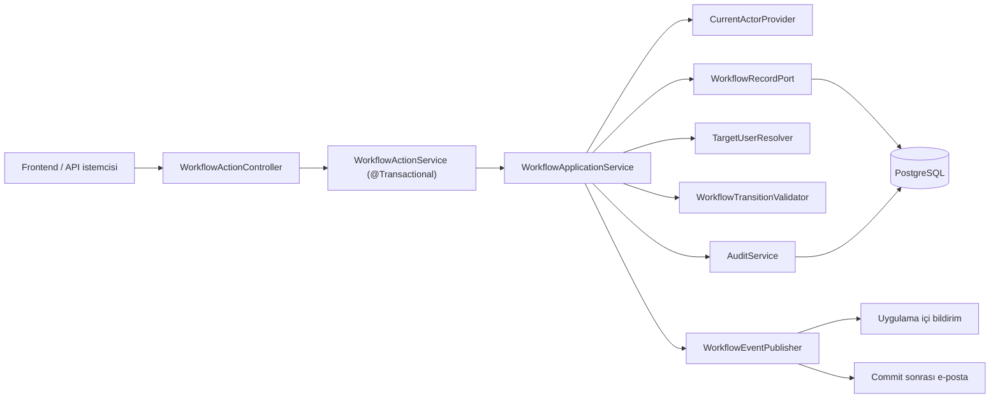
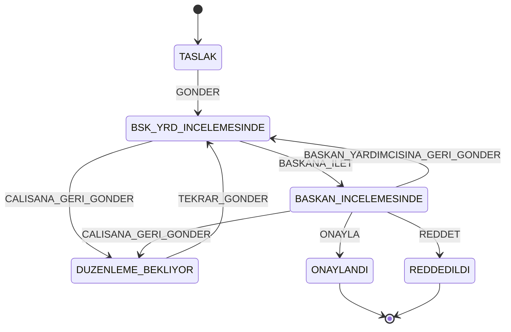
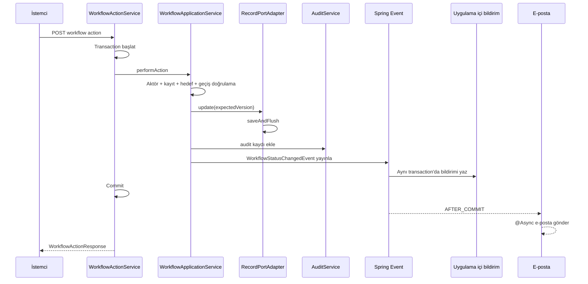

# İş Akışı ve Durum Geçişleri

Bu belge, İş Akışı ve Onay Yönetim Sistemi'nin çalışan backend kodundaki workflow davranışını tanımlar. Ürün hedefinden çok **mevcut uygulamayı** esas alır; planlanan ancak henüz uygulanmayan davranışlar “Bilinen boşluklar” bölümünde ayrıca belirtilir.

> Son kod doğrulaması 13 Ağustos 2026 tarihinde `test` dalının `806aeb80346993796f4cf46077b55a10fdaee8c0` commit'i üzerinde yapılmıştır. Durum makinesi, API veya hata eşlemesi değiştirildiğinde bu belge aynı değişiklik kapsamında güncellenmelidir.

## İçindekiler

- [Kapsam ve kaynaklar](#kapsam-ve-kaynaklar)
- [Mimari](#mimari)
- [Roller ve organizasyon kuralları](#roller-ve-organizasyon-kuralları)
- [Kayıt görünürlüğü ve aksiyon yetkisi](#kayıt-görünürlüğü-ve-aksiyon-yetkisi)
- [Kayıt durumları](#kayıt-durumları)
- [Geçiş matrisi](#geçiş-matrisi)
- [HTTP API sözleşmesi](#http-api-sözleşmesi)
- [Doğrulama sırası](#doğrulama-sırası)
- [Hedef çözümleme ve atama](#hedef-çözümleme-ve-atama)
- [Transaction, audit ve bildirimler](#transaction-audit-ve-bildirimler)
- [Hata sözleşmesi](#hata-sözleşmesi)
- [Eşzamanlılık ve kayıt kilidi](#eşzamanlılık-ve-kayıt-kilidi)
- [Test kapsamı](#test-kapsamı)
- [Bilinen boşluklar ve kararlar](#bilinen-boşluklar-ve-kararlar)
- [Değişiklik kontrol listesi](#değişiklik-kontrol-listesi)

## Kapsam ve kaynaklar

Workflow'un tek yazma ucu şudur:

```http
POST /api/records/{recordId}/workflow/actions
```

Kanonik uygulama kaynakları:

| Konu | Kaynak |
| --- | --- |
| Durumlar | [`RecordStatus`](../backend/src/main/java/btk/staj/WorkFlowProject/workflow/statemachine/RecordStatus.java) |
| Aksiyon özellikleri | [`WorkflowAction`](../backend/src/main/java/btk/staj/WorkFlowProject/workflow/statemachine/WorkflowAction.java) |
| İzinli geçişler | [`TransitionRules`](../backend/src/main/java/btk/staj/WorkFlowProject/workflow/statemachine/TransitionRules.java) |
| Doğrulama sırası | [`WorkflowTransitionValidator`](../backend/src/main/java/btk/staj/WorkFlowProject/workflow/statemachine/WorkflowTransitionValidator.java) |
| Hedef çözümleme | [`TargetUserResolver`](../backend/src/main/java/btk/staj/WorkFlowProject/workflow/service/TargetUserResolver.java) |
| Uygulama akışı | [`WorkflowApplicationService`](../backend/src/main/java/btk/staj/WorkFlowProject/workflow/service/WorkflowApplicationService.java) |
| Transaction sınırı | [`WorkflowActionService`](../backend/src/main/java/btk/staj/WorkFlowProject/workflow/service/WorkflowActionService.java) |
| HTTP ucu | [`WorkflowActionApi`](../backend/src/main/java/btk/staj/WorkFlowProject/workflow/controller/WorkflowActionApi.java) ve [`WorkflowActionController`](../backend/src/main/java/btk/staj/WorkFlowProject/workflow/controller/WorkflowActionController.java) |
| HTTP hata eşlemesi | [`GlobalExceptionHandler`](../backend/src/main/java/btk/staj/WorkFlowProject/common/exception/GlobalExceptionHandler.java) |
| Workflow yan etkileri | [`WorkflowStatusChangedListener`](../backend/src/main/java/btk/staj/WorkFlowProject/notification/listener/WorkflowStatusChangedListener.java) |

İstemci hedef durumu göndermez. Yalnız aksiyonu ve aksiyona bağlı alanları gönderir; hedef durum her zaman backend'deki merkezi geçiş tablosundan hesaplanır.

## Mimari



Durum makinesi ve uygulama servisi doğrudan Spring, JPA veya HTTP'ye bağlı değildir. Spring bean bağlantıları `WorkflowConfiguration` içinde yapılır. Controller, saf uygulama servisini doğrudan değil, transaction açan `WorkflowActionService` üzerinden çağırır.

## Roller ve organizasyon kuralları

| Rol | Workflow kapsamı |
| --- | --- |
| `CALISAN` | Kendi kaydını ilk kez gönderir veya düzeltme sonrasında yeniden gönderir. |
| `BASKAN_YARDIMCISI` | Yalnız kendisine atanmış kaydı Başkana iletir ya da Çalışana geri gönderir. |
| `BASKAN` | Yalnız kendisine atanmış kaydı onaylar, reddeder veya geri gönderir. |
| `ADMIN` | Workflow aktörü ve hedefi değildir. Her aksiyon denemesi `WORKFLOW_ROLE_NOT_ALLOWED` ile reddedilir. |

Kullanıcı yönetiminde `ADMIN`, `BASKAN` ve `BASKAN_YARDIMCISI` tekil rol olarak tasarlanmıştır. `changeRole` ikinci aktif kullanıcıya tekil rol verilmesini engeller; ancak `setActive(..., true)` aynı singleton kontrolünü yapmadığından bu invariant bütün yazma yollarında henüz garanti edilmez.

Başkan Yardımcısı koltuğu için ek kurallar:

- Aktif Başkan Yardımcısı doğrudan pasifleştirilemez.
- Bu kullanıcı başka bir role geçirilirken `PATCH /api/admin/users/{id}/role` isteğinde `replacementBaskanYardimcisiId` verilmelidir.
- Yerine seçilen kullanıcı aktif olmalı ve koltuğu boşaltan kullanıcıyla aynı olmamalıdır.
- Devir aynı kullanıcı yönetimi transaction'ında uygulanır ve iki rol değişikliği de audit kaydı üretir.

> Rol tekil olmasına rağmen mevcut workflow API'si `GONDER` ve `TEKRAR_GONDER` için `targetUserId` alanını zorunlu tutar. Çalışanın erişebildiği kullanıcı ucu yalnız `GET /api/users/me`; kullanıcı listesi Admin'e kapalıdır. Bu nedenle gerçek Çalışan istemcisi gerekli Başkan Yardımcısı UUID'sini backend'den keşfedemez. Backend'in hedefi otomatik çözmesi veya Çalışana açık, yalnız uygun workflow hedeflerini döndüren bir uç eklenmesi gerekir.

## Kayıt görünürlüğü ve aksiyon yetkisi

Kayıt listeleme/detay görünürlüğü ile workflow aksiyonu yapma yetkisi aynı kontrol değildir:

| Rol | Kayıt okuma kapsamı |
| --- | --- |
| `CALISAN` | Yaşam döngüsü boyunca kendisinin oluşturduğu kayıtlar |
| `BASKAN_YARDIMCISI` | Yalnız o anda kendisine atanmış kayıtlar |
| `BASKAN` | `BASKAN_INCELEMESINDE` durumundaki veya kendisine atanmış kayıtlar |
| `ADMIN` | Hiçbir workflow kaydı |

Liste sorguları soft-delete edilmiş kayıtları dışlar. Kayıt audit geçmişi ucu da okumadan önce aynı `RecordAccessPolicy` kuralını uygular.

Workflow controller'ı ayrıca `RecordAccessPolicy` çağırmaz. Aksiyon yetkisi; rol, durum ve `createdBy`/`assignedTo` ilişkisi üzerinden durum makinesinde belirlenir. Başkan Yardımcısı kaydı Başkana ilettiğinde `assignedTo` değiştiği için, daha önce işlem yaptığı bu kaydı artık yalnız geçmişte işlem yapmış olması nedeniyle göremez.

## Kayıt durumları

| Durum | Anlamı | Kaydı oluşturan düzenleyebilir mi? | Terminal mi? |
| --- | --- | --- | --- |
| `TASLAK` | Oluşturulmuş, henüz incelemeye gönderilmemiş kayıt | Evet | Hayır |
| `BSK_YRD_INCELEMESINDE` | Başkan Yardımcısının işlemini bekleyen kayıt | Hayır | Hayır |
| `BASKAN_INCELEMESINDE` | Başkanın nihai kararını bekleyen kayıt | Hayır | Hayır |
| `DUZENLEME_BEKLIYOR` | Düzenleme için kaydı oluşturan Çalışana dönmüş kayıt | Evet | Hayır |
| `ONAYLANDI` | Başkan tarafından onaylanmış kayıt | Hayır | Evet |
| `REDDEDILDI` | Başkan tarafından nihai olarak reddedilmiş kayıt | Hayır | Evet |

`ONAYLANDI` ve `REDDEDILDI` durumlarında yeni workflow aksiyonu uygulanamaz. Kayıt içeriği yalnız `TASLAK` ve `DUZENLEME_BEKLIYOR` durumlarında sahibi tarafından düzenlenebilir. Dosya yükleme terminal durumda engellenir; dosya silme ise mevcut kodda kayıt durumunu kontrol etmez. Bu asimetri [Bilinen boşluklar ve kararlar](#bilinen-boşluklar-ve-kararlar) bölümünde açık risk olarak tutulur.

Yeni kayıt, record modülü tarafından doğrudan `TASLAK` durumuyla oluşturulur; bu işlem bir workflow geçişi değildir.

Kanonik durum adı `BASKAN_INCELEMESINDE` değeridir. Eski sözleşme veya örneklerde görülebilen `BASKAN_ONAYINDA` kodda tanımlı değildir ve API'de kullanılmamalıdır.



## Geçiş matrisi

Tabloda bulunmayan her durum–aksiyon–rol birleşimi geçersizdir.

| Mevcut durum | Aksiyon | Aktör rolü | Gerekli kayıt ilişkisi | Hedef çözümü | Açıklama | Hedef durum |
| --- | --- | --- | --- | --- | --- | --- |
| `TASLAK` | `GONDER` | `CALISAN` | Kaydı oluşturan | İstekteki aktif Başkan Yardımcısı | İsteğe bağlı | `BSK_YRD_INCELEMESINDE` |
| `DUZENLEME_BEKLIYOR` | `TEKRAR_GONDER` | `CALISAN` | Hem oluşturan hem atanan | İstekteki aktif Başkan Yardımcısı | İsteğe bağlı | `BSK_YRD_INCELEMESINDE` |
| `BSK_YRD_INCELEMESINDE` | `BASKANA_ILET` | `BASKAN_YARDIMCISI` | Atanan kullanıcı | Backend'deki tek aktif Başkan | İsteğe bağlı | `BASKAN_INCELEMESINDE` |
| `BSK_YRD_INCELEMESINDE` | `CALISANA_GERI_GONDER` | `BASKAN_YARDIMCISI` | Atanan kullanıcı | Kaydın `createdBy` kullanıcısı | Zorunlu | `DUZENLEME_BEKLIYOR` |
| `BASKAN_INCELEMESINDE` | `ONAYLA` | `BASKAN` | Atanan kullanıcı | Yok | İsteğe bağlı | `ONAYLANDI` |
| `BASKAN_INCELEMESINDE` | `REDDET` | `BASKAN` | Atanan kullanıcı | Yok | Zorunlu | `REDDEDILDI` |
| `BASKAN_INCELEMESINDE` | `CALISANA_GERI_GONDER` | `BASKAN` | Atanan kullanıcı | Kaydın `createdBy` kullanıcısı | Zorunlu | `DUZENLEME_BEKLIYOR` |
| `BASKAN_INCELEMESINDE` | `BASKAN_YARDIMCISINA_GERI_GONDER` | `BASKAN` | Atanan kullanıcı | Kaydın `lastDeputyId` kullanıcısı | Zorunlu | `BSK_YRD_INCELEMESINDE` |

Kayıt ilişkileri:

- **Kaydı oluşturan:** oturum kullanıcısının kimliği `record.createdBy` ile aynıdır.
- **Atanan kullanıcı:** oturum kullanıcısının kimliği `record.assignedTo` ile aynıdır.
- **Hem oluşturan hem atanan:** iki koşul aynı anda sağlanmalıdır. `TEKRAR_GONDER` yalnız düzenleme için kendisine dönmüş kaydın sahibi tarafından yapılabilir.

## HTTP API sözleşmesi

### Kimlik doğrulama

Workflow ucu herkese açık değildir. Geçerli JWT ile kimliği doğrulanmış, aktif bir kullanıcı gerekir. Controller üzerinde ayrı `@PreAuthorize` bulunmaz; rol, durum ve kayıt ilişkisi kontrolleri merkezi durum makinesinde uygulanır.

### İstek

```http
POST /api/records/{recordId}/workflow/actions
Authorization: Bearer <access-token>
Content-Type: application/json
```

```json
{
  "action": "GONDER",
  "targetUserId": "a0eebc99-9c0b-4ef8-bb6d-6bb9bd380a11",
  "comment": "İncelemeye sunulmuştur."
}
```

| Alan | Tip | Genel kural |
| --- | --- | --- |
| `action` | `WorkflowAction` | Her zaman zorunlu. Bilinmeyen enum değeri `400 BAD_REQUEST` üretir. |
| `targetUserId` | UUID | Yalnız `GONDER` ve `TEKRAR_GONDER` için zorunlu; diğer aksiyonlarda gönderilmesi reddedilir. |
| `comment` | string | En fazla 2000 karakter. Geri gönderme aksiyonları ve `REDDET` için boş olmayan değer zorunludur. |

Zorunlu açıklamada yalnız boşluk, sekme veya satır sonundan oluşan değer kabul edilmez. Açıklaması isteğe bağlı aksiyonlarda boş değer teknik olarak kabul edilir; istemcinin alanı göndermemesi tercih edilir.

Çalışana geri gönderme örneği:

```json
{
  "action": "CALISANA_GERI_GONDER",
  "comment": "Bütçe kalemi ve teklif dosyası eksik."
}
```

Onay örneği:

```json
{
  "action": "ONAYLA"
}
```

### Başarılı yanıt

```json
{
  "recordId": "720f7295-68d1-4f61-b4e8-bb82f2bd9d0a",
  "action": "BASKANA_ILET",
  "previousStatus": "BSK_YRD_INCELEMESINDE",
  "newStatus": "BASKAN_INCELEMESINDE",
  "assignedTo": "5bedacf4-f132-4e30-9d38-e5ac3ef63d08",
  "performedBy": "ee9069af-b7b4-4afc-a170-4fd0d65bed35",
  "performedAt": "2026-08-13T12:30:00Z"
}
```

`assignedTo`, onay ve nihai ret sonrasında `null` olur. `performedAt`, backend'in UTC saatinden üretilir. Başarılı cevap tam kayıt detayı değil, geçiş özetidir; istemci gerekirse kayıt detayını yeniden çekmelidir.

## Doğrulama sırası

Hangi hata kodunun döneceği doğrulama sırasına bağlıdır. Uygulanan sıra şöyledir:

1. Aktör rolü workflow'a katılabilir mi? `ADMIN` burada elenir.
2. Kayıt terminal durumda mı?
3. Durum–aksiyon–rol birleşimi geçiş tablosunda var mı?
4. Aktör, kuralın istediği kayıt ilişkisini sağlıyor mu?
5. Zorunlu açıklama dolu mu?
6. İstekte hedef bekleniyorsa `targetUserId` var mı?
7. İstekte hedef beklenmiyorsa yanlışlıkla `targetUserId` gönderilmiş mi?
8. Çözülen hedef beklenen role sahip mi?
9. Çözülen hedef aktif mi?

Uygulama servisi hedef gerektiren aksiyonlarda iki aşamalı doğrulama yapar: önce aktör/durum/istek alanlarını kontrol eder, sonra hedef kullanıcıyı çözüp rol ve aktiflik doğrulamasını tamamlar. Bu sayede yetkisiz bir istek için gereksiz kullanıcı sorgusu yapılmaz.

## Hedef çözümleme ve atama

| Aksiyon | Hedefin kaynağı | Başarısızlık davranışı |
| --- | --- | --- |
| `GONDER` | İstekteki `targetUserId` | Kullanıcı yoksa veya rolü yanlışsa `WORKFLOW_TARGET_ROLE_INVALID`; pasifse `WORKFLOW_TARGET_INACTIVE` |
| `TEKRAR_GONDER` | İstekteki `targetUserId` | Kullanıcı yoksa veya rolü yanlışsa `WORKFLOW_TARGET_ROLE_INVALID`; pasifse `WORKFLOW_TARGET_INACTIVE` |
| `BASKANA_ILET` | Aktif `BASKAN` rolündeki kullanıcılar | Tam olarak bir aktif Başkan yoksa `WORKFLOW_ROLE_NOT_CONFIGURED` |
| `CALISANA_GERI_GONDER` | `record.createdBy` | Referans kullanıcı yoksa veri bütünlüğü hatası; rolü/aktifliği yanlışsa hedef doğrulama hatası |
| `BASKAN_YARDIMCISINA_GERI_GONDER` | `record.lastDeputyId` | Alan boşsa veya kullanıcı yoksa veri bütünlüğü hatası; rolü/aktifliği yanlışsa hedef doğrulama hatası |
| `ONAYLA` | Hedef yok | `assignedTo=null` |
| `REDDET` | Hedef yok | `assignedTo=null` |

Başkan Yardımcısı kaydı Başkana ilettiğinde aktör kimliği `lastDeputyId` alanına yazılır. Başkanın `BASKAN_YARDIMCISINA_GERI_GONDER` aksiyonu bu alanı kullanır; rastgele veya o anki başka bir kullanıcıya yönlendirme yapmaz.

## Transaction, audit ve bildirimler

### İşlem sırası



Kayıt güncellemesi, workflow audit kaydı ve uygulama içi bildirim tek transaction içindedir. Bu işlemlerden biri başarısız olursa tamamı geri alınır. E-posta dış sistem yan etkisi olduğu için yalnız başarılı commit sonrasında ve asenkron gönderilir.

### Audit

Her başarılı geçiş aşağıdaki bilgileri append-only `audit_logs` kaydına dönüştürür:

- kayıt kimliği;
- aksiyon;
- önceki ve yeni durum;
- aktör kimliği ve işlem anındaki rolü;
- açıklama;
- işlem zamanı.

Kayıt geçmişi şu uçtan okunur:

```http
GET /api/audit-logs/record/{recordId}
```

Okuma öncesinde `RecordAccessPolicy.assertCanView` çalışır. `AuditLogResponse` aktörü iç içe nesne yerine düz `userId`, `userFullName`, `roleId` ve `roleName` alanlarıyla döndürür. Audit kaydını güncelleyen veya silen bir HTTP ucu yoktur; veritabanı seviyesinde değiştirilemezlik ayrıca güçlendirilmelidir.

### Bildirim alıcısı

| Geçiş sonucu | Uygulama içi bildirim ve e-posta alıcısı |
| --- | --- |
| Bir kullanıcıya atanan kayıt | Yeni `assignedTo` kullanıcısı |
| `ONAYLANDI` veya `REDDEDILDI` | Kaydı oluşturan kullanıcı |

Uygulama içi mesaj 500 karaktere sığacak şekilde kısaltılır. Bildirim türü aksiyondan `RECORD_SUBMITTED`, `RECORD_FORWARDED`, `RECORD_RETURNED`, `RECORD_APPROVED` veya `RECORD_REJECTED` olarak türetilir.

Bildirim okuma uçları:

| Metot ve adres | Davranış |
| --- | --- |
| `GET /api/notifications?page=0&size=20` | Oturum kullanıcısının okunmuş ve okunmamış geçmişi; en yeniden eskiye, `size` en fazla 100 |
| `GET /api/notifications/unread` | Okunmamış bildirimler |
| `GET /api/notifications/unread/count` | Okunmamış bildirim sayısı |
| `PUT /api/notifications/{id}/read` | Yalnız bildirimin sahibi için okundu işareti |

Geçmiş listesinde istemcinin `sort` parametresi kullanılmaz; sıra daima backend tarafından en yeniden eskiye sabitlenir.

### E-posta

E-posta gövdesi `templates/mail/workflow-status.html` Thymeleaf şablonundan üretilir. Kullanıcıdan gelen başlık ve açıklama `th:text` ile HTML kaçışlı yazılır. Mesaj, kayıt detayına `${FRONTEND_URL}/records/{recordId}` biçiminde deep link içerir; gönderen adresi `MAIL_FROM` ile yapılandırılır.

SMTP veya şablon hatası loglanır, workflow transaction'ı geri alınmaz. Mevcut uygulamada retry, outbox veya dead-letter queue yoktur.

## Hata sözleşmesi

Standart hata gövdesi:

```json
{
  "code": "WORKFLOW_COMMENT_REQUIRED",
  "message": "Bu işlem için açıklama zorunludur",
  "status": 400,
  "timestamp": "2026-08-13T15:30:00"
}
```

Bean Validation hatalarında ayrıca `fieldErrors` bulunur. Mevcut `ApiError` modelinde `path` veya `traceId` alanı yoktur.

| Kod/durum | Mevcut HTTP | Ne zaman oluşur? |
| --- | --- | --- |
| `RESOURCE_NOT_FOUND` | `404` | Kayıt yoksa veya workflow için soft-delete edilmişse |
| `WORKFLOW_ROLE_NOT_ALLOWED` | `403` | `ADMIN` gibi workflow dışı rol aksiyon denerse |
| `WORKFLOW_FORBIDDEN` | `403` | Aktör kaydın gerekli sahibi/atananı değilse |
| `WORKFLOW_RECORD_LOCKED` | `409` | Terminal kayıtta aksiyon denenirse |
| `WORKFLOW_INVALID_TRANSITION` | `400` | Durum–aksiyon–rol birleşimi tanımlı değilse |
| `WORKFLOW_COMMENT_REQUIRED` | `400` | Zorunlu açıklama yoksa veya boşsa |
| `WORKFLOW_TARGET_REQUIRED` | `400` | `GONDER`/`TEKRAR_GONDER` hedefi eksikse |
| `WORKFLOW_TARGET_NOT_ALLOWED` | `400` | Diğer aksiyonlarda istek hedef taşırsa |
| `WORKFLOW_TARGET_ROLE_INVALID` | `400` | Hedef bulunamazsa veya beklenen rolde değilse |
| `WORKFLOW_TARGET_INACTIVE` | `400` | Hedef kullanıcı pasifse |
| `WORKFLOW_STATUS_NOT_CONFIGURED` | `500` | Rezerve kod; mevcut enum-tabanlı akışta bunu üreten bir yol yoktur |
| `WORKFLOW_ROLE_NOT_CONFIGURED` | `500` | Özellikle tam olarak bir aktif Başkan çözülemezse |
| `VALIDATION_ERROR` | `400` | `action` yoksa veya `comment` 2000 karakteri aşarsa |
| `UNAUTHORIZED` | `401` | Geçerli kimlik doğrulama yoksa |

`WorkflowDataIntegrityException` gibi beklenmeyen referans bütünlüğü sorunları şu anda genel handler'a düşer ve `500 INTERNAL_ERROR` olur; ayrıntı istemciye sızdırılmaz.

## Eşzamanlılık ve kayıt kilidi

Kayıt entity'sindeki sürüm alanı optimistic locking için kullanılır. Uygulama servisi kaydı okuduğu sürümle `WorkflowRecordUpdate` üretir. `RecordPortAdapter`:

1. Kaydı yeniden okur.
2. Mevcut sürümü beklenen sürümle karşılaştırır.
3. Durum, atama ve `lastDeputyId` alanlarını değiştirir.
4. `saveAndFlush` ile veritabanı hatasını transaction bitmeden görünür hale getirir.

Soft-delete edilmiş kayıt, workflow uygulama servisi tarafından bulunamamış gibi değerlendirilir ve `404 RESOURCE_NOT_FOUND` döner.

> Optimistic-lock HTTP eşlemesi henüz tamamlanmamıştır. `RecordPortAdapter` sürüm çatışmasında doğrudan `ObjectOptimisticLockingFailureException` fırlatır; `GlobalExceptionHandler` bu tipi özel olarak yakalamadığı için gerçek istek şu anda genel `500 INTERNAL_ERROR` cevabına düşer. `WORKFLOW_VERSION_CONFLICT` enum değeri mevcut olsa da adaptör bu koda çevirmemekte, handler da bu kodu `409` olarak eşlememektedir. İstenen kararlı davranış `409 WORKFLOW_VERSION_CONFLICT` olmalı; bu belge mevcut davranışı gizlemez.

İstemci, eşleme düzeltildikten sonra `409 WORKFLOW_VERSION_CONFLICT` aldığında kayıt detayını yeniden çekmeli, kullanıcıya güncel durumu göstermeli ve aksiyonu otomatik olarak tekrarlamamalıdır.

## Test kapsamı

Mevcut otomatik testler şu katmanları kapsar:

- merkezi geçiş tablosunun sekiz izinli geçişi;
- validator'ın rol, terminal durum, ilişki, açıklama ve hedef kontrolleri;
- hedef kullanıcı çözümleme senaryoları;
- uygulama servisinin başarılı ve reddedilen akışları;
- istek DTO'su Bean Validation kuralları;
- controller'ın başarılı işlem ve temel hata cevapları;
- güvenlik aktörünün kimlik/aktiflik/rol çözümlemesi;
- JPA record adaptörünün sürüm kontrolü ve `saveAndFlush` davranışı;
- event publisher ve bildirim listener davranışı;
- bildirim geçmişi, sahiplik ve sayfalama servisi;
- Thymeleaf e-posta şablonu ve HTML escaping.

Son incelenen `test` commit'inin GitHub Actions çalışması başarılıdır: backend `verify` ve frontend lint/test/build job'ları geçmiştir.

Önemli eksik testler:

- gerçek PostgreSQL üzerinde iki eşzamanlı workflow isteğinin yarış testi;
- optimistic-lock exception'ının uçtan uca `409` sözleşme testi;
- record update + audit + uygulama içi bildirimin birlikte rollback entegrasyon testi;
- backend ve gerçek frontend arasında workflow uçtan uca testi;
- bildirim geçmişinin gerçek PostgreSQL'de kullanıcı kapsamı, sırası ve sayfalama testi.

## Bilinen boşluklar ve kararlar

1. **Optimistic-lock hata eşlemesi:** Gerçek çatışma şu anda `500` olur; `409 WORKFLOW_VERSION_CONFLICT` uygulanmalıdır.
2. **Tekil Başkan Yardımcısı ve istek hedefi:** Rol tekil olduğu halde `GONDER`/`TEKRAR_GONDER` `targetUserId` bekler ve Çalışana açık hedef keşif ucu yoktur. Backend tek aktif kullanıcıyı çözmeli veya yalnız uygun aktif workflow hedeflerini döndüren güvenli bir uç sağlamalıdır; mevcut hali gerçek frontend entegrasyonunu bloke eder.
3. **Frontend entegrasyonu:** Ana ekranlar hâlâ kısmen mock/local state kullanır. Workflow cevabından sonra kayıt yeniden yükleme ve hata kodu eşlemeleri gerçek backend ile tamamlanmalıdır.
4. **İlk parola değişimi:** `mustChangePassword` istemciye dönse de workflow dahil diğer korumalı uçlar backend seviyesinde henüz engellenmez.
5. **E-posta teslim garantisi:** Gönderim asenkron ve best-effort'tur; retry/outbox/DLQ yoktur.
6. **Audit değiştirilemezliği:** Uygulama yazma/silme ucu sunmaz, fakat veritabanı rolü veya trigger ile append-only kuralı zorlanmaz.
7. **Bildirim geçmişi indeksi:** Büyüyen veri için `(user_id, created_at DESC)` birleşik indeksi değerlendirilmelidir.
8. **Sözleşme drift'i:** Entegrasyon sözleşmesindeki `BASKAN_ONAYINDA` örneği `BASKAN_INCELEMESINDE` olarak düzeltilmelidir.
9. **Terminal ek silme ve dosya IDOR'u:** Yükleme terminal kayıtta engellenir; `deleteFile` kayıt kilidi, sahiplik veya görünürlük kontrolü yapmaz. İndirme/önizleme de kayıt görünürlüğüyle sınırlandırılmalıdır.
10. **Tekil rolün yeniden etkinleştirilmesi:** `setActive(..., true)` aynı rolde başka aktif kullanıcı olup olmadığını kontrol etmez. Örneğin iki aktif Başkan oluşursa `BASKANA_ILET`, hedefi tekilleştiremediği için `500 WORKFLOW_ROLE_NOT_CONFIGURED` ile durur.

Başlangıç şartnamesiyle bilinçli veya fiilî uygulama farkları da korunmalıdır:

- Başkan geri gönderme hedefini serbestçe seçmez; Çalışana dönüş `createdBy`, Başkan Yardımcısına dönüş `lastDeputyId` ile sabittir.
- Şartnamedeki “tüm ilgililer” ifadesine karşılık mevcut uygulama her olay için tek alıcı seçer: yeni atanan kullanıcı, terminal geçişte ise kaydı oluşturan kullanıcı.

## Değişiklik kontrol listesi

Yeni bir workflow durumu veya aksiyonu eklenirken en az şu işler aynı değişiklikte yapılmalıdır:

1. `RecordStatus` veya `WorkflowAction` enum'unu güncelleyin.
2. İzinli birleşimi yalnız `TransitionRules` içine ekleyin; controller/service içinde paralel kural yazmayın.
3. Hedef, açıklama ve aktör ilişkisini `WorkflowAction`/validator modelinde tanımlayın.
4. Hedef çözümleme gerekiyorsa `TargetUserResolver` ve port testlerini güncelleyin.
5. Audit ve bildirim türü/alıcı davranışını belirleyin.
6. `WorkflowErrorCode` ve gerçek HTTP eşlemesini birlikte ekleyin.
7. Durum makinesi, uygulama servisi, controller ve entegrasyon testlerini güncelleyin.
8. OpenAPI istemcisini yeniden üretin ve frontend mock/adapter katmanını eşleyin.
9. Bu belgeyi, `README.md` özetini ve frontend–backend sözleşmesini aynı PR'da güncelleyin.
