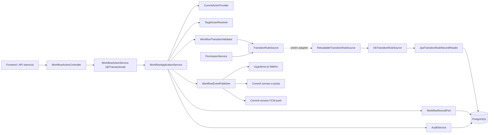
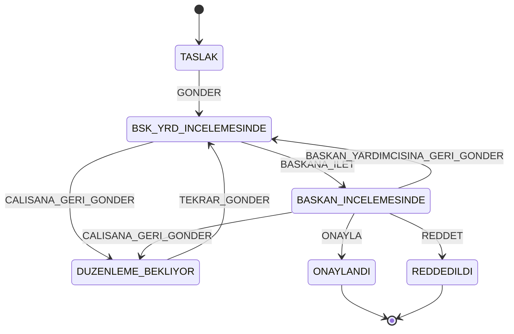
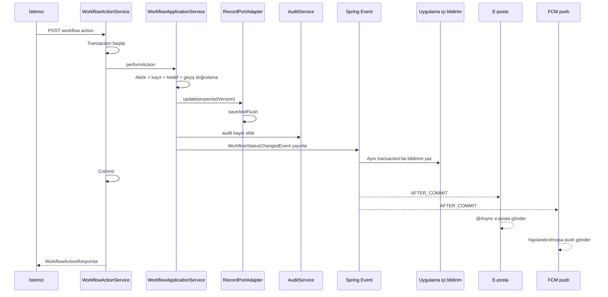

# İş Akışı ve Durum Geçişleri

Bu belge, İş Akışı ve Onay Yönetim Sistemi'nin çalışan backend kodundaki workflow davranışını tanımlar. Ürün hedefinden çok **mevcut uygulamayı** esas alır; planlanan ancak henüz uygulanmayan davranışlar ile uygulanmış olup beklenen sonucu vermeyen davranışlar “Bilinen boşluklar” bölümünde ayrıca belirtilir. Durum makinesi, API veya hata eşlemesi değiştirildiğinde belge aynı değişiklik kapsamında güncellenir.

4 Eylül 2026 — `codex/ap-2-frontend-uyum` @ `c9b0297`: AP-2 hizalaması, V23,
WF-5/WF-6 ve departman görünürlüğü birlikte uygulanmıştır (PR #69 ve #70 yerel
geçmişte birleşmiştir). Uzak `test`/CI/ortam kabulü ayrıca doğrulanmalıdır.
Bu belgenin anlattığı davranışın **doğrulanmış istisnaları** aşağıdaki “Bilinen
boşluklar” bölümündedir; tekrar üretim adımları
[inceleme raporundadır](PROJE_INCELEME_RAPORU_2026-09-04.md).

## İçindekiler

- [Kapsam ve kaynaklar](#kapsam-ve-kaynaklar)
- [Mimari](#mimari)
- [Roller ve organizasyon kuralları](#roller-ve-organizasyon-kuralları)
- [Kayıt görünürlüğü ve aksiyon yetkisi](#kayıt-görünürlüğü-ve-aksiyon-yetkisi)
- [Kayıt durumları](#kayıt-durumları)
- [Geçiş matrisi](#geçiş-matrisi)
- [HTTP API sözleşmesi](#http-api-sözleşmesi)
- [Doğrulama sırası](#doğrulama-sırası)
- [Hedef çözümleme ve atama](#hedef-çözümleme-ve-atama)
- [Transaction, audit ve bildirimler](#transaction-audit-ve-bildirimler)
- [Hata sözleşmesi](#hata-sözleşmesi)
- [Eşzamanlılık ve kayıt kilidi](#eşzamanlılık-ve-kayıt-kilidi)
- [Test kapsamı](#test-kapsamı)
- [Bilinen boşluklar ve kararlar](#bilinen-boşluklar-ve-kararlar)
- [Değişiklik kontrol listesi](#değişiklik-kontrol-listesi)

## Kapsam ve kaynaklar

Kayıt üzerindeki workflow aksiyonunun JWT ile çağrılan HTTP ucu şudur:

```http
POST /api/records/{recordId}/workflow/actions
```

E-posta `/api/public/mail-actions/consume` ucu da aynı uygulama servisini kendi
transaction sınırında çağırır. Kural reload'u ve WF-8 bağ yönetimi kayıt aksiyonu
uygulamaz; WF-8'in yönetim HTTP uçları AP-8 kapsamında henüz eklenmemiştir.

Kanonik uygulama kaynakları:

| Konu | Kaynak |
| --- | --- |
| Durumlar | [`RecordStatus`](../backend/src/main/java/btk/staj/WorkFlowProject/workflow/statemachine/RecordStatus.java) |
| Aksiyon özellikleri | [`WorkflowAction`](../backend/src/main/java/btk/staj/WorkFlowProject/workflow/statemachine/WorkflowAction.java) |
| Geçiş kuralı okuma sınırı | [`TransitionRuleSource`](../backend/src/main/java/btk/staj/WorkFlowProject/workflow/statemachine/TransitionRuleSource.java) |
| Üretim kural adapteri | [`DbTransitionRuleSource`](../backend/src/main/java/btk/staj/WorkFlowProject/workflow/adapter/DbTransitionRuleSource.java) |
| DB okuma adapteri | [`JpaTransitionRuleRecordReader`](../backend/src/main/java/btk/staj/WorkFlowProject/workflow/adapter/JpaTransitionRuleRecordReader.java) |
| Parity ve veritabanısız test referansı (`TZ-1` ile test ağacında) | [`StaticTransitionRuleSource`](../backend/src/test/java/btk/staj/WorkFlowProject/workflow/statemachine/StaticTransitionRuleSource.java) ve [`TransitionRules`](../backend/src/test/java/btk/staj/WorkFlowProject/workflow/statemachine/TransitionRules.java) |
| Doğrulama sırası | [`WorkflowTransitionValidator`](../backend/src/main/java/btk/staj/WorkFlowProject/workflow/statemachine/WorkflowTransitionValidator.java) |
| Hedef çözümleme | [`TargetUserResolver`](../backend/src/main/java/btk/staj/WorkFlowProject/workflow/service/TargetUserResolver.java) |
| Uygulama akışı | [`WorkflowApplicationService`](../backend/src/main/java/btk/staj/WorkFlowProject/workflow/service/WorkflowApplicationService.java) |
| Transaction sınırı | [`WorkflowActionService`](../backend/src/main/java/btk/staj/WorkFlowProject/workflow/service/WorkflowActionService.java) |
| HTTP ucu | [`WorkflowActionApi`](../backend/src/main/java/btk/staj/WorkFlowProject/workflow/controller/WorkflowActionApi.java) ve [`WorkflowActionController`](../backend/src/main/java/btk/staj/WorkFlowProject/workflow/controller/WorkflowActionController.java) |
| HTTP hata eşlemesi | [`GlobalExceptionHandler`](../backend/src/main/java/btk/staj/WorkFlowProject/common/exception/GlobalExceptionHandler.java) |
| Workflow yan etkileri | [`WorkflowStatusChangedListener`](../backend/src/main/java/btk/staj/WorkFlowProject/notification/listener/WorkflowStatusChangedListener.java) |

İstemci hedef durumu göndermez. Yalnız aksiyonu ve aksiyona bağlı alanları gönderir; hedef durum her zaman backend'deki merkezi geçiş tablosundan hesaplanır.

## Mimari



Durum makinesi ve uygulama servisi doğrudan Spring, JPA veya HTTP'ye bağlı değildir. `WorkflowTransitionValidator` ve `PermissionService` kuralları `TransitionRuleSource` üzerinden okur. `WorkflowConfiguration` bu sınıra `ReloadableTransitionRuleSource` bean'ini bağlar; sarmaladığı `DbTransitionRuleSource` açılışta `JpaTransitionRuleRecordReader` ile aktif geçişleri yükler ve değiştirilemez bir snapshot tutar. Boş veya geçersiz kural verisi uygulamanın açılmasını engeller. Snapshot `WORKFLOW_MANAGE` gerektiren `POST /api/workflow/rules/reload` ile yenilenebilir; geçersiz yeni kural kümesi yüklenmez ve çalışan snapshot korunur. Statik kaynak yalnız parity ve veritabanısız testlerde referanstır ve test ağacında durur. Controller, saf uygulama servisini doğrudan değil, transaction açan `WorkflowActionService` üzerinden çağırır.

WF-8 ile `WorkflowActorBindingService`, mevcut geçişe dinamik aktör rolü bağlayıp kullanılmayan bağları pasifleştirebilir. Bağ ve audit aynı transaction'da yazılır; doğrulanmış snapshot yalnız commit sonrası yayınlanır. Manuel reload aynı güncelleme kilidini kullanır. Her workflow işlemi başlangıçta tek snapshot yakalar; başlamış işlem eski kurallarıyla tamamlanır. Servis girdileri, kullanım koruması ve AP-8 entegrasyonu: [WF-8 / AP-8 sözleşmesi](WF8_AP8_AKTOR_ROL_BAGLAMA_SOZLESMESI.md).

## Roller ve organizasyon kuralları

Aşağıdaki tablo başlangıç seed'inin sistem rolü davranışıdır. WF-8 ile mevcut
geçişe bağlanan aktif dinamik rol de gerekli permission ve kayıt ilişkisini
sağladığında o geçişi kullanabilir; aktörlerin kapalı listesi değildir.

| Rol | Workflow kapsamı |
| --- | --- |
| `CALISAN` | Kendi kaydını ilk kez gönderir veya düzeltme sonrasında yeniden gönderir. |
| `BASKAN_YARDIMCISI` | Yalnız kendisine atanmış kaydı Başkana iletir ya da Çalışana geri gönderir. |
| `BASKAN` | Yalnız kendisine atanmış kaydı onaylar, reddeder veya geri gönderir. |
| `ADMIN` | Workflow aktörü ve hedefi değildir. Her aksiyon denemesi `WORKFLOW_ROLE_NOT_ALLOWED` ile reddedilir. |

Yerleşik roller görüntülenen `name` yerine değişmez `system_key` ile tanınır. Dar kapsamlı `SystemRoleKey`; varsayılan çalışanı, bootstrap admin'i, hesap korumalarını ve yardımcı devrini belirler. Workflow aktör ve hedef kimliği `RoleId` taşır; Görünürlük aktörü de `RoleId`, isteğe bağlı `SystemRoleKey` ve güncel permission kümesi taşır; `RoleName` yalnız kalan uyumluluk/test sınırlarında korunur.

Kullanıcı kapasitesi `roles.max_users` ile belirlenir: `NULL` sınırsızdır; dolu değer yalnız aktif kullanıcıları rol ID'sine göre sınırlar. Seed'de `ADMIN`, `BASKAN` ve `BASKAN_YARDIMCISI` için değer `1`'dir. Oluşturma, bootstrap, rol değiştirme, yeniden etkinleştirme ve yardımcı devri ortak `RoleCapacityService` kontrolünü kullanır. Güncellenen kullanıcılar UUID, ardından etkilenen roller ID sırasıyla `PESSIMISTIC_WRITE` kilitlenir; sayım ve yazım aynı transaction'dadır. Devirde ayrılan ve gelen kullanıcı birlikte hesaplanır. Limit aşımı `409 ADMIN_LIMIT_EXCEEDED` döndürür; pasif role atama yapılamaz.

`PATCH /api/admin/users/{id}/role`, pozitif `roleId` veya eski `roleName` alanlarından tam birini kabul eder. Ad API sınırında ID'ye çözülür. İkisi birlikte, ikisi de eksik, boş ad veya pozitif olmayan ID `400` döndürür. Web/mobilin `roleName` gönderimleri ve mevcut yanıt alanları korunur; yeni istemciler ID kullanabilir.

Başkan Yardımcısı koltuğu için ek kurallar:

- Aktif Başkan Yardımcısı doğrudan pasifleştirilemez.
- Bu kullanıcı başka bir role geçirilirken `PATCH /api/admin/users/{id}/role` isteğinde `replacementBaskanYardimcisiId` verilmelidir.
- Yerine seçilen kullanıcı aktif, `CALISAN` sistem rolünde olmalı ve koltuğu boşaltan kullanıcıyla aynı olmamalıdır.
- Devir aynı kullanıcı yönetimi transaction'ında uygulanır ve iki rol değişikliği de audit kaydı üretir.

> Rol tekil olduğu için `GONDER` ve `TEKRAR_GONDER` hedefini de backend çözer; istemci `targetUserId` göndermez. Çalışanın erişebildiği kullanıcı ucu yalnız `GET /api/users/me` olduğundan Başkan Yardımcısı UUID'sini keşfedemez ve tekil rol kararı gereği ona kullanıcı listeleme ucu açılmayacaktır. Sistemde tam olarak bir aktif Başkan Yardımcısı yoksa (devir anında sıfır, yanlış yapılandırmada birden fazla) istek `409 WORKFLOW_ROLE_NOT_CONFIGURED` ile durur.

## Kayıt görünürlüğü ve aksiyon yetkisi

Kayıt listeleme/detay görünürlüğü ile workflow aksiyonu yapma yetkisi aynı kontrol değildir:

| Rol | Kayıt okuma kapsamı |
| --- | --- |
| Dinamik rol / `CALISAN` | Kendisinin oluşturduğu, doğrudan kendisine atanan veya yetkili departman/durum kapsamındaki kayıtlar |
| `BASKAN_YARDIMCISI` | Kendisinin oluşturduğu veya kendisine atanmış kayıtlar, `DUZENLEME_BEKLIYOR` durumundakiler ve bir kez kendi elinden geçmiş kayıtlar (`last_deputy_id`) |
| `BASKAN` | Kendisinin oluşturduğu, `BASKAN_INCELEMESINDE` durumundaki, sonuçlanmış (`ONAYLANDI`/`REDDEDILDI`) veya kendisine atanmış kayıtlar |
| `ADMIN` | Hiçbir workflow kaydı |

Kapsamın iki kolu, `assigned_to`'nun geçişte boşalması yüzünden gerekli:

- **Başkan Yardımcısı**, `BASKANA_ILET` ile `assigned_to`'yu Başkana devreder ama `last_deputy_id` kendisinde kalır. Bu kol olmasaydı ilettiği evrağı anında kaybeder; "Sonuçlananlar" ve panodaki "Son Kayıtlar" listeleri kalıcı olarak boş görünürdü.
- **Başkan**, `ONAYLA`/`REDDET` ile `assigned_to`'yu boşaltır. Sonuçlanan iki durum kapsama açıkça yazılmasaydı verdiği karardan sonra kaydı kaybederdi. Bu sistem istisnası durum bazlıdır: WF-8 ile yetkilendirilmiş dinamik aktörün sonuçlandırdığı kayıtlar da Başkan kapsamındadır. Dinamik aktör, oluşturucu değilse atama boşaldığında kendi erişimini kaybeder.

Bütün okuma yolları aktif kullanıcı/rol ve `RECORD_VIEW` ister; ADMIN her durumda reddedilir. Soft-delete kayıtlar listede yoktur, tekil kayıt/dosya/geçmiş okumalarında `404` döner. Dinamik roller görünür kaydın güncel içeriğini ve tam geçmişini görür; ek `AUDIT_VIEW` şartı yoktur. Sistem rollerinin içerik/geçmiş kesimleri korunur.

Kural tek bir saf Java `RecordVisibilityScope` tanımından gelir. `RecordAccessPolicy` tekil değerlendirmeyi, `RecordSpecifications` scope’un SQL çevirisini yapar; sorgu adapter’ı rol seçimi içermez. Liste toplamları SQL’de scope uygulandıktan sonra hesaplanır. Ayrıntı ve departman kapsamı: [WF-2C2 / DB-8 sözleşmesi](WF2C2_DB8_GORUNURLUK_SOZLESMESI.md).

Workflow controller'ı ayrıca `RecordAccessPolicy` çağırmaz. Aksiyon yetkisi; rol, permission, durum ve oluşturucu/atama ilişkisi üzerinden durum makinesinde belirlenir. Okuma kapsamı bir kaydı görünür kılması, o kayıt üzerinde aksiyon yapılabileceği anlamına gelmez: ilettiği evrağı izleyen Başkan Yardımcısı onu salt okunur görür.

### Permission authorities (WF-2B)

JWT doğrulamasında her istekte kullanıcı, rol ve aktif permission kodları DB'den okunur. E-posta aksiyonları da aynı `AuthenticatedUserFactory` yolunu kullanır. Principal değişmez bir permission kümesi taşır; global EAGER koleksiyon veya `ROLE_<rol adı>` authority'si yoktur. Pasif permission authority üretmez, pasif rol erişim sağlayamaz. `spring.jpa.open-in-view=false` altında gerekli veriler authentication sırasında yüklenir.

Endpoint'ler Spring method security ile aşağıdaki `hasAuthority` kontrollerini uygular. Ek `ADMIN_PANEL_ACCESS` koşulu yoktur; kullanıcı rolünün görüntülenen adı yetki sağlamaz.

| İşlem | Authority |
| --- | --- |
| Kayıt oluşturma / düzenleme / silme | `RECORD_CREATE` / `RECORD_EDIT` / `RECORD_DELETE` |
| Dosya yükleme / silme | `FILE_MANAGE` |
| Kullanıcı listeleme | `USER_VIEW` |
| Kullanıcı oluşturma / rol atama / etkinlik değiştirme | `USER_MANAGE` |
| Rol listeleme | `ROLE_VIEW` |
| Admin audit listesi / kullanıcı audit geçmişi | `AUDIT_VIEW` |
| Geçiş kuralı snapshot'ını yenileme (`POST /api/workflow/rules/reload`) | `WORKFLOW_MANAGE` |

Authority'si olmayan istek `403` döner; `docs/openapi.json` springdoc anlık görüntüsü olduğu için bu koşulu uç bazında taşımaz, bağlayıcı kaynak bu tablodur.

`V17`, `FILE_MANAGE` ve `RECORD_DELETE` kodlarını `CALISAN`, `AUDIT_VIEW` kodunu `ADMIN` sistem rolüne atar. Kayıt sahipliği, düzenlenebilir durum, yalnız taslak silme ve dosya kilidi kontrolleri ayrıca uygulanır. Dinamik roller bu capability'lerle kullanıcı yönetimi ve kayıt yaşam döngüsü işlemlerini yapabilir; audit aktörün gerçek kullanıcı/rol ID'sini kullanır. Dinamik rollerin workflow ve görünürlük modeli WF-2D2/WF-2C2 kapsamındadır.

## Kayıt durumları

| Durum | Anlamı | Kaydı oluşturan düzenleyebilir mi? | Terminal mi? |
| --- | --- | --- | --- |
| `TASLAK` | Oluşturulmuş, henüz incelemeye gönderilmemiş kayıt | Evet | Hayır |
| `BSK_YRD_INCELEMESINDE` | Başkan Yardımcısının işlemini bekleyen kayıt | Hayır | Hayır |
| `BASKAN_INCELEMESINDE` | Başkanın nihai kararını bekleyen kayıt | Hayır | Hayır |
| `DUZENLEME_BEKLIYOR` | Düzenleme için kaydı oluşturan Çalışana dönmüş kayıt | Evet | Hayır |
| `ONAYLANDI` | Başkan tarafından onaylanmış kayıt | Hayır | Evet |
| `REDDEDILDI` | Başkan tarafından nihai olarak reddedilmiş kayıt | Hayır | Evet |

`ONAYLANDI` ve `REDDEDILDI` durumlarında yeni workflow aksiyonu uygulanamaz. Kayıt içeriği yalnız `TASLAK` ve `DUZENLEME_BEKLIYOR` durumlarında gerekli permission'a sahip sahibi tarafından düzenlenebilir. Dosya yükleme ve silme mevcut `RecordLockValidator` üzerinden sahiplik ve kilit kontrolüne tabidir.

Yeni kayıt, record modülü tarafından doğrudan `TASLAK` durumuyla oluşturulur; bu işlem bir workflow geçişi değildir.

Kanonik durum adı `BASKAN_INCELEMESINDE` değeridir. Eski sözleşme veya örneklerde görülebilen `BASKAN_ONAYINDA` kodda tanımlı değildir ve API'de kullanılmamalıdır.



## Geçiş matrisi

Tabloda bulunmayan her durum–aksiyon–rol birleşimi geçersizdir.

| Mevcut durum | Aksiyon | Aktör rolü | Gerekli kayıt ilişkisi | Hedef çözümü | Açıklama | Hedef durum |
| --- | --- | --- | --- | --- | --- | --- |
| `TASLAK` | `GONDER` | `CALISAN` | Kaydı oluşturan | Backend'deki tek aktif Başkan Yardımcısı | İsteğe bağlı | `BSK_YRD_INCELEMESINDE` |
| `DUZENLEME_BEKLIYOR` | `TEKRAR_GONDER` | `CALISAN` | Hem oluşturan hem atanan | Backend'deki tek aktif Başkan Yardımcısı | İsteğe bağlı | `BSK_YRD_INCELEMESINDE` |
| `BSK_YRD_INCELEMESINDE` | `BASKANA_ILET` | `BASKAN_YARDIMCISI` | Atanan kullanıcı | Backend'deki tek aktif Başkan | İsteğe bağlı | `BASKAN_INCELEMESINDE` |
| `BSK_YRD_INCELEMESINDE` | `CALISANA_GERI_GONDER` | `BASKAN_YARDIMCISI` | Atanan kullanıcı | Kaydın `createdBy` kullanıcısı | Zorunlu | `DUZENLEME_BEKLIYOR` |
| `BASKAN_INCELEMESINDE` | `ONAYLA` | `BASKAN` | Atanan kullanıcı | Yok | İsteğe bağlı | `ONAYLANDI` |
| `BASKAN_INCELEMESINDE` | `REDDET` | `BASKAN` | Atanan kullanıcı | Yok | Zorunlu | `REDDEDILDI` |
| `BASKAN_INCELEMESINDE` | `CALISANA_GERI_GONDER` | `BASKAN` | Atanan kullanıcı | Kaydın `createdBy` kullanıcısı | Zorunlu | `DUZENLEME_BEKLIYOR` |
| `BASKAN_INCELEMESINDE` | `BASKAN_YARDIMCISINA_GERI_GONDER` | `BASKAN` | Atanan kullanıcı | Kaydın `lastDeputyId` kullanıcısı | Zorunlu | `BSK_YRD_INCELEMESINDE` |
| `TASLAK` | `DEPARTMANA_GONDER` | `CALISAN` | Kaydı oluşturan | İstekteki aktif departman | İsteğe bağlı | `BSK_YRD_INCELEMESINDE` |
| `DUZENLEME_BEKLIYOR` | `DEPARTMANA_GONDER` | `CALISAN` | Hem oluşturan hem atanan | İstekteki aktif departman | İsteğe bağlı | `BSK_YRD_INCELEMESINDE` |

Her geçiş ayrıca `required_permission_id` üzerinden okunan `requiredPermissionCode` değerini ister: gönderme, tekrar gönderme ve iletme için `RECORD_FORWARD`; onay için `RECORD_APPROVE`; ret için `RECORD_REJECT`; üç geri gönderme satırı için `RECORD_RETURN`. Aktif bir geçişte eksik/boş permission metadata'sı açılış hatasıdır. Permission pasifleştirilirse principal'a alınmaz ve geçiş `WORKFLOW_FORBIDDEN` ile reddedilir; snapshot'ın yenilenmesini beklemek gerekmez.

Kayıt ilişkileri:

- **Kaydı oluşturan:** oturum kullanıcısının kimliği `record.createdBy` ile aynıdır.
- **Atama sahibi:** kullanıcı `record.assignedTo` ile aynıdır veya atanan aktif departmanın aktif üyesidir ve mevcut durum/aksiyon routing'i kendi aktif workflow rolünü işaret eder. Geçiş permission'ı ayrıca validator tarafından denetlenir.
- **Hem oluşturan hem atanan:** iki koşul aynı anda sağlanmalıdır. `TEKRAR_GONDER` yalnız düzenleme için kendisine dönmüş kaydın sahibi tarafından yapılabilir.

## HTTP API sözleşmesi

### Kimlik doğrulama

Workflow ucu herkese açık değildir. Geçerli JWT ile kimliği doğrulanmış, kullanıcısı ve rolü aktif bir principal gerekir. Controller üzerinde ayrı `@PreAuthorize` bulunmaz; workflow aktörlüğü, rol, permission, durum ve kayıt ilişkisi kontrolleri merkezi durum makinesinde uygulanır.

### İstek

```http
POST /api/records/{recordId}/workflow/actions
Authorization: Bearer <access-token>
Content-Type: application/json
```

```json
{
  "action": "GONDER",
  "comment": "İncelemeye sunulmuştur."
}
```

| Alan | Tip | Genel kural |
| --- | --- | --- |
| `action` | `WorkflowAction` | Her zaman zorunlu. Bilinmeyen enum değeri `400 BAD_REQUEST` üretir. |
| `targetDepartmentId` | Integer | Yalnız `DEPARTMANA_GONDER` için zorunlu. `targetUserId` ile birlikte verilirse `400 VALIDATION_ERROR`; başka aksiyonda verilirse `400 WORKFLOW_TARGET_NOT_ALLOWED`. |
| `targetUserId` | UUID | **Hiçbir aksiyonda gönderilmez.** Hedefi her zaman backend çözer; alan yine de gönderilirse istek `400 WORKFLOW_TARGET_NOT_ALLOWED` ile reddedilir. |
| `comment` | string | En fazla 2000 karakter. Geri gönderme aksiyonları ve `REDDET` için boş olmayan değer zorunludur. |

Zorunlu açıklamada yalnız boşluk, sekme veya satır sonundan oluşan değer kabul edilmez. Açıklaması isteğe bağlı aksiyonlarda boş değer teknik olarak kabul edilir; istemcinin alanı göndermemesi tercih edilir.

Çalışana geri gönderme örneği:

```json
{
  "action": "CALISANA_GERI_GONDER",
  "comment": "Bütçe kalemi ve teklif dosyası eksik."
}
```

Onay örneği:

```json
{
  "action": "ONAYLA"
}
```

### Başarılı yanıt

```json
{
  "recordId": "720f7295-68d1-4f61-b4e8-bb82f2bd9d0a",
  "action": "BASKANA_ILET",
  "previousStatus": "BSK_YRD_INCELEMESINDE",
  "newStatus": "BASKAN_INCELEMESINDE",
  "assignedTo": "5bedacf4-f132-4e30-9d38-e5ac3ef63d08",
  "performedBy": "ee9069af-b7b4-4afc-a170-4fd0d65bed35",
  "performedAt": "2026-08-13T12:30:00Z"
}
```

`assignedTo`, onay ve nihai ret sonrasında `null` olur. `performedAt`, backend'in UTC saatinden üretilir. Başarılı cevap tam kayıt detayı değil, geçiş özetidir; istemci gerekirse kayıt detayını yeniden çekmelidir.

## Doğrulama sırası

Hangi hata kodunun döneceği doğrulama sırasına bağlıdır. Uygulanan sıra şöyledir:

1. Aktörün DB kaynaklı `is_workflow_actor` bilgisi workflow'a katılmasına izin veriyor mu? `ADMIN` seed'de burada elenir.
2. Kayıt terminal durumda mı?
3. Durum–aksiyon–rol birleşimi geçiş tablosunda var mı?
4. Aktör, kuralın istediği kayıt ilişkisini ve `requiredPermissionCode` yetkisini sağlıyor mu? İkisinden biri eksikse `WORKFLOW_FORBIDDEN` döner.
5. Zorunlu açıklama dolu mu?
6. Aksiyon hedef bekliyorsa en az bir hedef alanı gönderilmiş mi? `DEPARTMANA_GONDER` hedef departman ister.
7. Gönderilen hedef alanı aksiyonun beklediği tür mü? Yanlış alan `WORKFLOW_TARGET_NOT_ALLOWED` üretir; iki hedef alanı birlikte HTTP DTO doğrulamasında reddedilir.
8. Çözülen hedef beklenen role sahip mi?
9. Çözülen hedef aktif mi?

Uygulama servisi hedef gerektiren aksiyonlarda iki aşamalı doğrulama yapar: önce aktör/durum/istek alanlarını kontrol eder, sonra hedef kullanıcıyı çözüp rol ve aktiflik doğrulamasını tamamlar. Bu sayede yetkisiz bir istek için gereksiz kullanıcı sorgusu yapılmaz.

## Hedef çözümleme ve atama

```json
{ "action": "DEPARTMANA_GONDER", "targetDepartmentId": 12, "comment": "Satın alma incelemesi" }
```

Departmana gönderim `assigned_department_id` alanını doldurur ve `assigned_to` alanını temizler. Hedef aktif olmalı; iniş durumu için aktif routing/transition, aktif workflow rolü, uygun aktif üye, `RECORD_VIEW` ve geçiş permission'ı bulunmalıdır. Eksik/pasif departman `400 WORKFLOW_DEPARTMENT_INVALID`, kullanılabilir iniş routing'i yoksa `409 WORKFLOW_DEPARTMENT_ROUTING_NOT_CONFIGURED` döner. Kayıt zaten departmandayken eksik routing veya yetkisiz üyelik `403 WORKFLOW_FORBIDDEN` üretir. Üyelik tek başına yetki vermez.

Departman kontrolü ön validator kabulünden sonra çalışır; yetkisiz istek departman yapılandırma hatasıyla maskelenmez. Aktörün atama ilişkisi bir kez hesaplanıp her iki doğrulama geçişinde kullanılır.


Hedefin nasıl çözüleceği **aksiyonun değil geçişin** özelliğidir:
`workflow_transitions.target_strategy` ve `expected_target_role_id` kolonlarından okunur.
Aynı aksiyon farklı geçişlerde farklı hedefe gidebilir — `CALISANA_GERI_GONDER` hem Başkan
Yardımcısının hem Başkanın kullandığı iki ayrı satırda bulunur.

| Strateji | Hedefin kaynağı | Başarısızlık davranışı |
| --- | --- | --- |
| `ROLE` | `expected_target_role_id` rolündeki tek aktif kullanıcı | Tam olarak bir aktif kullanıcı yoksa `WORKFLOW_ROLE_NOT_CONFIGURED` |
| `CREATOR` | `record.createdBy` | Referans kullanıcı yoksa veri bütünlüğü hatası; rolü/aktifliği yanlışsa hedef doğrulama hatası |
| `CURRENT_ASSIGNEE` | `record.assignedTo` | Alan boşsa veya kullanıcı yoksa veri bütünlüğü hatası |
| `PREVIOUS_ACTOR` | `record.lastDeputyId` | Alan boşsa veya kullanıcı yoksa veri bütünlüğü hatası; rolü/aktifliği yanlışsa hedef doğrulama hatası |
| `NONE` | Hedef yok | `assignedTo=null` |
| `DEPARTMENT` | İstekteki `targetDepartmentId`; kullanıcı seçilmez | Aktif departman ve kullanılabilir iniş routing'i zorunlu |

Seed edilmiş on geçişin dağılımı: `GONDER`, `TEKRAR_GONDER` ve `BASKANA_ILET` → `ROLE`;
her iki `CALISANA_GERI_GONDER` → `CREATOR`; `BASKAN_YARDIMCISINA_GERI_GONDER` →
`PREVIOUS_ACTOR`; `ONAYLA` ve `REDDET` → `NONE`; iki `DEPARTMANA_GONDER` → `DEPARTMENT`. `CURRENT_ASSIGNEE` şu an hiçbir geçişte
kullanılmıyor ama sözleşmede tanımlı olduğu için desteklenir.

Kod tarafında ek bir kural vardır: hedef gerektiren bir geçiş beklenen hedef rolü de taşımak
zorundadır. `NONE` ve `DEPARTMENT` için `expected_target_role_id` boş, kullanıcı hedefleyen stratejiler için doludur. Bu, veritabanı
CHECK'inden daha katıdır — CHECK yalnız `ROLE` için rolü zorunlu kılar — ve iki aşamalı
doğrulamanın çalışması için gereklidir. İhlal, isteği değil **açılışı** düşürür.

Başkan Yardımcısı kaydı Başkana ilettiğinde aktör kimliği `lastDeputyId` alanına yazılır. `PREVIOUS_ACTOR` stratejisi bu alanı kullanır; rastgele veya o anki başka bir kullanıcıya yönlendirme yapmaz. Bu primitive genel bir audit geçmişi taraması değildir.

## Transaction, audit ve bildirimler

### İşlem sırası



Kayıt güncellemesi, workflow audit kaydı ve uygulama içi bildirim tek transaction içindedir. Bu işlemlerden biri başarısız olursa tamamı geri alınır. E-posta ve push dış sistem yan etkileri olduğu için yalnız başarılı commit sonrasında denenir; başarısızlıkları workflow transaction'ını geri almaz.

### Audit

Her başarılı geçiş aşağıdaki bilgileri append-only `audit_logs` kaydına dönüştürür:

- kayıt kimliği;
- aksiyon;
- önceki ve yeni durum;
- aktör kimliği ve işlem anındaki rolü;
- açıklama;
- işlem zamanı.

Kayıt geçmişi şu uçtan okunur:

```http
GET /api/audit-logs/record/{recordId}
```

Okuma öncesinde `RecordAccessPolicy.assertCanView` çalışır. `AuditLogResponse` aktörü iç içe nesne yerine düz `userId`, `userFullName`, `roleId` ve `roleName` alanlarıyla döndürür. Audit kaydını güncelleyen veya silen bir HTTP ucu yoktur; veritabanı seviyesinde değiştirilemezlik ayrıca güçlendirilmelidir.

### Bildirim alıcısı

| Geçiş sonucu | Uygulama içi bildirim, e-posta ve push alıcısı |
| --- | --- |
| Bir kullanıcıya atanan kayıt | Yeni `assignedTo` kullanıcısı |
| Departmana atanan kayıt | Event `assignedDepartmentId` taşır; NT-5 tamamlanana kadar alıcı kümesi boştur, oluşturan/yardımcı fallback'ine düşmez |
| `ONAYLANDI` veya `REDDEDILDI` | Kaydı oluşturan kullanıcı ve kaydı Başkana ileten son Başkan Yardımcısı; aynı kullanıcıysa tekilleştirilir |

Uygulama içi mesaj 500 karaktere sığacak şekilde kısaltılır. Bildirim türü aksiyondan `RECORD_SUBMITTED`, `RECORD_FORWARDED`, `RECORD_RETURNED`, `RECORD_APPROVED` veya `RECORD_REJECTED` olarak türetilir.

Bildirim okuma uçları:

| Metot ve adres | Davranış |
| --- | --- |
| `GET /api/notifications?page=0&size=20` | Oturum kullanıcısının okunmuş ve okunmamış geçmişi; en yeniden eskiye, `size` en fazla 100 |
| `GET /api/notifications/unread` | Okunmamış bildirimler |
| `GET /api/notifications/unread/count` | Okunmamış bildirim sayısı |
| `PUT /api/notifications/{id}/read` | Yalnız bildirimin sahibi için okundu işareti |

Geçmiş listesinde istemcinin `sort` parametresi kullanılmaz; sıra daima backend tarafından en yeniden eskiye sabitlenir.

### E-posta, hızlı işlem ve push

E-posta gövdesi `templates/mail/workflow-status.html` Thymeleaf şablonundan üretilir. Kullanıcıdan gelen başlık ve açıklama `th:text` ile HTML kaçışlı yazılır. Mesaj, kayıt detayına `${FRONTEND_URL}/records/{recordId}` biçiminde deep link içerir; frontend bunu kanonik `/kayitlar/{recordId}` rotasına taşır. Gönderen adresi `MAIL_FROM` ile yapılandırılır.

Atama yapılan geçişlerde alıcı için uygun birincil aksiyon varsa `mail_action_tokens`
tablosunda süreli ve tek kullanımlık anahtar üretilir. E-postadaki bağlantı
`${FRONTEND_URL}/hizli-islem#token=...` biçimindedir. Frontend anahtarı fragment'tan
okuyup adres çubuğundan temizler; `POST /api/public/mail-actions/preview` yalnız
doğrulama yapar, açık kullanıcı onayından sonra `/consume` aksiyonu yürütür.

`PushNotificationService`, aynı alıcı kümesi için FCM HTTP v1 üzerinden başlık,
mesaj, `recordId` ve `notificationType` gönderir. FCM yapılandırılmamışsa servis
opsiyoneldir ve workflow push olmadan çalışmaya devam eder.

SMTP, şablon veya push hatası loglanır, workflow transaction'ı geri alınmaz. Mevcut uygulamada retry, outbox veya dead-letter queue yoktur.

## Hata sözleşmesi

Standart hata gövdesi:

```json
{
  "code": "WORKFLOW_COMMENT_REQUIRED",
  "message": "Bu işlem için açıklama zorunludur",
  "status": 400,
  "timestamp": "2026-08-13T15:30:00"
}
```

Bean Validation hatalarında ayrıca `fieldErrors` bulunur. Mevcut `ApiError` modelinde `path` veya `traceId` alanı yoktur.

| Kod/durum | Mevcut HTTP | Ne zaman oluşur? |
| --- | --- | --- |
| `RESOURCE_NOT_FOUND` | `404` | Kayıt yoksa veya workflow için soft-delete edilmişse |
| `WORKFLOW_ROLE_NOT_ALLOWED` | `403` | `ADMIN` gibi workflow dışı rol aksiyon denerse |
| `WORKFLOW_FORBIDDEN` | `403` | Aktör gerekli permission'a sahip değilse veya kaydın gerekli sahibi/atananı değilse |
| `WORKFLOW_RECORD_LOCKED` | `409` | Terminal kayıtta aksiyon denenirse |
| `WORKFLOW_INVALID_TRANSITION` | `400` | Durum–aksiyon–rol birleşimi tanımlı değilse |
| `WORKFLOW_COMMENT_REQUIRED` | `400` | Zorunlu açıklama yoksa veya boşsa |
| `WORKFLOW_TARGET_REQUIRED` | `400` | `DEPARTMANA_GONDER` isteğinde hedef alanı yok |
| `WORKFLOW_TARGET_NOT_ALLOWED` | `400` | Aksiyon için yanlış hedef alanı gönderildi |
| `WORKFLOW_DEPARTMENT_INVALID` | `400` | Hedef departman yok veya pasif |
| `WORKFLOW_DEPARTMENT_ROUTING_NOT_CONFIGURED` | `409` | İniş durumunda uygun üye/rol/permission/transition/routing birleşimi yok |
| `WORKFLOW_TARGET_ROLE_INVALID` | `400` | Hedef bulunamazsa veya beklenen rolde değilse |
| `WORKFLOW_TARGET_INACTIVE` | `400` | Hedef kullanıcı pasifse |
| `WORKFLOW_STATUS_NOT_CONFIGURED` | `500` | Rezerve kod; durum kataloğu `workflow_statuses` ile FK altında olduğu için bunu üreten bir yol yoktur |
| `WORKFLOW_VERSION_CONFLICT` | `409` | Kayıt, istek hazırlanırken başka bir işlem tarafından değiştirilmişse. Durum makinesi üretmez; `RecordPortAdapter` flush anındaki `@Version` çatışmasını bu koda çevirir |
| `VERSION_CONFLICT` | `409` | Aynı çatışmanın workflow dışı yazmalarda (ör. kayıt güncelleme) oluşan hâli; `GlobalExceptionHandler` emniyet ağı üretir |
| `WORKFLOW_ROLE_NOT_CONFIGURED` | `409` | Tekil rol hedefi çözülemezse: `BASKANA_ILET` için aktif Başkan, `GONDER`/`TEKRAR_GONDER` için aktif Başkan Yardımcısı sayısı 1 değilse. Kalıcı kural ihlali değil geçici çatışma olduğu için `4xx`; sunucu tarafında `WARN` olarak loglanır |
| `VALIDATION_ERROR` | `400` | `action` yoksa veya `comment` 2000 karakteri aşarsa |
| `UNAUTHORIZED` | `401` | Geçerli kimlik doğrulama yoksa |

`WorkflowDataIntegrityException` gibi beklenmeyen referans bütünlüğü sorunları şu anda genel handler'a düşer ve `500 INTERNAL_ERROR` olur; ayrıntı istemciye sızdırılmaz.

## Eşzamanlılık ve kayıt kilidi

Kayıt entity'sindeki sürüm alanı optimistic locking için kullanılır. Uygulama servisi kaydı okuduğu sürümle `WorkflowRecordUpdate` üretir. `RecordPortAdapter`:

1. Kaydı yeniden okur.
2. Mevcut sürümü beklenen sürümle karşılaştırır.
3. Durum, atama ve `lastDeputyId` alanlarını değiştirir.
4. `saveAndFlush` ile veritabanı hatasını transaction bitmeden görünür hale getirir.

> 2. adımdaki karşılaştırma **ikincil** bir savunmadır: çağrıyla aynı transaction içinde 1. adımdaki okuma persistence context'ten aynı managed entity'yi döndürdüğü için sürümler genellikle eşit çıkar. Asıl koruma 4. adımdaki flush anında Hibernate'in `@Version` kontrolüdür — ürettiği `UPDATE ... WHERE id = ? AND version = ?` ifadesi sıfır satır güncellediğinde çatışma doğar.

Soft-delete edilmiş kayıt, workflow uygulama servisi tarafından bulunamamış gibi değerlendirilir ve `404 RESOURCE_NOT_FOUND` döner.

Sürüm çatışması `409 WORKFLOW_VERSION_CONFLICT` olarak döner. `RecordPortAdapter`, altyapıya özgü `OptimisticLockingFailureException`'ı port sınırını geçmeden bu koda çevirir (özgün istisna `cause` olarak korunur), böylece workflow çekirdeği persistence teknolojisini tanımamaya devam eder. Workflow dışındaki yazmalarda (örneğin `RecordServiceImpl`) oluşan çatışmalar ise `GlobalExceptionHandler`'daki emniyet ağına düşer ve `409 VERSION_CONFLICT` döner; ikisi de aynı kullanıcı mesajını taşır ve `WARN` olarak loglanır.

İstemci `409` aldığında kayıt detayını yeniden çekmeli, kullanıcıya güncel durumu göstermeli ve aksiyonu otomatik olarak tekrarlamamalıdır.

## Test kapsamı

`DepartmentWorkflowIntegrationTest` gönderim/geri dönüş, yanlış veya eksik hedef, pasif/eksik departman, routing/rol/permission/üyelik kaybı, gerçek JWT okuma uçları, policy–SQL ID eşitliği ve iki üyenin eşzamanlı sürüm yarışını kapsar. Yarışta tek geçiş/audit commit olur, diğer istek `409 WORKFLOW_VERSION_CONFLICT` alır. `WorkflowRecordUpdateTest` atama dışlamasını, listener testi departmanın terminal alıcılara düşmemesini korur.


Mevcut otomatik testler şu katmanları kapsar:

- merkezi geçiş tablosunun on izinli geçişi;
- validator'ın rol, permission, terminal durum, ilişki, açıklama ve hedef kontrolleri ve hata öncelikleri;
- on geçişin DB/static permission ve hedef metadata parity'si;
- 12 endpoint için doğru, eksik ve farklı authority matrisi;
- eski JWT ile permission kaldırma, pasif permission/rol ve dinamik rollerin gerçek servis/audit akışı;
- yeniden adlandırılmış sistem rolleriyle bootstrap, hedef çözümü ve yardımcı devri;
- aktif kullanıcı kapasitesi ve son koltuğa eşzamanlı atama/etkinleştirme;
- hedef kullanıcı çözümleme senaryoları;
- uygulama servisinin başarılı ve reddedilen akışları;
- istek DTO'su Bean Validation kuralları;
- controller'ın başarılı işlem ve temel hata cevapları;
- güvenlik aktörünün kimlik/aktiflik/rol çözümlemesi;
- JPA record adaptörünün sürüm kontrolü ve `saveAndFlush` davranışı;
- event publisher ve bildirim listener davranışı;
- bildirim geçmişi, sahiplik ve sayfalama servisi;
- Thymeleaf e-posta şablonu ve HTML escaping.

`WorkflowTransitionPersistenceIntegrationTest` gerçek bir PostgreSQL bağlantısı ister; veritabanı ayakta değilse `ApplicationContext` hatasıyla düşer. Yerelde `docker compose up -d db` gerekir.

Önemli eksik testler:

- gerçek PostgreSQL üzerinde iki eşzamanlı workflow isteğinin yarış testi (uçtan uca `409` sözleşmesi artık `WorkflowTransitionPersistenceIntegrationTest` ile kapsanıyor, ancak gerçek paralel istek yarışı hâlâ test edilmiyor);
- record update + audit + uygulama içi bildirimin birlikte rollback entegrasyon testi;
- backend ve gerçek frontend arasında workflow uçtan uca testi;
- bildirim geçmişinin gerçek PostgreSQL'de kullanıcı kapsamı, sırası ve sayfalama testi.

## Bilinen boşluklar ve kararlar

1. **E-posta teslim garantisi:** Gönderim asenkron ve best-effort'tur; retry/outbox/DLQ yoktur.
2. **Audit değiştirilemezliği:** Uygulama yazma/silme ucu sunmaz, fakat veritabanı rolü veya trigger ile append-only kuralı zorlanmaz.
3. **Bildirim geçmişi indeksi:** Büyüyen veri için `(user_id, created_at DESC)` birleşik indeksi değerlendirilmelidir.
4. **Aksiyon metadata'sı hâlâ enum'da:** Açıklama zorunluluğu (`comment_required`) ve
   istemcinin hedef gönderip gönderemeyeceği `WorkflowAction` enum'unda tutulur. `workflow_actions`
   tablosunda karşılıkları seed'li ve parity testi ayrışmalarını engelliyor, ama kod henüz
   tabloyu okumuyor.
5. **Kural kaynağının yönetilebilirliği:** WF-8 servisi sabit geçişlere dinamik aktör rolü bağlar ve kullanımda olmayan bağları pasifleştirir. AP-8 HTTP/UI entegrasyonu açıktır. Grafik topolojisi ve sabit geçiş alanları düzenlenemez. Bellekteki snapshot başarılı bağ değişikliğinde otomatik, `POST /api/workflow/rules/reload` ile de manuel yenilenir.

### Doğrulanmış davranış sapmaları

Aşağıdakiler eksik özellik değil, **çalıştırılarak doğrulanmış hatalı
davranışlardır**. Bu belgenin geri kalanı düzeltilmiş hedefi anlatır; bugünkü
kodda şu sapmalar vardır:

| No | Sapma | Öncelik |
| --- | --- | --- |
| B02 | Dinamik departman rolü `BASKANA_ILET` yaptığında `last_deputy_id` bu üyeye yazılır; Başkan'ın `BASKAN_YARDIMCISINA_GERI_GONDER` geçişi V15 seed'i gereği hedefin yerleşik `BASKAN_YARDIMCISI` olmasını istediği için `WORKFLOW_TARGET_ROLE_INVALID` ile reddedilir. Dinamik aktörün geri dönüş kolu tamamlanmaz | P1 |
| B03 | Görev devri ve `last_deputy_id` toplu güncellemeleri `records.version` artırmadığı için, kaydı önceden yüklemiş bir workflow transaction'ı devir sonrası eski `lastDeputyId` ile çatışmasız yazabilir | P1 |
| B01 | Workflow e-postasının hızlı işlem tokenı `AFTER_COMMIT` aşamasında üretilemez; dinleyici hatayı yakalar ve mail düğmesiz gider (NT-7 mail üzerinden işlem kabulü sağlanmaz) | P1 |
| B04 | `RecordLockValidator` kayıt kilidi almaz ve dosya yükleme kaydın sürümüne dokunmaz; kontrol ile dosya satırının yazılması arasında kayıt incelemeye geçse bile yükleme commit edilir | P1 |
| B06 | Dondurulmuş içerik gösterilirken `q`/kategori filtreleri güncel kayıt kolonlarında çalışır; gösterilmeyen düzenleme arama sonucunu etkiler | P2 |

Başlangıç şartnamesiyle bilinçli veya fiilî uygulama farkları da korunmalıdır:

- Başkan geri gönderme hedefini serbestçe seçmez; Çalışana dönüş `createdBy`, Başkan Yardımcısına dönüş `lastDeputyId` ile sabittir.
- Şartnamedeki “tüm ilgililer” ifadesine karşılık mevcut uygulama atamalı geçişte yeni atanan kullanıcıyı; terminal geçişte kaydı oluşturan ile son Başkan Yardımcısını seçer.

Yukarıdaki boşlukların bir kısmı **Workflow V1 açık işidir**, bir kısmı bilinçli olarak
**Workflow V2'ye** bırakılmıştır:

| Boşluk | Nereye ait |
| --- | --- |
| Ortak görünürlük ve dinamik rol okuma erişimi | Departman/durum çiftleri dahil ortak policy/SQL, JWT okuma uçları ve sayfalama testleri uygulandı |
| Departman, üyelik, routing ve atama veri katmanı | V18–V22 ile şema/entity/repository hazır; V22 ad uzunluğu, self-parent ve silme korumalarını DB-1 ile hizalar |
| Departman runtime ve görünürlük | V23 + WF-5/WF-6 ve policy/SQL departman kolu uygulandı; yönetim ekranları (`AP-4`/`AP-5`) ve NT-5 ayrı teslim. Bildirim dinleyicisi departmana atanan kayıtta bilinçli olarak boş alıcı kümesi döner |
| Dinamik aktörden Başkana iletilen kaydın geri dönüşü | Workflow V1 açık işi — B02; hedef rol kontrolünü koşulsuz kaldırmak güvenli çözüm değildir |
| Departman hedefinin kalıcı workflow audit'ine yazılması | Workflow V1 açık işi — B12; `WorkflowTransitionAudit` departman/kişi atama alanı taşımaz |
| İstemcinin kullanılabilir aksiyonu backend'den öğrenmesi | Workflow V1 açık işi — B10; web paneli `systemKey` sabitlerine bağlı olduğu için dinamik rol düğme göremez |
| Mevcut geçişe dinamik aktör rolü bağlama | WF-8 servis ve sözleşmesi uygulandı; AP-8 HTTP/UI açık |
| Admin'den rol/permission yönetimi | Workflow V1 — `AP-2`/`AP-3` |
| WebSocket bildirim kanalı | Workflow V1 — `NT-2`…`NT-4` |
| Aksiyon metadata'sının enum'dan tabloya taşınması | V1 acceptance'ı için zorunlu değil |
| Grafik topolojisinin arayüzden düzenlenmesi, workflow definition/versioning, draft/publish | **Workflow V2** — V1'de yasak (DB-1 §14) |

Geçiş kuralları veritabanından okunur; `TransitionRules` statik tablosu test ağacındaki parity ve veritabanısız test referansıdır. Workflow rol kimliği `WF-2D2` ile tamamen `RoleId`'ye taşındı. Dinamik rol görünürlüğü mevcut şemada ortaktır; departman görünürlüğü uygulandı, WebSocket bildirim kanalı açıktır. HTTP istek audit'i `ADMIN` sistem anahtarında `audit_logs`, diğerlerinde `user_audit_logs` tablosuna gider; rolün yeniden adlandırılması bu dağılımı değiştirmez.

## Değişiklik kontrol listesi

Yeni bir workflow durumu veya aksiyonu eklenirken en az şu işler aynı değişiklikte yapılmalıdır:

1. `RecordStatus` veya `WorkflowAction` enum'unu güncelleyin.
2. İzinli birleşimi yeni bir Flyway migration'ıyla DB kataloglarına ekleyin; uygulanmış migration'ları değiştirmeyin. Test ağacındaki `TransitionRules` parity referansını aynı değişiklikte güncelleyin. Tüketiciler kuralları `TransitionRuleSource` üzerinden okumalıdır.
3. Hedef stratejisini, beklenen hedef rolü, gerekli permission'ı ve aktör ilişkisini geçiş metadata'sında; açıklama koşulunu aksiyon modelinde tanımlayın. DB/static parity ve validator testlerini birlikte güncelleyin.
4. Hedef çözümleme gerekiyorsa `TargetUserResolver` ve port testlerini güncelleyin.
5. Audit ve bildirim türü/alıcı davranışını belirleyin.
6. `WorkflowErrorCode` ve gerçek HTTP eşlemesini birlikte ekleyin.
7. Durum makinesi, uygulama servisi, controller ve entegrasyon testlerini güncelleyin.
8. OpenAPI istemcisini yeniden üretin ve frontend mock/adapter katmanını eşleyin.
9. Bu belgeyi, frontend–backend sözleşmesini ve gerekiyorsa OpenAPI anlık görüntüsünü aynı değişiklikte güncelleyin.
